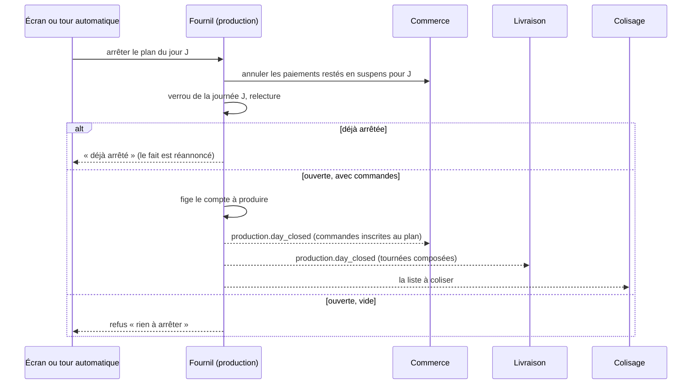

# L'arrêt du plan de production

**État au 2026-10-06.** Remplace le plan de l’arrêt du plan (lots A0 à A3
bâtis le 2026-10-06, retiré ce jour-là — il vit dans l'historique git).

## En une phrase

**Arrêter le plan d'une journée, c'est figer ce que le fournil va produire.**
Tant qu'un plan n'est pas arrêté, rien ne part en fournée : pas d'heure de
tirage, pas de liste à coliser, pas de tournée composée.

Le geste se fait **la veille au soir**, pour le lendemain. Il peut se faire à
la main ou tout seul, selon le réglage.

## Ce que fait un arrêt



- **Une seule fermeture, même à deux.** Deux arrêts simultanés (deux clics,
  ou l'arrêt automatique contre un arrêt anticipé) ne ferment qu'une fois : la
  journée est verrouillée par un verrou consultatif sur sa clé, puis relue
  sous lui (`infrastructure/prisma-production-day.lock.ts`). Le second trouve
  la journée close et réannonce seulement. Le retirage passe par le même verrou.
- **Une commande arrivée après l'arrêt** n'est pas perdue : « Reprendre le
  tirage » (le retirage, fiche d'atelier) l'ajoute à la fournée.

## Le réglage — Production › Réglages

| Mode                                       | Ce qu'on règle     | Ce qui se passe                                                                                       |
| ------------------------------------------ | ------------------ | ----------------------------------------------------------------------------------------------------- |
| **Manuel** (au départ, alerte à **20:00**) | une heure d'alerte | passé l'heure, si le plan du lendemain n'est pas arrêté, une alerte part et la colonne passe en rouge |
| **Automatique**                            | une heure d'arrêt  | à l'heure, le serveur arrête le plan du lendemain (à cinq minutes près)                               |

Ce qui est refusé, avec un message qui le dit :

- un mode sans son heure, une heure mal formée ;
- une heure d'arrêt hors de **12:00 – 23:55** (passé minuit, « le lendemain »
  deviendrait le surlendemain) ;
- une heure d'arrêt **avant la dernière heure limite de commande** (rattrapage
  compris), lue au commerce : arrêter plus tôt annulerait le paiement de
  clients encore en train de commander. Si une règle permet de commander le
  jour même, le mode automatique est impossible, et la page le dit.

**Le calendrier des jours fermés du fournil** se tient sur la même page. La
veille d'un jour fermé, ni arrêt ni alerte.

Un seul réglage pour la maison, tous lieux confondus : la clôture est par
journée. Chaque changement est journalisé (« … a réglé l'arrêt du plan :
automatique, arrêt à 20:30 ; c'était manuel, alerte à 20:00 »).

## L'arrêt automatique et les alertes

Le Worker réveille l'API toutes les cinq minutes ; il appelle la route machine
`POST admin/production/auto-close` (jeton du Worker, pas de droit staff). À
chaque tour, à l'heure de Paris :

| Situation                                                         | Ce qui se passe                                                                                                                                                            |
| ----------------------------------------------------------------- | -------------------------------------------------------------------------------------------------------------------------------------------------------------------------- |
| Le lendemain est un jour fermé, ou déjà arrêté                    | rien                                                                                                                                                                       |
| **Automatique**, heure d'arrêt passée                             | le vrai arrêt, **une seule tentative par journée** (trace `production.production_auto_close_attempt`, prise par une seule instance). Journal : « arrêté automatiquement ». |
| … et le lendemain est vide                                        | alerte « Rien à arrêter pour le … : aucune commande »                                                                                                                      |
| … et l'arrêt échoue                                               | alerte avec la raison ; **pas de nouvelle tentative** (relancer toutes les cinq minutes rappellerait Stripe sur une panne qui ne guérit pas seule)                         |
| … et la tentative reste en cours plus de **15 minutes**           | alerte « L'arrêt automatique du plan du … n'a pas abouti »                                                                                                                 |
| **Manuel**, heure d'alerte passée, lendemain avec commandes       | alerte « Le plan du … n'est pas arrêté »                                                                                                                                   |
| Le plan **d'aujourd'hui** n'est pas arrêté et porte des commandes | alerte « Le plan d'aujourd'hui n'a pas été arrêté ». Jamais arrêté d'office : la fournée est déjà au four.                                                                 |

Les alertes vont dans la cloche et en push, aux personnes qui ont
`production_count_stop`, **une par type et par journée** même avec plusieurs
instances, et ouvrent le prévisionnel.

## Le prévisionnel

L'état de chaque colonne est calculé par le serveur, avec les mêmes seuils que
l'arrêt automatique (`domain/services/forecast-day-state.ts`) :

| État                            | Rendu                                                                             |
| ------------------------------- | --------------------------------------------------------------------------------- |
| Plan non arrêté, en retard      | colonne en surcouche rouge, « Plan non arrêté », barres rouges en tête et au pied |
| Production du jour, plan arrêté | colonne en surcouche accent, « Arrêté »                                           |
| Journée future arrêtée          | « Arrêté » dans l'en-tête                                                         |
| Journée passée                  | surcouche grise                                                                   |
| Jour fermé du fournil           | hachures, « Fournil fermé »                                                       |

- **Bandeau rouge, en haut de la page, sur toutes les semaines** : le plan
  d'aujourd'hui n'est pas arrêté. Bouton « Arrêter le plan du … maintenant ».
- **Bouton du soir**, toujours à la même place, sur toutes les semaines :
  « Arrêter le plan du <lendemain> » (en mode automatique : « … maintenant
  (avant <heure>) », un arrêt anticipé). Sans rien à arrêter, il reste,
  désactivé : « Rien à arrêter » ou « Plan du … arrêté ».
- La page se relit toutes les 60 secondes : le retard vient de l'heure, pas
  d'un changement de données.
- Le **dossier du jour** s'ouvre par un bouton ; « Imprimer le dossier » ouvre
  le PDF figé à l'arrêt, et n'existe donc qu'**après** l'arrêt (voir
  [`dossier-prod-du-jour.md`](dossier-prod-du-jour.md)).

## Les droits

| Droit                   | Ce qu'il donne                                                                                                                                                                                                                                                               |
| ----------------------- | ---------------------------------------------------------------------------------------------------------------------------------------------------------------------------------------------------------------------------------------------------------------------------- |
| `production_count_stop` | arrêter le plan (soir, anticipé, rattrapage) ; recevoir les alertes                                                                                                                                                                                                          |
| `production_settings`   | lire / modifier le mode, les heures et les jours fermés                                                                                                                                                                                                                      |
| `production_plan`       | lire le plan du soir. ⚠️ Son `write` ne donne **plus rien** : proposé à l'écran des rôles, décrit « N'ajoute rien » — incohérence assumée, voir [`droits-et-permissions/todo-ressources-en-lecture-seule.md`](../droits-et-permissions/todo-ressources-en-lecture-seule.md). |

Les migrations ajoutent ces ressources sans les accorder : on les règle à
l'écran (`/admin/staff-roles`). La graine dev / e2e les donne aux rôles qui
arrêtaient le plan.

## Où vit le code

- Fournil (`apps/lfd-api/src/production/`) : réglage
  `domain/entities/production-close-settings.ts`, jours fermés
  `domain/entities/production-closed-day.ts`, tour
  `domain/services/auto-close-round.ts` et
  `application/commands/run-auto-close-round.handler.ts`, arrêt signé
  automatique `application/services/bus-automatic-day-closer.ts`, alertes
  `application/services/plan-arrest-bell.ts`, routes
  `http/production-settings.controller.ts` et `http/auto-close.controller.ts`.
- Heure limite lue au commerce par le canal
  `channels/commerce/order-cutoff-rules.reader.ts`.
- Worker : `apps/lfd-api/container/worker.ts`.
- Écrans : `apps/lfd-backoffice-frontend/src/app/production/previsionnel/`,
  `…/production/production-settings-page/`.
- Migrations : `20261006100000_les_droits_de_l_arret_du_plan`,
  `20261006100100_le_reglage_de_l_arret_du_plan`,
  `20261006120000_la_tentative_d_arret_automatique`,
  `20261006140000_le_previsionnel_suit_l_arret_du_plan` — toutes additives.

## Reste à faire

1. **Le déploiement en production** (rien n'est encore sur `main`) :
   - faire relire les quatre migrations par `lecteur-de-migrations` ;
   - **avant** la promotion, Hugo lance en production les deux requêtes qui
     listent qui arrête le plan aujourd'hui :
     ```sql
     SELECT r.key, r.label,
            (SELECT count(*) FROM public.staff_users u WHERE u.role_key = r.key AND u.status = 'active') AS titulaires_actifs
     FROM public.staff_role_definitions r
     CROSS JOIN LATERAL jsonb_array_elements(r.grants) AS g
     WHERE r.archived_at IS NULL AND g->>'resource' = 'production_plan' AND g->>'action' = 'write'
     ORDER BY r.key;

     SELECT u.email, u.role_key, o.effect
     FROM public.staff_permission_overrides o JOIN public.staff_users u ON u.id = o.staff_user_id
     WHERE o.resource = 'production_plan' AND o.action = 'write'
     ORDER BY u.email;
     ```
   - 🔴 le jour même, **avant 20:00**, accorder `production_count_stop` à ces
     rôles et personnes à l'écran (sinon plus personne n'arrête le plan), et
     `production_settings` à qui règle le fournil.
2. **Rouvrir un plan arrêté par erreur** (Hugo, Q7) : « Rouvrir le plan »,
   tant que rien n'a commencé en aval (aucune fournée cochée, rien au
   colisage, aucune tournée partie ou retouchée), sous `production_count_stop`,
   par un fait « plan rouvert » que commerce, livraison et colisage savent
   défaire. À concevoir avant d'être bâti ; en attendant, le retirage couvre
   un arrêt trop tôt.
