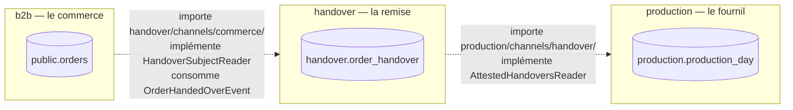
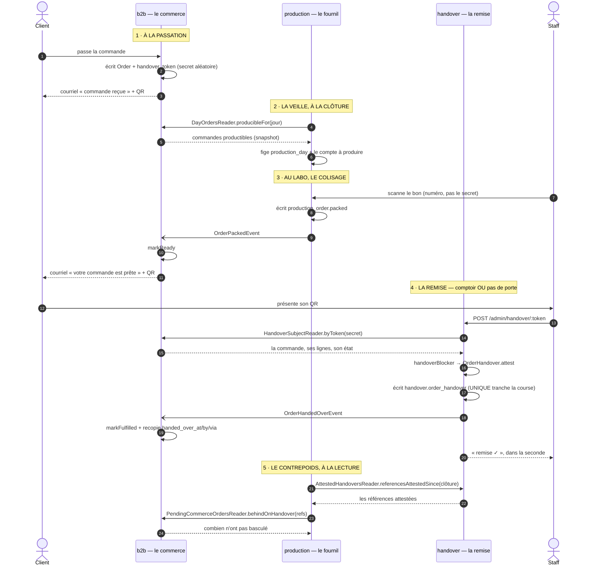

# La remise quitte le fournil — un contexte à elle, son schéma, sa table

> **État : doc-first.** Rien de ce document n'est bâti. Il décrit une cible et le
> chemin pour y aller ; le §7 dit ce qui reste à trancher avant la première ligne.
>
> **Portée** : `apps/lfd-api`. L'écran de remise du back-office ne dépend pas de
> ce document — il s'appelle `/admin/…/handover` avant comme après. Les deux
> chantiers sont volontairement séparés (§8).
>
> **V5, 2026-09-10.** Le plan a été démoli quatre fois. Ce qu'il en reste tient
> parce qu'il a perdu à chaque passe, pas parce qu'il a convaincu.
>
> **V2** — `vitruve` : le §4 (le sens des frontières) était **littéralement
> inversé**, et la commande de migration normale du dépôt détruisait la table.
>
> **V3** — Hugo : le contrôleur déménage d'URL, et 🔴 **le créneau horaire
> EXISTE**, contrairement à ce que les deux versions précédentes affirmaient —
> l'erreur venait d'avoir cherché une colonne au lieu d'ouvrir le bon de commande.
>
> **V4** — Hugo à nouveau (« qui donne à la remise sa colonne ? ») : le plan
> déménageait du **code sans donner aucune donnée** à la remise, d'où le §3 bis.
> Puis `vitruve`, seconde passe : quatre bloquants de plus, dont deux qui
> renversent une décision de la V3 — 🔴 **« pas en service » ne veut pas dire
> « pas déployé »**, et la vue de transition revient, pour une raison que la V2
> n'avait pas trouvée.
>
> **V5** — Hugo encore, et c'est l'argument le plus fort reçu par ce document :
> **c'est de l'alimentaire, donc ce qui est cuit est facturé**. Le contenu d'une
> commande gèle quand le four démarre, et la remise a lieu après. J'avais posé
> deux règles trop larges — « recopier à la passation », puis « ne rien
> stocker » — et la bonne se déduit de ce fait métier : on instantané quand la
> copie devient un **fait distinct**, jamais pour aller plus vite. Le §3 bis est
> réécrit là-dessus, et il donne au passage sa raison d'être au découpage : le
> jour où la remise devient un worker, seul un **adaptateur** change.
>
> Ce qui a été démoli est nommé là où ça l'a été : une objection qu'on efface se
> represente.

## 0. Ce qui est vrai aujourd'hui, vérifié le 2026-09-10

Tout ce paragraphe a été ouvert, pas rappelé de mémoire.

| Fait                                                                                  | Où                                                                                                                                  |
| ------------------------------------------------------------------------------------- | ----------------------------------------------------------------------------------------------------------------------------------- |
| La table `order_handover` est dans le schéma **`production`** — 6 colonnes            | [`prisma/schema/production.prisma`](../../apps/lfd-api/prisma/schema/production.prisma)                                             |
| Elle n'a **aucune clé étrangère**, ni vers `production_order`, ni vers `orders`       | [migration `20260907240000_remise_au_fournil`](../../apps/lfd-api/prisma/migrations/20260907240000_remise_au_fournil/migration.sql) |
| `order_id` et `reference` sont **tous deux `@unique`**                                | idem                                                                                                                                |
| La règle (`handoverBlocker`) vit au fournil depuis le 2026-09-07                      | [`handover/domain/services/handover.ts`](../../apps/lfd-api/src/handover/domain/services/handover.ts)                               |
| L'agrégat, son dépôt, son service d'attestation et son contrôleur aussi               | `production/{domain,application,http}/`                                                                                             |
| Le fournil déclare **trois ports** vers le commerce, dont `HandoverSubjectReader`     | [`production/channels/commerce/`](../../apps/lfd-api/src/production/channels/commerce/index.ts)                                     |
| Le commerce garde un **snapshot** de la remise : `handed_over_at/by/via` sur `orders` | [`prisma/schema/public/orders.prisma`](../../apps/lfd-api/prisma/schema/public/orders.prisma)                                       |
| Le **jeton** (`handover_token`) est sur `orders`, émis à la passation                 | idem, et [`prisma-order.repository.ts:49`](../../apps/lfd-api/src/b2b/orders/infrastructure/prisma-order.repository.ts)             |
| Le back-office est **en service depuis le 2026-08-17**                                | `CLAUDE.md` §0                                                                                                                      |
| 🔴 **La remise est DÉPLOYÉE** — `c4dbee9a`, `2c25c5ec`, `67700893` sont dans `main`   | vérifié par `git branch --contains`, 2026-09-10                                                                                     |

### 🔴 « Pas en service » ≠ « pas déployé »

Hugo a indiqué que la remise n'est pas en service. **C'est une affirmation
d'usage, pas de structure**, et les deux ne se confondent pas — la V3 les avait
confondues, et son §0 contredisait alors son §6 dans le même document.

Ce qui est **certain**, vérifié dans `main` : la route
`POST /admin/production/handover/:token` répond, l'écran `retrait/:token` est
servi, le QR part dans **les deux** courriels (passation et « commande prête »),
et le droit `b2b_orders` le couvre explicitement. `merger dans main déploie`
(`CLAUDE.md` §0).

Ce qui est **incertain** : si quelqu'un s'en est servi depuis trois jours
ouvrés. Rien dans le dépôt ne peut le dire.

**Conséquence, et elle est double** :

- pour les **données**, le `SELECT count(*)` de la tranche 2 tranche (§6) ;
- pour la **disponibilité**, rien ne tranche : la route est ouverte, et une
  table absente rend `500` même quand elle était vide. C'est le §6 bis, et
  c'est ce que la V3 avait rayé pour la mauvaise raison.

### Qui touche la table, exhaustivement

⚠️ **La V1 disait « un appel, une méthode » et c'était un inventaire incomplet** —
vrai des _lectures_ faites depuis `src/production/`, faux comme liste des
consommateurs. Il y en a **trois**, et le troisième est une écriture destructrice :

| Qui                                                                                                                                     | Quoi                                |
| --------------------------------------------------------------------------------------------------------------------------------------- | ----------------------------------- |
| [`get-production-day-status.handler.ts:66`](../../apps/lfd-api/src/production/application/queries/get-production-day-status.handler.ts) | `referencesAttestedSince(closedAt)` |
| Le contexte remise lui-même                                                                                                             | `findByOrderId`, `attest`           |
| [`dev/seeding/production.seed.ts:69`](../../apps/lfd-api/src/dev/seeding/production.seed.ts)                                            | 🔴 `orderHandover.deleteMany()`     |

Le troisième contredit déjà le JSDoc du port — « rien à supprimer : une
attestation qu'on peut retirer n'atteste plus rien ». C'est une tension
**existante**, mais après la coupe elle devient une fonction nommée
`resetProduction` qui vide la table d'un **autre contexte**, et le dossier `dev/`
n'est surveillé par aucune porte. Le déménagement ne la crée pas ; il la rend
sienne. Cf. tranche 3.

🔴 **Un commentaire faux, en DEUX endroits.** « Émis à la passation pour les
seules commandes `pickup` » ([`public/orders.prisma`](../../apps/lfd-api/prisma/schema/public/orders.prisma)),
et « Seul le retrait en reçoit un » ([`prisma-order.repository.ts:48`](../../apps/lfd-api/src/b2b/orders/infrastructure/prisma-order.repository.ts)).
Faux depuis le 2026-09-07 : `issuesHandoverToken()` n'a plus de paramètre et rend
`true` sans condition, précisément parce que la livraison passe par le même scan.
Deux commentaires ont survécu à la fonction qu'ils décrivent.

⚠️ **Et il y en a deux autres**, trouvés en relisant toute la doc :

- `public/orders.prisma` dit aussi « Les deux autres colonnes **SONT**
  l'attestation ». Faux depuis le 2026-09-07 : l'attestation est dans
  `order_handover`, et `orders.handed_over_*` en est le **snapshot** — ce que le
  §3 de ce plan affirme par ailleurs.
- [`order/architecture-bon-de-commande.md`](../order/architecture-bon-de-commande.md)
  écrit « Rien de tout ça n'existe. `issuesHandoverToken()` rend
  `method === "pickup"` » — alors que **le même document**, plus bas, marque le
  lot ✅ livré. Un doc qui se contredit à trente lignes d'écart.

Quatre phrases, un seul fait. Tranche 1.

## 1. Pourquoi un contexte à part

### Le critère, et pourquoi ce n'est PAS « qui est présent »

⚠️ **La V1 proposait « qui est présent au moment du geste ? ». Ce critère ne
discrimine pas** — en retrait, le geste a lieu au labo, avec le personnel du
labo. Il rend deux réponses selon l'acheminement, et une frontière qui dépend du
mode de livraison n'est pas une frontière.

**Le vrai critère est la CLÉ D'IDENTITÉ, et il est déjà écrit dans le code.**

La production est un contexte **en forme de journée** : son agrégat racine est
`ProductionDay`, sa clé primaire est `service_day`, son événement est une
clôture, et ses deux pièces — feuille d'atelier, compte à produire — sont des
instantanés d'un jour.

La remise est **en forme de commande, et sans jour**. Elle est identifiée par
`order_id`, elle n'a ni date de service ni clôture, et
[`architecture-contexte-production.md`](architecture-contexte-production.md) dit
déjà pourquoi, en toutes lettres :

> « Une commande passée **après** la clôture de sa journée n'est donc dans aucun
> plan, et reste remettable. L'accrocher à `production_order` aurait obligé à
> créer sa ligne de plan à la volée, ce qui fausserait le compte à produire. »

🔴 **C'est la migration du 2026-09-07 elle-même qui a refusé le mariage.** Le
jour où la remise est entrée chez le fournil, on lui a donné une table
**indépendante de la journée de production**, sans clé étrangère, parce
qu'aucune autre forme ne marchait. Deux agrégats dont les clés d'identité
diffèrent et qui ne partagent jamais une transaction sont deux contextes ; le
schéma commun était le vestige.

### L'objection, et ce qu'elle vaut vraiment

**La remise a déménagé dans `production` il y a trois jours**, avec une raison
écrite : « C'est au labo qu'on retire — le client s'y présente, le coursier y
charge. »

⚠️ **La V1 réfutait cette phrase par sa voisine du même JSDoc, écrit le même
jour. C'était malhonnête** : l'auteur du déménagement connaissait les deux
acheminements — il a écrit « le coursier y charge ». Il n'a rien oublié.

Ce qui a changé n'est pas ce qu'on sait, c'est ce qu'on a **construit** : la
table dayless du 07 est le fait neuf, et il n'existait pas quand la phrase a été
écrite. Un déménagement se justifie par une structure, pas par une relecture.

🔴 **Et le critère ne prouve pas autant qu'il en a l'air.** Il sépare
`order_handover` de `ProductionDay` — ça, c'est solide. Il ne la sépare **pas**
de `ProductionOrder`, dont la clé est `@@unique([serviceDay, orderId])` et qui n'a
elle non plus aucune clé étrangère vers `orders`. Ce qui distingue vraiment les
deux est le **`serviceDay`** : la ligne de production appartient à une journée, la
remise à aucune.

⚠️ Et le test de falsification que la V3 proposait — « `order_handover` a-t-elle
gagné une clé de journée ? » — est un test qu'aucun état du monde ne fera
échouer. Il avait l'air d'un garde-fou ; c'en était l'apparence.

**Ce qui reste vrai, et c'est plus modeste** : c'est le troisième emplacement de
cette table en un mois, et aucune phrase de ce document n'empêchera un quatrième.
Ce qui en tiendra lieu est le §3 bis — le jour où la remise aura sa file, ses
faits et son schéma, la refusionner coûtera une migration, pas un `git mv`. **La
structure est le seul garde-fou qui tienne.**

## 2. 🔴 Le nom : `handover`, pas `remise`

Le lexique du dépôt (`CLAUDE.md` §8) traduit **`remise` par `discount`**, et le
dossier s'en sert : `PickupAddress.discountMode`, `discountValue`,
`CartAdjustmentMode`. Un schéma Postgres nommé `remise` porterait donc, dans le
vocabulaire du dépôt, le sens « rabais ».

Le bloc, le schéma et le dossier s'appellent **`handover`**. Les libellés
d'écran disent « remise » — c'est du français destiné à des humains, et le §8 le
prévoit explicitement.

## 3. Ce que la remise possède — et ce qu'elle ne possède pas

**Elle possède le FAIT** : quand, par qui, comment. C'est ce qu'elle grave et ce
que personne d'autre ne peut attester.

**Elle ne possède pas le jeton.** Il naît à la passation, voyage dans le courriel
du client, et le JSDoc de `issuesHandoverToken` a déjà tranché : « Le fournil
s'en sert pour retrouver la commande, il ne le fabrique pas. » Le déplacer
obligerait le commerce à demander un secret à un autre contexte au moment
d'écrire une commande — un couplage synchrone à l'écriture, pour rien.

⚠️ **La question sera reposée**, parce qu'elle est légitime : un secret dont la
seule fonction est d'ouvrir une porte de remise ressemble à une propriété de la
remise. La réponse est que le **moment** décide, pas l'usage — et le moment est
la passation.

**Le commerce garde son snapshot** (`orders.handed_over_*`). Ce n'est pas une
seconde vérité : c'est la figure du SKU du PIM recopié dans une `OrderLine`. Le
commerce recopie ce qu'on lui annonce ; il ne le rend jamais.

## 3 bis. Ce que la remise STOCKE, et ce qu'elle DEMANDE

> **Réécrit le 2026-09-10, après trois versions fausses.** La V4 proposait une
> file recopiée à la **passation** ; la V5 disait « ne stocke rien, demande
> tout ». Les deux appliquaient une règle trop large. Ce qui suit est la règle
> juste, et elle vient d'un argument métier, pas technique.

### La règle

> **On ne copie pas pour aller plus vite. On instantané quand la copie devient un
> fait distinct.**
>
> Le test : _cette copie peut-elle diverger de la source, et cet écart veut-il
> dire quelque chose ?_
> Oui → c'est un **fait**, il lui faut sa table. Non → c'est un **cache**, on lit
> vif.

Un cache espère que rien n'a bougé. Un instantané enregistre le moment où plus
rien ne **peut** bouger. Ce n'est pas la même chose, et c'est ce qui distingue
une bonne copie d'un passif.

### La règle appliquée, ligne par ligne

| Donnée                                               | Peut-elle diverger ?                        | Verdict     |
| ---------------------------------------------------- | ------------------------------------------- | ----------- |
| `production_order` — ce qu'on s'est engagé à faire   | **oui** — substitution, casse               | **fait** ✅ |
| l'attestation de remise                              | **oui** — elle survit à l'annulation        | **fait** ✅ |
| « cette commande est attendue à 7 h au Labo »        | non — c'est la donnée du commerce, verbatim | cache ❌    |
| le contenu du sac, ses lignes, ses quantités         | non — gelé, voir ci-dessous                 | cache ❌    |
| « le client a appelé, il passera à 9 h »             | **oui** — ça naît au comptoir               | **fait** ✅ |
| « mis au frais », « sac préparé », « client appelé » | **oui** — personne d'autre ne le sait       | **fait** ✅ |

🔴 **La deuxième ligne est celle qui a fait comprendre la règle.** `production_order`
n'est pas une copie de la commande : c'est le seul endroit où existe « le matin
du 12, on s'est engagé à fabriquer ceci ». Le doc du fournil le dit —
« Un écart entre les deux est un fait à lire, **jamais à réconcilier** » —, et
une commande annulée après coup ne doit pas effacer ce qu'on a cuit.

### 🔴 Pourquoi le contenu peut être lu vif, sans risque

**C'est de l'alimentaire.** Ce qui est cuit est facturé. Le contenu d'une
commande **gèle donc quand le four démarre** — pas par convention, par la
physique et la facturation. Et la remise a lieu **après**.

Au moment où le comptoir sert, le contenu ne peut plus changer. Une lecture vive
et un instantané pris à la clôture donnent **la même réponse** — donc
l'instantané n'achète rien, et il coûte : suivre les annulations, les avenants,
et survivre à un événement manqué sur un bus **ni persisté ni rejoué**, dans un
dépôt qui a déjà vu un abonné échouer.

⚠️ **Ce qui bouge encore après le four : pas le _quoi_, mais le _où_ et le
_quand_.** Un client qui appelle pour passer plus tard, ou à l'autre point.
C'est de la logistique, ça naît au comptoir, et **ça, la remise le stocke** —
c'est la cinquième ligne du tableau.

### Ce que l'écran lit, et d'où

| Ce qu'il affiche                            | Source                                 |
| ------------------------------------------- | -------------------------------------- |
| la file du jour, les créneaux, les points   | **lecture vive** du commerce           |
| le prévisionnel de demain, de la semaine    | la même, filtrée par date              |
| le retardataire — commandé après la clôture | la même ; aucun instantané ne l'aurait |
| le contenu du sac, au moment du scan        | la même, déjà en place                 |
| « au frais », « appelé », « passera à 9 h » | **sa table à elle**                    |
| l'attestation                               | **sa table à elle**                    |

Le port qui sert les quatre premières lignes est **déclaré par la remise** et
implémenté par le commerce — `HandoverQueueReader.forDay(jour, point)`, voisin de
`HandoverSubjectReader` qui existe déjà pour une commande. Le créneau vient avec,
sans être recopié nulle part : c'est la réponse à « qui donne à la remise sa
colonne d'horaires ». **Le commerce, quand on la lui demande.**

### 🔴 Le jour où la remise devient un worker à part

C'est l'argument qui justifie de faire ce travail maintenant, et il faut dire
exactement ce qu'il achète — parce que ce n'est pas ce qu'on croit.

**Ce n'est pas la copie qui rend indépendant. C'est le port.**

Aujourd'hui, `HandoverQueueReader` est une classe abstraite résolue en processus.
Le jour où la remise part dans son propre Worker, avec sa base :

| Ce qui change                                                    | Ce qui ne change pas                                |
| ---------------------------------------------------------------- | --------------------------------------------------- |
| l'**adaptateur** du port : appel HTTP au lieu d'un appel direct  | le port, son contrat, ses appelants                 |
| la lecture vive devient trop chère → **instantané à la clôture** | la table des faits propres, qui voyage telle quelle |
| `AttestedHandoversReader` devient un appel réseau                | le sens des flèches, déjà tenu par la matrice       |

Autrement dit : **le seul travail restant sera de remplacer un adaptateur.** La
règle du tableau gagne alors un second déclencheur — _on instantané aussi quand
la source devient distante_ —, et ce jour-là l'instantané à la clôture aura une
raison qu'il n'a pas aujourd'hui.

⚠️ **On ne le fait donc pas maintenant.** Payer aujourd'hui la synchronisation
d'une copie pour un découpage qui n'existe pas est de la généralité spéculative :
on prend le coût tout de suite et le bénéfice peut-être jamais. Le port, lui,
coûte une classe abstraite et rend le futur bon marché — c'est le bon moment pour
lui, et le mauvais pour la copie.

## 4. Les frontières — dans le sens que la PORTE lit

🔴 **La V1 écrivait cette section à l'envers**, et c'est l'objection la plus
utile qu'elle ait reçue. Elle raisonnait en « qui déclare le port ». La porte,
elle, lit **le graphe d'imports** : `ALLOWED[bloc importateur]` contient les
blocs qu'il a le droit d'atteindre, et `PORT_SURFACE["depuis→vers"]` nomme le
sous-dossier **du bloc cible** par lequel il doit passer.

Vérifié dans [`context-boundaries.mjs`](../../dev-toolbox/gates/context-boundaries.mjs) :
`b2b: new Set([… "production"])` et `"b2b→production": "production/channels/commerce/"`
— c'est bien le **commerce** qui importe le canal que la **production** publie.

**Un contexte qui publie un port n'importe personne. C'est celui qui l'implémente
qui importe.** La V1 avait donc mis en gras l'interdiction de la seule flèche
dont le plan a besoin.

### La matrice, corrigée

| Depuis ↓ vers →    | `staff` | `pim` | `b2b` | `production`        | `handover`          | `platform` |
| ------------------ | ------- | ----- | ----- | ------------------- | ------------------- | ---------- |
| **`b2b`**          | ✓       | port  | —     | port                | **port uniquement** | ✓          |
| **`production`**   | ✓       | ✗     | ✗     | —                   | **✗**               | ✓          |
| **`handover`**     | ✓       | ✗     | **✗** | **port uniquement** | —                   | ✓          |
| **`appBootstrap`** | ✓       | ✓     | ✓     | ✓                   | **✓**               | ✓          |

Et les deux surfaces à ajouter :

```
"b2b→handover":       "handover/channels/commerce/"
"handover→production": "production/channels/handover/"
```

**Pourquoi `b2b → handover` et non l'inverse** : après la coupe, deux fichiers du
commerce importent la surface de la remise — `prisma-handover-subject.reader.ts`
(qui implémente `HandoverSubjectReader`) et `on-order-handed-over.handler.ts`
(qui consomme l'événement). La remise, elle, ne lit **rien** du commerce : elle
déclare, on lui fournit.

**Pourquoi `handover → production`** : le compteur `handedOverBehind` du statut de
journée a besoin des attestations. La production déclare
`AttestedHandoversReader` dans `production/channels/handover/`, et **la remise
l'implémente** — donc c'est elle qui importe. `production → handover` reste `✗` :
le fournil ne sait pas que la remise existe.



⚠️ **Les flèches du diagramme sont des IMPORTS, pas des flux de données.** La
donnée va dans l'autre sens sur les deux traits — c'est tout l'objet de
l'inversion de dépendance, et c'est exactement là que la V1 s'est trompée.

### Et le même dossier dans le temps — qui envoie quoi, à quel moment

Le diagramme ci-dessus dit **qui dépend de qui**. Celui-ci dit **ce qui circule**,
et les deux ne se superposent pas : sur chaque trait d'import, la donnée voyage à
contresens.



**Trois choses que ce diagramme rend visibles, et qu'aucune prose ne rendait :**

🔴 **Le fournil n'est nulle part dans l'étape 4.** Le colisage (3) et la remise
(4) ne se touchent pas : entre les deux, il n'y a qu'un courriel au client. C'est
l'argument du §1 sous une autre forme — et c'est aussi pourquoi une commande
`placed` jamais colisée reste remettable.

⚠️ **Les traits pleins vers `b2b` sont des APPELS SYNCHRONES** (la remise lit),
les traits pointillés `-)` sont des **faits publiés** sur le bus en processus.
Les seconds ne sont ni persistés ni rejoués : l'abonné doit être idempotent, et
c'est pourquoi le service d'attestation republie sur ses chemins de refus.

**Le secret change de main trois fois** (1 → courriel, 3 → courriel, 4 → scan) et
n'est jamais fabriqué par la remise. C'est le §3 : le moment décide, et le moment
est la passation.

## 5. Le schéma et la table

Le `datasource` gagne `"handover"` dans `schemas`, et `lint:prisma-schema-layout`
exige alors un fichier **handover.prisma** — à créer, **un seul bloc** (c'est
`production.prisma` qui en porte 5, 4 après la coupe).

La table ne change **ni de forme, ni de nom, ni de colonne** : un déménagement de
schéma, rien d'autre. Les deux `UNIQUE` la suivent — ce sont eux qui rendent la
seconde remise _inexprimable_ plutôt que refusée par un `WHERE`, et le doc de
production note que c'est « le seul endroit du dossier où le déménagement a rendu
une garantie plus forte ». Elle ne doit pas s'affaiblir en déménageant.

## 6. La migration — et la condition qui la rend simple

> **Décision d'Hugo, 2026-09-10 : la remise n'est pas en service.** Pas de
> contrainte horaire, pas de contrainte de base. Ce §6 était, en V2, la partie la
> plus lourde du plan — une vue Postgres de transition, un tableau de retour
> arrière, une vérification sur Accelerate. **Tout cela disparaît**, et il faut
> dire exactement à quelle condition, parce que c'est la seule chose qui tient
> le plan debout.

### La condition, et la commande qui la falsifie

Tout ce qui suit suppose que **`production.order_handover` est vide en
production**. Le back-office est en service depuis le 2026-08-17
(`CLAUDE.md` §0), mais la remise n'a jamais été ouverte à l'usage.

🔴 **À vérifier avant d'appliquer la tranche 5**, et pas de mémoire :

```sql
SELECT count(*) FROM production.order_handover;
```

Zéro → ce qui suit s'applique. Autre chose → **s'arrêter**, et rouvrir la
version V2 de ce document (`git log` de ce fichier), qui décrit le chemin avec
vue de transition. Les deux chemins existent ; c'est ce compte qui choisit.

⚠️ L'accès à la base de production suit le §0 du `CLAUDE.md` : le secret ne
traverse jamais une ligne de commande — `~/.pgpass` ou un fichier de service.

### Pourquoi la question se pose, alors qu'on ne fait « que » changer un schéma

**`pnpm --filter lfd-api db:migrate` — la commande du `CLAUDE.md` §10 — génère un
`DROP TABLE`.** Prisma ne connaît pas `SET SCHEMA` : un `@@schema` modifié est,
pour lui, une table détruite et une table créée.

Reproduit le 2026-09-10, `prisma migrate diff --script` du schéma actuel vers la
cible :

```sql
CREATE SCHEMA IF NOT EXISTS "handover";
DROP TABLE "production"."order_handover";
CREATE TABLE "handover"."order_handover" ( … );
```

Sur une table **vide**, c'est sans conséquence et c'est la migration qu'on garde.
Sur une table qui porte des attestations — les preuves qu'un colis est parti —,
c'est une destruction sans retour arrière : un `SET SCHEMA` inverse ne
ressuscite rien.

🔴 **C'est pourquoi le `SELECT count(*)` n'est pas une formalité.** La même
commande produit une migration anodine ou une perte de preuves, et rien dans son
apparence ne distingue les deux cas.

### 🔴 §6 bis — la vue revient, et pour une raison que la V2 n'avait pas trouvée

La V2 voulait une vue de transition **pour ne pas perdre d'écriture**. La V3 l'a
supprimée en constatant qu'une table vide n'a rien à perdre. **Les deux
raisonnaient sur la donnée, et le problème n'est pas la donnée.**

Le workflow applique `prisma migrate deploy` **avant** `wrangler deploy`, et son
propre commentaire dit que « l'ANCIENNE image répond encore **une à deux
minutes** ». Pendant cette fenêtre, `production.order_handover` **n'existe
plus** — le `DROP` est passé — et l'ancienne image la vise encore.

**Une table vide répond aux requêtes. Une table absente non.** Ce qui casse n'est
pas une écriture perdue, c'est un `undefined_table` en **500** sur trois routes
ouvertes :

| Route                             | Pourquoi elle touche la table                                                                                                                     |
| --------------------------------- | ------------------------------------------------------------------------------------------------------------------------------------------------- |
| `GET /admin/…/handover/:token`    | [`get-handover.handler.ts:39`](../../apps/lfd-api/src/handover/application/queries/get-handover.handler.ts) — `findByOrderId` **même en lecture** |
| `POST /admin/…/handover/:token`   | `handover-attestation.service.ts` — la lecture précède l'attestation                                                                              |
| `GET /admin/production/day/:jour` | `get-production-day-status.handler.ts:66` — `referencesAttestedSince`                                                                             |

Un client au comptoir prend donc un 500 pendant une à deux minutes, **que la
table ait été vide ou non**. La vue règle ça :

```sql
CREATE VIEW "production"."order_handover" AS
  SELECT * FROM "handover"."order_handover";
```

⚠️ **Mais la migration Prisma DÉTRUIT au lieu de déplacer.** On ne peut donc pas
poser une vue sur une table qui n'existe plus. Deux chemins, et il faut choisir :

| Chemin                                           | Ce qu'il donne                                               | Ce qu'il coûte                                     |
| ------------------------------------------------ | ------------------------------------------------------------ | -------------------------------------------------- |
| **A** — migration à la main : `SET SCHEMA` + vue | aucune coupure, données préservées quoi qu'en dise le compte | migration écrite à la main, vue à retirer ensuite  |
| **B** — `DROP`/`CREATE` de Prisma, sans vue      | une migration ordinaire                                      | 🔴 **1 à 2 min de 500 au comptoir**, à chaque fois |

**Le plan retient A**, et le `SELECT count(*)` cesse d'être un pivot : il devient
un contrôle. Avec A, la réponse ne change pas le geste — elle change seulement ce
qu'on risque si on se trompe.

### Ce qui a été éprouvé — et qui redevient nécessaire

Éprouvé sur `lfd-dev-postgres` et **valide** : l'écriture traverse la vue,
`SQLSTATE 23505` remonte avec la contrainte de la table de base, `isUniqueViolation`
ne lit que `.code` — l'arbitrage de course y est insensible. `assertSchemaIsFresh`
ne regarde que le journal, Prisma 7 ignore une vue non déclarée, et le harnais
e2e interroge `pg_tables`, qui ne liste pas les vues.

🔴 **Non éprouvé, et c'est maintenant sur le chemin critique** : tout ceci l'a été
sur l'adapter `pg`, le transport des **tests**. La prod tourne sur **Accelerate**.
Puisque le chemin A est retenu, cette vérification n'est plus une précaution —
c'est la tranche 2.

## 7. Ce qui reste à trancher

**a. ~~La vue, ou une fenêtre assumée ?~~ — TRANCHÉ : la vue, chemin A.** La V3
la rayait au motif qu'une table vide n'a rien à perdre. C'était raisonner sur la
donnée quand le problème est la **disponibilité de la route** : une table absente
rend 500 pendant une à deux minutes, vide ou non. Cf. §6 bis.

**b. `handedOverBehind` reste-t-il au fournil ?** ⚠️ La V1 disait que le
déplacer « supprimerait un port ». **Faux** : ce compteur croise `AttestedHandovers`
(remise) **et** `PendingCommerceOrdersReader.behindOnHandover` — un port déclaré
par la production et implémenté par le commerce. Le déplacer sur l'écran de
remise ferait consommer à `handover` un port de `production` : on remplacerait
`handover → production` par… `handover → production`. Le gain est nul côté
frontières ; la question redevient « où ce chiffre se lit-il le mieux ? », ce qui
est un choix d'écran. **Ne bloque plus la tranche 3.**

**c. ~~Le contrôleur déménage-t-il d'URL ?~~ — TRANCHÉ : oui.**
`/admin/production/handover/*` devient `/admin/handover/*`. Les QR déjà partis
encodent `{admin}/retrait/{token}`, une route du **front**, qui ne bouge pas —
seul le chemin d'API qu'elle appelle change, ce qui est déjà arrivé une fois sans
casse.

🔴 **Mais pas d'un seul coup — c'est un contrat déjà servi.** Le back-office est
une SPA déployée par **son propre workflow**, indépendant de celui de l'API : un
onglet ouvert garde son bundle, et le QR d'un client peut ouvrir l'ancien à tout
moment. Le `CLAUDE.md` §0 est explicite : « Un contrat déjà servi ne se casse
pas. […] il se **déprécie**, il ne disparaît pas dans le même déploiement. »

Le geste est donc **deux `@Controller` sur le même handler**, l'ancien marqué
déprécié, puis retrait au déploiement suivant. La V3 écrivait « ce qui est déjà
arrivé une fois sans casse » sans dire quand ni comment — une justification qui
ne se vérifie pas.

⚠️ **Trois conséquences non listées**, toutes vérifiées : le service front épingle
le préfixe ; `gateway/src/traffic.ts` tronque l'étiquette à deux segments, donc
la métrique passe de `admin/production` à `admin/handover` et **l'historique se
coupe en deux** ; et `packages/contracts/src/staff-access.ts` code en dur
`POST /admin/production/handover/:token` dans la justification du droit
`b2b_orders`.

Reste à décider si `@AdminSurface("b2b_orders")` suit — la ressource est celle du
commerce, et le JSDoc du contrôleur dit pourquoi : « le commercial qui prend la
commande est souvent celui qui remet le sac ». Déménager l'URL ne doit retirer le
geste à personne.

## 8. Ce que ce plan ne fait PAS

**L'écran de remise du back-office.** Il se bâtit avant, après ou pendant, et
n'en dépend pas : il appelle une route HTTP. Les mélanger ferait dépendre un
écran attendu d'une migration de schéma.

### 🔴 Le créneau EXISTE — la V1 et la V2 disaient le contraire

Les deux versions précédentes affirmaient qu'« aucune colonne de créneau
n'existe » et que l'écran devrait s'en passer. **C'est faux, et l'erreur vient
d'avoir cherché une colonne `window` dans le schéma au lieu d'ouvrir le bon de
commande.** Hugo a signalé le contraire ; vérifié, il a raison.

La commande porte un acheminement **convenu et figé** dans la colonne
`orders.fulfillment` (JSON), de forme `OrderFulfillment` — et son premier champ
est :

```ts
readonly window: FulfillmentDecision<FulfillmentWindow | null>;
//                                   { start: "HH:mm" | null, end: "HH:mm" }
```

Le bon de commande l'imprime déjà
([`order-sheet.ts:75`](../../apps/lfd-api/src/b2b/orders/domain/services/order-sheet.ts)),
et la colonne porte sa propre justification : « Figé comme les prix : le contact
d'une adresse, ses heures ou son exigence de signature peuvent changer demain, et
un bon déjà imprimé ne doit pas se mettre à dire autre chose que le papier parti
en tournée. »

**Trois conséquences pour l'écran de remise** — aucune ne relève de ce plan, mais
elles n'ont plus à être inventées :

- la colonne de gauche de la file (`7 h – 8 h`) a sa donnée ;
- `start` est **nullable**, et ça veut dire « avant `end` » — d'où un `6 h 30`
  affiché seul, exactement comme la maquette le montre ;
- le **retard** est donc calculable : `maintenant − end`, sur un créneau dont la
  fin est passée. Il n'y a rien à ajouter en base.

### ⚠️ Trois états, pas deux — et celui que le plan redoutait n'existe plus

La V3 avertissait contre `fulfillment IS NULL` (« une commande d'avant la
colonne »). **Ce cas n'existe plus en production** : la migration
`20260815180000_figer_acheminement_des_commandes_anterieures` a rempli **toutes**
les commandes antérieures, en posant `'window', jsonb_build_object('value', NULL,
'source', 'default')`.

| État                             | Ce que ça veut dire                       | En production       |
| -------------------------------- | ----------------------------------------- | ------------------- |
| `fulfillment IS NULL`            | pas de bloc d'acheminement                | **n'existe plus**   |
| `window.value === null`          | bloc présent, **aucune tranche demandée** | **le cas de masse** |
| `window.value = { start?, end }` | une fenêtre convenue                      | le cas intéressant  |

La file devra donc gérer en nombre le cas que la V3 ne nommait pas, et jamais
celui contre lequel elle prévenait.

### 🔴 Et le « retard » ne se calcule pas sur n'importe quelle fenêtre

`FulfillmentDecision` porte une **provenance** : `source: "default" | "override"`.
Un `end` en `default` est une **heure d'ouverture recopiée** à la commande, pas
une promesse faite à quelqu'un. Afficher « 56 min de retard » sur une heure de
fermeture de boutique produirait une alarme que personne n'a promise.

Le retard n'a de sens que sur un `override` — une tranche réellement demandée.
Sur un `default`, l'écran affiche la fenêtre sans en tirer de retard. C'est une
décision d'écran, mais elle se prend ici, parce que c'est ici qu'on voit la
provenance.

### Le bon digital, depuis le panneau

`OrderHandoverView.orderId` existe déjà pour ça — son JSDoc dit « Pour ouvrir la
fiche complète quand le comptoir ne suffit pas ». Le bon se sert en PDF sur
`GET /admin/orders/:id/bon.pdf`, et le front l'appelle déjà
([`orders.service.ts:84`](../../apps/lfc-B2B-admin-frontend/src/app/commandes/orders.service.ts)).
**Rien à ajouter côté API** : c'est un lien.

## 9. Les tranches

| #   | Ce qu'elle fait                                                                                                                                                                        | Réversible ?               |
| --- | -------------------------------------------------------------------------------------------------------------------------------------------------------------------------------------- | -------------------------- |
| 1   | Les **quatre** phrases fausses sur le jeton (§0) : deux dans le code, deux dans la doc.                                                                                                | oui                        |
| 2   | 🔴 Éprouver la vue **sur Accelerate**, projet jetable. Chemin critique : sans ce résultat, la tranche 6 n'existe pas.                                                                  | —                          |
| 3   | `src/handover/` — le déplacement **et la recomposition** (voir ci-dessous).                                                                                                            | oui                        |
| 4   | Les portes : **`BLOCK_OF`** d'abord, puis `ALLOWED.handover`, `ALLOWED.b2b ∋ handover`, les deux `PORT_SURFACE`, et `BLOCKS` de `model-ownership`.                                     | oui                        |
| 5   | L'URL : **alias déprécié**, deux `@Controller` sur le même handler. Le service front, `traffic.ts`, `staff-access.ts`.                                                                 | oui                        |
| 6   | `SELECT count(*)`, puis la migration **écrite à la main** : `CREATE SCHEMA` + `SET SCHEMA` + vue. `datasource`, **handover.prisma**, `schema-ops.counter.ts`, `schema-parity.spec.ts`. | oui — `SET SCHEMA` inverse |
| 7   | Déploiements suivants : `DROP VIEW`, puis retrait de l'alias d'URL.                                                                                                                    | oui                        |
| 8   | Doc : ce fichier passe à « implémenté », le doc de production perd son §remise, et sa ligne d'index (périmée) est reprise.                                                             | —                          |

### ⚠️ La tranche 3 n'est pas un `git mv`, et la V3 la chiffrait à zéro

Ce qu'elle contient réellement, en plus du déplacement :

- **scinder `production-errors.ts`** — 3 classes de remise sur 9 ;
- **scinder `channels/commerce/index.ts`**, qui exporte aujourd'hui les cinq
  pièces de la production **et** les trois de la remise, `HandoverVia` compris ;
- **créer `production/channels/handover/AttestedHandoversReader`** et **retirer
  `referencesAttestedSince` de `OrderHandoverRepository`** — le §4 la décrit
  comme acquise, elle n'existe pas ;
- **scinder `ProductionFeedModule`**, qui câble aujourd'hui les trois ports en un
  seul `@Global` et importe `OrdersModule` ;
- **créer `HandoverModule`**, son enregistrement dans l'`AppModule`, et le module
  de composition qui reliera `AttestedHandoversReader` ;
- **traiter `resetProduction`** (§0), qui vide la table d'un autre contexte.

🔴 **Et la file du §3 bis n'est dans aucune tranche ci-dessus** — c'est délibéré :
elle demande une table, un fait de passation à publier, et un port. C'est un lot
à part, qui vient **après** la coupe et non pendant. Le déménagement doit pouvoir
s'arrêter tout seul.

### L'ordre, et ce qui ne se sépare pas

🔴 **Les tranches 3 et 4 partent ENSEMBLE.** `context-boundaries.mjs` remplit
`unknownDirs` dès que **`BLOCK_OF[dossier]` est `undefined`** — c'est cette table
qui décide, pas `ALLOWED`, qui n'est même jamais atteinte sans elle. Un
`src/handover/` sans sa ligne dans `BLOCK_OF` rend `pnpm lint:gates` rouge.

⚠️ La tranche 4 n'est pas cosmétique non plus : `lint:prisma-model-ownership`
filtre sur `BLOCKS` et **ignore en silence** un dossier inconnu. Sans elle,
personne ne tient plus la propriété de `OrderHandover` — la porte posée le
2026-09-09 pour fermer « une frontière qu'on ne franchit qu'en SQL » se tairait
sur tout le bloc neuf.

⚠️ **Le `SELECT count(*)` est en tranche 6, pas en 2, et c'est un changement.** La
V3 le mettait en tête ; entre la mesure et la migration, il y avait trois tranches
et au moins un déploiement, la route restant ouverte tout du long. Un compte pris
d'avance atteste d'un état révolu. Il se reprend **immédiatement avant** la
migration.

**Le point d'arrêt** : les tranches 3+4+5 ne touchent pas la base, la tranche 6 ne
touche pas le code. C'est le seul, et il est net.
