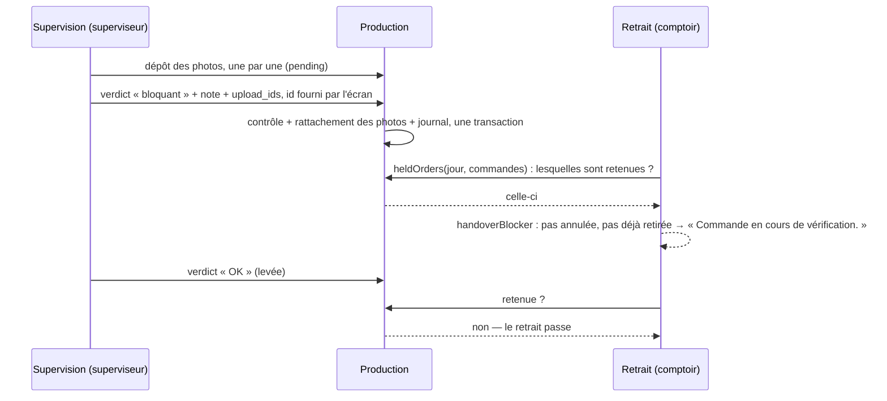

# Plan — le contrôle qualité du superviseur

> **État : 📐 plan, rien n'est bâti.** Ouvert le 2026-09-28, sur une demande
> reçue par Hugo : un contrôle qualité fait par le superviseur. Les réponses de
> Hugo du même jour sont au §1 ; elles tranchent la forme.
>
> Il déplace une **frontière de sécurité** (un geste neuf sous une
> permission) et **bloque un retrait** : contredit par `vitruve` le 2026-09-28
> (**3 BLOQUANT, 9 SÉRIEUX**), tous repris ou assumés au §9.

---

## 0. Ce que c'est

Le superviseur regarde ce qui sort du fournil et **rend un verdict**, à deux
niveaux :

- une **ligne de préparation** : un produit du compte du jour (« les 96
  croissants ») ;
- une **commande colisée** : un bac déclaré prêt.

Trois verdicts, chacun avec sa note et ses photos :

| Verdict      | Effet                                                | Note        | Photos       |
| ------------ | ---------------------------------------------------- | ----------- | ------------ |
| **OK**       | aucun ; trace                                        | facultative | facultatives |
| **Réserve**  | aucun blocage ; trace **visible**                    | obligatoire | au moins une |
| **Bloquant** | la commande est **retenue au retrait** jusqu'à levée | obligatoire | au moins une |

Le mot « warning » de la demande devient **Réserve** à l'écran : c'est ce que
dit un superviseur (« je fais une réserve ») ; `warning` reste le nom de code.

---

## 1. Les décisions de Hugo (2026-09-28)

| #   | Question                            | Réponse                                                                                |
| --- | ----------------------------------- | -------------------------------------------------------------------------------------- |
| Q1  | Que fait un contrôle non conforme ? | **Trace, ET blocage du retrait.** Au comptoir : « commande en cours de vérification ». |
| Q2  | Obligatoire avant le retrait ?      | **Facultatif.**                                                                        |
| Q3  | Photo ?                             | **Oui**, une ou plusieurs.                                                             |
| Q4  | Tout ou échantillon ?               | **Tout est contrôlable.** Pas de tirage.                                               |
| —   | Combien d'états ?                   | **Trois** : OK, réserve, bloquant — note et photo(s) dès la réserve.                   |
| Q5  | Où se fait le geste ?               | **Sur la Supervision.**                                                                |

Conséquence de Q5, dite pour qu'elle ne passe pas en douce : la Supervision
était **une vue qui n'agit pas** (`order/plan-supervision-du-jour.md`, §1). Le
contrôle y devient **le seul geste**. La règle se réécrit : _la Supervision
n'agit pas sur la commande — elle la juge_. Aucune coche, aucun colisage,
aucun retrait n'y entre.

---

## 2. Ce qui existe, et sur quoi le plan s'appuie

Ouvert le 2026-09-28.

| Fait                                                                                                                                                                                                                                                                                                             | Où                                                                                                    |
| ---------------------------------------------------------------------------------------------------------------------------------------------------------------------------------------------------------------------------------------------------------------------------------------------------------------- | ----------------------------------------------------------------------------------------------------- |
| La ligne de préparation est une ligne de `production_count` (`service_day`, `sku`, `quantity`, `done_at`, `done_by`, `done_initials`).                                                                                                                                                                           | `prisma/schema/production.prisma`                                                                     |
| Une commande passée **après** la clôture n'est dans aucun plan : elle n'a aucune `production_order_line` tant qu'un retirage ne l'a pas absorbée — et elle reste remettable.                                                                                                                                     | `handover/domain/services/handover.ts` (JSDoc), `production-day.ts` (`absorbArrivals`)                |
| La commande colisée est une ligne de `production_order` (`packed_at`, `packed_by`). **Déclarée prête est irréversible** : le client en a été prévenu.                                                                                                                                                            | `production.prisma`, `packages/contracts/src/production-packing.ts`                                   |
| Le fournil peut **reprendre** une journée arrêtée (retirage) : le compte d'une ligne peut changer après coup.                                                                                                                                                                                                    | `production/domain/entities/production-day.ts` (`retaken`)                                            |
| Le retrait refuse par **une phrase** construite par une seule règle pure, `handoverBlocker(candidate)`. Le candidat porte le statut commerce et `handedOverAt`, lu dans `order_handover` — table rangée dans le schéma `production` mais **possédée par le bloc `handover`**.                                    | `handover/domain/services/handover.ts`, `handover/infrastructure/prisma-order-handover.repository.ts` |
| **Trois** endroits construisent un candidat : `OrderHandover.attest` (le geste — scan, saisie manuelle et coursier passent tous par `HandoverAttestation`), `get-handover.handler.ts` (`blockedReason`, l'écran avant le geste). La file (`get-handover-queue.handler.ts`) n'en construit **aucun** aujourd'hui. | `handover/domain/entities/order-handover.ts`, `handover/application/`                                 |
| La lecture d'une retenue est faite AVANT l'écriture de l'attestation, sans verrou commun avec le contrôle.                                                                                                                                                                                                       | `handover/application/services/handover-attestation.service.ts`                                       |
| `handover → production` : **port uniquement**. La production publie déjà des canaux que d'autres lisent.                                                                                                                                                                                                         | `CLAUDE.md` §3, `production/channels/`                                                                |
| Le stockage des pièces qui documentent **notre travail** — sans aucun montant — est `ProductionDocumentStore`, son propre bucket et ses propres clés.                                                                                                                                                            | `platform/storage/production-document-store.ts`                                                       |
| Les cartes à photo (`b2b/shared/photo-cards`) ne sont importables **que depuis `b2b/`**. La production ne peut pas s'en servir.                                                                                                                                                                                  | `CLAUDE.md` §3                                                                                        |
| La Supervision est sous `b2b_supervision` : `read` pour la voir ; `write` n'est accordé par RÔLE qu'à l'administrateur, « sur une vue en lecture seule ». Les **dérogations par personne** existent déjà. Sa promesse écrite : « ni lignes, ni montants, ni contact ».                                           | `packages/contracts/src/staff-access.ts`                                                              |
| `@AdminSurface` dérive le niveau du verbe HTTP : un `POST` exige `write`, un `GET` `read`.                                                                                                                                                                                                                       | `platform/auth/admin-surface.decorator.ts`                                                            |
| Aucun rôle « superviseur » n'existe. Rôles : admin, commercial, comptabilité, communication, comptoir, support, dev.                                                                                                                                                                                             | `staff-access.ts`                                                                                     |

---

## 3. Les décisions de conception

### D1 — Le contrôle vit dans la PRODUCTION

C'est un fait sur **ce qui a été fabriqué et colisé** : la production le
possède, comme elle possède la coche et le bac. Le commerce n'en sait rien —
ni le prix, ni le client n'entrent dans un contrôle.

### D2 — Un contrôle est une LIGNE, jamais une colonne réécrite

`production_quality_check` : une ligne par verdict rendu, **jamais modifiée**.
Le verdict courant d'une cible est le plus récent. Lever un blocage, c'est
rendre un nouveau verdict (OK ou réserve), pas effacer l'ancien : « qui a
bloqué, pourquoi, qui a levé, quand » reste lisible.

```
production_quality_check
  id            : fourni par le CLIENT (ULID) — la clé d'idempotence (D8)
  service_day
  target_kind   : 'line' | 'order'
  sku           : pour une ligne     (null sinon)
  order_id      : pour une commande  (null sinon)
  verdict       : 'ok' | 'warning' | 'blocking'
  note          : texte, obligatoire hors 'ok'
  checked_by, checked_at
  quantity_seen : pour une ligne — la quantité au moment du contrôle (D5)
production_quality_photo
  check_id, position, storage_key, content_type, byte_size
  UNIQUE (check_id, position)
```

Contraintes **en base**, pas seulement dans l'agrégat : `CHECK` sur la paire
`target_kind` / `sku` / `order_id` (exactement une cible), `CHECK` sur la note
non vide hors `ok`, `UNIQUE (check_id, position)`. Le « au moins une photo »
ne s'exprime pas en `CHECK` entre deux tables : **l'agrégat seul le tient**, et
c'est assumé — le contrôle et ses lignes de photos s'écrivent dans la même
transaction, par le seul port d'écriture.

Migration **purement additive** : deux tables neuves dans le schéma
`production`, aucune colonne touchée.

### D3 — La permission : `b2b_supervision:write`, et un rôle à ouvrir

`b2b_supervision:write` existe déjà et ne sert à rien (« `write` sur une vue en
lecture seule »). Il devient **le droit de juger**. Aujourd'hui seul
l'administrateur l'a : c'est la bonne valeur par défaut.

« De la part du superviseur » : aucun rôle ne le porte. **À trancher (Q-A)** —
ouvrir un rôle `superviseur` (Supervision en écriture, commandes en lecture)
ou accorder le droit par **dérogation** à une personne, mécanisme qui existe
déjà. Le plan ne crée pas le rôle d'autorité : un rôle se décide, il ne se
déduit pas.

🔴 **La note et les photos ne se lisent qu'en `write`.** Une photo de contrôle
peut montrer une étiquette, un nom, une adresse ; la ressource promet « ni
lignes, ni montants, ni contact » à ses lecteurs. Qui n'a que `read` voit la
**pastille** du verdict — c'est tout ce qu'il lui faut pour savoir qu'une
commande est retenue — et ni la note, ni les photos. Les routes de lecture du
détail sont donc des `GET` explicitement marqués `write`.

### D4 — Le blocage passe par la règle du retrait, et par elle seule

`HandoverCandidate` gagne `qualityHold: boolean`. `handoverBlocker` le lit
**après** « annulée », « pas passée » et **« déjà retirée »**, et rend :

> « Commande en cours de vérification. »

🔴 **Après, et c'est ce qui rend D6 juste sans rien savoir du retrait.** La
production ne peut pas savoir ce qui est parti : `order_handover` appartient au
bloc `handover`, `lint:prisma-model-ownership` refuse qu'elle la lise, et
`production → handover` est interdit. Une retenue posée sur une commande déjà
remise est donc **inoffensive** : la règle dit d'abord « déjà retirée ». Un
scan rejoué sur un sac parti ne répond jamais « en vérification ».

La phrase ne dit pas le motif : elle est lue **devant le client**. Le motif est
sur la Supervision.

**Le port, et son sens.** `production/channels/handover/` porte aujourd'hui
UNE pièce, que la production déclare et que le retrait implémente
(`AttestedHandoversReader`). Le contrôle y ajoute la pièce inverse :
`QualityHoldsReader`, **publiée** par la production (classe abstraite,
implémentée dans `production/infrastructure/`, reliée par `appBootstrap`) et
lue par le retrait — la figure de `pim/channels/b2b-platform/`. Un même
dossier porte alors les deux sens ; son en-tête est réécrit pour nommer
chaque pièce et qui l'implémente. Pas de dossier neuf :
`lint:context-boundaries` n'autorise `handover → production` que par celui-ci.

Le port est **par lot** : `heldOrders(serviceDay, orderIds): Set<orderId>`. La
file du comptoir et la Supervision portent N commandes ; une question
unitaire ferait N allers-retours.

**Les trois lecteurs, énumérés** — en oublier un, c'est un écran qui dit
« remettable » et un scan qui refuse :

1. `OrderHandover.attest` — le geste : scan, saisie manuelle **et** coursier
   (livraison), tous par `HandoverAttestation` ;
2. `get-handover.handler.ts` — `blockedReason`, l'écran avant le geste ;
3. la file (`get-handover-queue.handler.ts`) — elle n'en construit aucun
   aujourd'hui ; elle gagne un champ **additif** `heldForQuality: boolean` dans
   son contrat servi, lu par le retrait boutique et la Supervision.

**La course, assumée.** La retenue est lue, puis l'attestation écrite, sans
verrou commun avec le contrôle : un blocage rendu dans cet intervalle — une
fraction de seconde — laisse partir la commande. Le refus au scan est une
**vérification**, pas une interdiction. Un verrou commun obligerait le retrait
et la production à partager une transaction, ce que la frontière interdit ;
le risque est un sac remis pendant que le superviseur appuie sur Enregistrer.

Une commande est **retenue** si son verdict courant est `blocking`, **ou** si
une de ses lignes de la journée porte un verdict courant `blocking` (D6).

### D5 — Un contrôle de ligne se périme si la quantité change

Le retirage peut changer la quantité d'une ligne après son contrôle. Le
contrôle garde `quantity_seen`. Si la quantité courante diffère, l'écran dit
**« contrôlé sur 96, compte actuel 120 — à revoir »**. Le verdict ne s'efface
pas ; il n'est plus présenté comme valant pour le compte actuel.

⚠️ Un **blocage** périmé **reste bloquant** : un lot jugé dangereux ne devient
pas sain parce qu'on en a fait plus. Seul un nouveau verdict le lève.

### D6 — Un blocage de ligne retient les commandes DU PLAN qui portent ce produit

Un verdict `blocking` sur « croissants » dit que **le lot** est en cause : les
commandes du plan de la journée qui contiennent ce SKU sont retenues. Celles
déjà parties passent quand même — D4 les laisse dire « déjà retirée ».

**La source est le plan**, `production_order_line` par SKU — c'est ce que la
production possède. Deux conséquences, dites plutôt que découvertes :

- une commande passée **après la clôture** et pas encore absorbée n'est dans
  aucun plan : un blocage de ligne **ne la retient pas**. Elle le sera dès
  qu'un retirage l'absorbe. Aller la chercher au commerce ouvrirait un second
  canal pour un cas rare ; le plan l'assume ;
- un retirage qui absorbe de NOUVELLES commandes les fait entrer sous le
  blocage si elles portent le SKU — même si leurs croissants viennent d'une
  fournée postérieure. Le blocage vise **le produit de la journée**, pas le lot
  vu. C'est la lecture prudente ; la levée se fait par un nouveau verdict.

Le SKU est celui du **compte** (`production_count.sku`), le même que
`production_order_line.sku` : une déclinaison n'est jamais comparée à un
produit.

**À confirmer (Q-B)** : c'est lourd — un blocage de ligne peut retenir vingt
commandes.

### D7 — Facultatif, et visible

Rien n'exige un contrôle (Q2). La Supervision montre :

- sur chaque ligne et chaque commande colisée : une **pastille** du verdict
  courant (OK / réserve / bloquant / à revoir), ou rien ;
- au masthead : **« N commandes retenues »** sur la carte Retrait — c'est la
  colonne qui retient ;
- dans la colonne Retrait : la ligne d'une commande retenue dit **« En
  vérification »**, et sa carte passe en alerte.

### D8 — Les photos : déposées d'abord, rattachées ensuite

Le stockage objet n'entre dans aucune transaction de base. Écrire les photos
avec le verdict laisserait soit des photos orphelines (le journal échoue), soit
des lignes qui pointent vers rien. Le geste est donc coupé en deux :

1. **Dépôt** — chaque photo part seule (`POST …/quality/photos`, multipart),
   dès qu'elle est prise. Elle est écrite sous `quality/pending/<upload_id>` et
   rend son `upload_id`. Rien n'est encore au dossier.
2. **Verdict** — `POST …/quality/checks` avec **l'`id` du contrôle, fourni
   par le client** (ULID), la cible, le verdict, la note et les `upload_id`.
   Une transaction : le contrôle, ses lignes de photos (qui DÉPLACENT la clé
   vers `quality/<service_day>/<check_id>/<position>`), le journal.
3. **Idempotence** — le même `id` rejoué (double clic, réseau mobile) rend le
   contrôle déjà écrit, sans en créer un second. Un `id` connu avec un autre
   contenu est refusé (409).
4. **Nettoyage** — un balayage retire les dépôts `pending` de plus de 24 h
   jamais rattachés. Une photo déposée puis abandonnée ne coûte qu'une nuit.

`ProductionDocumentStore` — « ce qui documente notre travail », sans montant.
Même envoi que les notes du commercial, mais **réécrit dans la production** :
les cartes à photo sont `b2b/`, et une règle qui y ressemble n'est pas une
règle partagée (`CLAUDE.md` §3). Bornes : JPEG / PNG / WebP / HEIC, 10 Mo, six
photos par contrôle. Lues par une route authentifiée en `write` (D3), jamais
une URL publique.

**Conservation (Q-C)** : la documentation dit que ce stockage garde « des
semaines » (`order/architecture-pieces-en-r2.md`), mais **aucune règle
d'expiration n'a été trouvée dans le dépôt** — ni dans `platform/storage/`,
ni dans la configuration lue. La question n'est donc pas « faut-il garder plus
longtemps », mais « combien de temps garder, et qui l'applique ».

### D9 — Le journal

Trois faits : `production_quality.checked` (verdict, cible, auteur),
`production_quality.hold_raised`, `production_quality.hold_lifted`. Écrits dans
la transaction du contrôle par `publishTraced` sous `UnitOfWork` — ce que
`lint:journal-tracked` exige de la zone production —, et un journal en panne
annule le verdict, comme `production_day.closed`.

Un blocage de **ligne** porte dans son fait **la liste des commandes retenues à
cet instant** : sans elle, « qui a été retenu par ce blocage » ne se
reconstituerait pas depuis le journal — le plan bouge au retirage.

---

## 4. Le flux



---

## 5. Les écrans (Supervision)

- **Préparation** — dans le détail d'un rayon, chaque ligne gagne un bouton
  **Contrôler** et sa pastille. Le rayon replié porte la pire pastille de ses
  lignes.
- **Colisage** — chaque commande **colisée** gagne **Contrôler** et sa
  pastille. Une commande pas encore colisée ne se contrôle pas : il n'y a rien
  de fini à juger.
- **Le panneau de contrôle** (`fold-panel`) — trois choix, la note, l'ajout de
  photos (appareil sur mobile), l'historique des verdicts de la cible.
  **Enregistrer** reste désactivé tant qu'une réserve ou un blocage n'a ni
  note ni photo.
- **Retrait** — « En vérification », et la recherche trouve les retenues.
- Le bouton n'apparaît qu'à qui a `b2b_supervision:write` ; le serveur refuse
  de toute façon.

Le **retrait boutique** (poste du comptoir) affiche aussi « En vérification »
sur la ligne, avant qu'on scanne — le refus au scan reste la garantie.

---

## 6. Les lots

| Lot     | Contenu                                                                                                                                                                                  | Qui                                   |
| ------- | ---------------------------------------------------------------------------------------------------------------------------------------------------------------------------------------- | ------------------------------------- |
| **QC1** | Domaine : l'agrégat du contrôle, ses invariants, la péremption (D5), la règle de retenue (D4, D6). Pur, testé.                                                                           | `batisseur`                           |
| **QC2** | Migration additive, adaptateur Prisma, dépôt + rattachement des photos, idempotence, balayage des dépôts, journal, routes (`CommandBus` dans le contrôleur).                             | `batisseur` + `lecteur-de-migrations` |
| **QC3** | `QualityHoldsReader` par lot, en-tête du canal réécrit, `HandoverCandidate.qualityHold` aux trois lecteurs, `heldForQuality` dans la file, e2e : refus, levée, sac déjà parti, coursier. | `batisseur`                           |
| **QC4** | Supervision : panneau, pastilles, masthead, colonne Retrait.                                                                                                                             | `pablo`                               |
| **QC5** | Retrait boutique : « En vérification » dans la file.                                                                                                                                     | `pablo`                               |

---

## 7. Questions ouvertes

- **Q-A** — Un rôle `superviseur`, ou une dérogation par personne (le
  mécanisme existe) ? (D3)
- **Q-B** — Un blocage de LIGNE retient-il toutes les commandes **du plan**
  qui portent ce produit, y compris celles qu'un retirage ajoute après ? (D6)
  Recommandation : **oui**.
- **Q-C** — Combien de temps garder les photos de contrôle, et qui applique
  l'expiration ? Aucune n'est en place aujourd'hui. (D8)
- **Q-D** — Le **client** est-il prévenu qu'une commande est retenue ?
  Recommandation : **non** au premier lot — la retenue est un geste interne,
  souvent levée dans l'heure ; le comptoir parle au client s'il est là.

---

## 8. Hors du plan

Un contrôle rendu obligatoire, un tirage d'échantillon, un contrôle sur une
commande non colisée, un rappel de commande déjà retirée, des statistiques de
non-conformité par produit.

---

## 9. Contradiction par `vitruve` (2026-09-28)

| #   | Objection                                                                                          | Sort                                                                                           |
| --- | -------------------------------------------------------------------------------------------------- | ---------------------------------------------------------------------------------------------- |
| B1  | La retenue lue AVANT « déjà retirée » : un sac parti aurait répondu « en vérification »            | **Corrigé** — D4 : lue après ; la règle pure garantit D6 sans lire `order_handover`            |
| B2  | Un blocage de ligne ne voit pas les commandes hors plan                                            | **Assumé et écrit** — D6, et §2                                                                |
| B3  | Transaction « contrôle + photos + journal » impossible avec un stockage objet ; aucune idempotence | **Corrigé** — D8 : dépôt puis rattachement, `id` client, balayage des dépôts                   |
| S   | Le canal `production/channels/handover/` change de sens                                            | **Nommé** — D4 : figure « publié par », en-tête réécrit (QC3)                                  |
| S   | Port unitaire : N+1 pour la file et la Supervision ; contrat de la file sans champ                 | **Corrigé** — D4 : `heldOrders` par lot, `heldForQuality` additif                              |
| S   | Trois constructeurs de candidat, non énumérés                                                      | **Corrigé** — D4 : énumérés, coursier compris                                                  |
| S   | Course entre lecture de la retenue et écriture de l'attestation                                    | **Assumé et écrit** — D4                                                                       |
| S   | Retirage et blocage : lot vu ou produit du jour ?                                                  | **Tranché** — D6 : le produit du jour ; remonté en Q-B                                         |
| S   | « Au moins une photo » sans garde en base ; pas d'unicité de position                              | **Corrigé** — D2 : `UNIQUE (check_id, position)` ; l'invariant de photo reste à l'agrégat, dit |
| S   | Conservation : prémisse « des semaines » non établie                                               | **Corrigé** — D8, Q-C reformulée                                                               |
| S   | Les photos lisibles par tout lecteur de la Supervision                                             | **Corrigé** — D3 : note et photos en `write` seulement                                         |
| S   | Le journal d'un blocage de ligne ne dit pas qui il retient                                         | **Corrigé** — D9 : la liste des commandes retenues dans le fait                                |
| m   | `handedOverAt` « du fournil » ; dérogations existantes ; §9 vide                                   | **Corrigés** — §2, D3, ce tableau                                                              |
