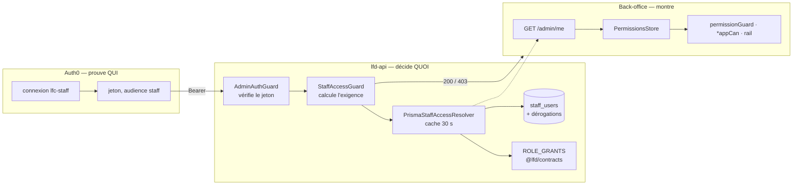
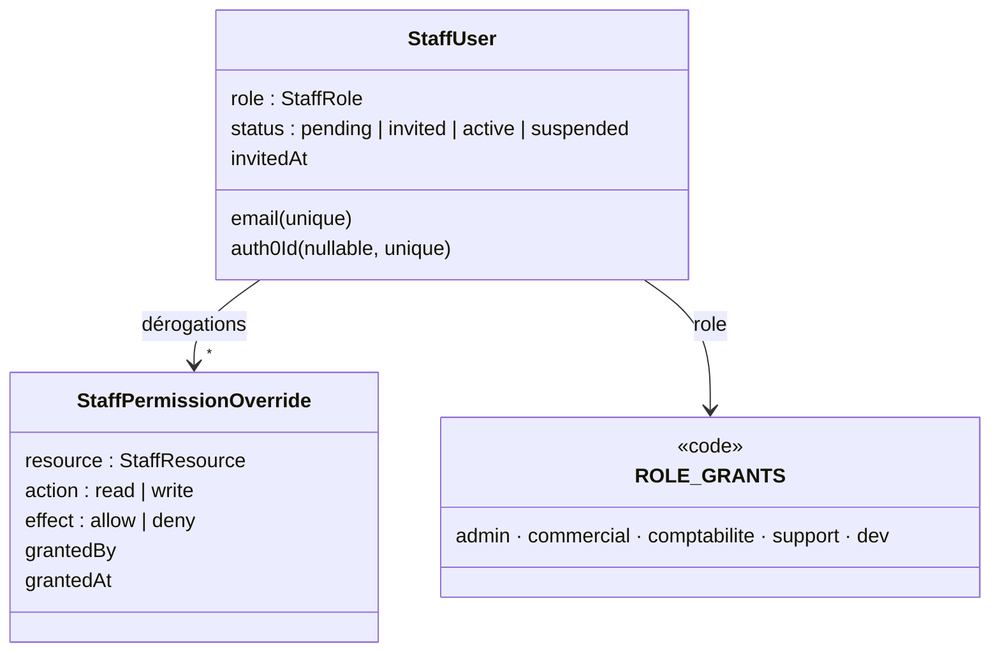
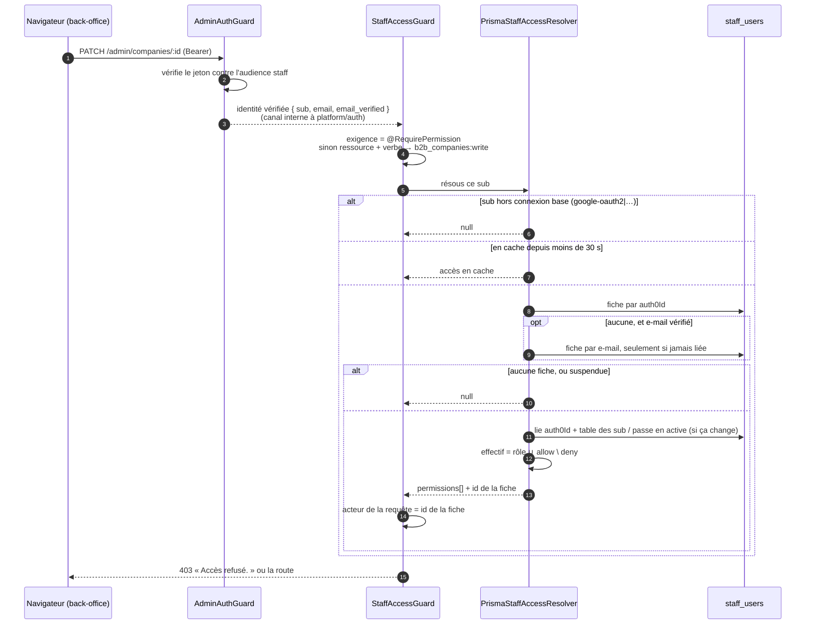
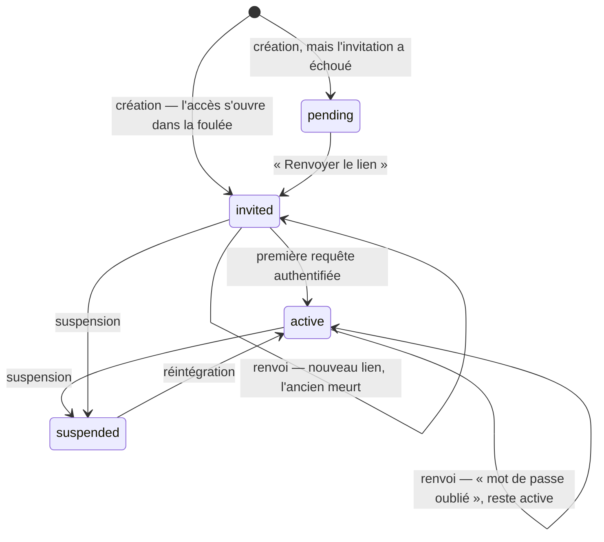
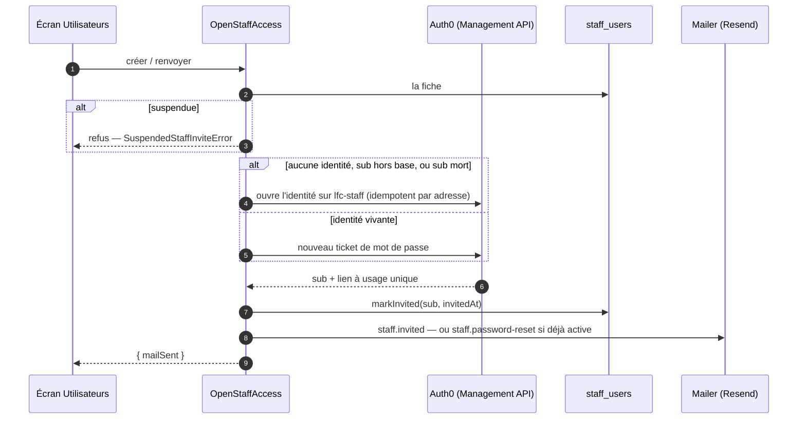

# Accès staff — qui, dans l'équipe, peut faire quoi

> **Ce document décrit le contrôle d'accès du back-office tel qu'il tourne.**
> Il répond à trois questions : qui fait partie de l'équipe (l'annuaire), ce que
> chacun peut faire (rôles, permissions, dérogations), et comment on entre
> (invitation, connexion Auth0, liaison de la fiche). Il dit aussi comment le
> système garantit qu'on ne peut jamais s'enfermer dehors.
>
> Tout ce qui est écrit au présent a été **vérifié contre le code le
> 2026-09-18**. Ce qui n'est pas fait, ou pas fait jusqu'au bout, est rangé au
> [§13](#s13), et nulle part ailleurs.
>
> Le pendant client — le mur `company_id`, la personne et la société — est dans
> [`../auth-inscription/architecture-identite-auth-tenancy.md`](../auth-inscription/architecture-identite-auth-tenancy.md).
> Le réglage du tenant Auth0 est dans [`../auth-inscription/auth0-setup.md`](../auth-inscription/auth0-setup.md).

## Table des matières

1. [En une page](#s1)
2. [Où vit l'annuaire](#s2)
3. [Le modèle : permission, rôle, dérogation](#s3)
4. [Les ressources](#s4)
5. [La matrice des rôles](#s5)
6. [Ne jamais pouvoir s'enfermer dehors](#s6)
7. [Comment une requête est autorisée](#s7)
8. [Le cycle de vie d'une fiche](#s8)
9. [L'invitation](#s9)
10. [Le front cache, le serveur refuse](#s10)
11. [Le poste de développement](#s11)
12. [Ce qui le prouve](#s12)
13. [Points en suspens](#s13)

---

<a id="s1"></a>

## 1. En une page



- **Auth0 prouve l'identité, jamais les droits.** Le jeton dit « ce porteur est
  ce `sub` » ; il ne porte ni rôle ni permission.
- **Les droits vivent en base et se relisent à chaque requête**, amortis par un
  cache de 30 s, **vidé à chaque écriture sur l'annuaire**. Retirer un accès
  prend effet à la requête suivante, pas à l'expiration du jeton.
- **Toute route `/admin/*` exige une fiche connue, non suspendue, et la bonne
  permission.** Tout ce qui manque donne `403`, jamais `200`.
- **L'écran ne consomme qu'un point, `GET /admin/me`**, et se déduit des
  permissions — jamais du rôle.

---

<a id="s2"></a>

## 2. Où vit l'annuaire

L'annuaire est le bloc **`src/staff/`** de `lfd-api`, le socle que les autres
blocs lisent pour l'autorisation. La matrice des blocs (CLAUDE.md §3) en tient la
frontière : `pim`, `b2b`, `production` et `handover` lisent `staff` pour
l'autorisation, `staff` ne lit aucun d'eux.

| Sous-dossier           | Ce qu'il porte                                                                                     |
| ---------------------- | -------------------------------------------------------------------------------------------------- |
| `staff/directory/`     | les fiches, `GET /admin/me`, l'admin racine (`bootstrap-admin.ts`)                                 |
| `staff/permissions/`   | la politique anti-verrouillage (`staff-access.policy.ts`), le résolveur d'accès, les rôles en base |
| `staff/invitations/`   | l'ouverture d'accès (`OpenStaffAccess`), la file des accès à remettre à la main                    |
| `staff/notifications/` | la cloche et les notifications poussées du back-office                                             |
| `platform/auth/`       | les deux gardes, les décorateurs `@AdminSurface`, `@RequirePermission`, `@AdminSelfSurface`        |
| `@lfd/contracts`       | `staff-access.ts` (ressources, `ROLE_GRANTS`, résolution) et `staff-role.ts` (rôles en base)       |

`platform/auth` déclare le port `StaffAccessResolver` ; `staff/permissions` en
fournit l'adaptateur ; `appBootstrap/staff-access.module.ts` les relie.
`platform` ne connaît donc pas l'annuaire.

---

<a id="s3"></a>

## 3. Le modèle : permission, rôle, dérogation



### Permission — `ressource:action`

L'unité atomique, écrite `b2b_orders:write`. L'action vaut `read` ou `write`,
jamais autre chose. **`write` implique `read`** : on ne modifie pas ce qu'on ne
voit pas.

### Rôle — un paquet nommé de permissions

Cinq rôles : `admin`, `commercial`, `comptabilite`, `support`, `dev`. Une fiche
en porte **un seul** (colonne `role`, enum `StaffRole`). Ce que chacun ouvre est
défini dans le code, par `ROLE_GRANTS` (`packages/contracts/src/staff-access.ts`) :
typé, testé, relu en revue avec les écrans qu'il gouverne.

### Dérogation — un écart par personne

Par couple (ressource, action) : pas de ligne (hérite du rôle), `allow` ou
`deny`. C'est la réponse au besoin du terrain — « commercial, **mais** gère aussi
les relances », « commerciale, **sauf** les prospects » — sans inventer un rôle
par personne.

Chaque dérogation porte **`grantedByStaffId`** — l'id de la fiche de l'auteur,
jamais son `sub` Auth0 — et `grantedAt`. Une édition de fiche n'écrit que ce qui
change : une dérogation inchangée garde son auteur et sa date. L'ancienne
colonne `grantedBy`, qui stockait le `sub`, est supprimée par la migration
`20260918140000_retrait_du_sub_des_derogations`.

### La formule

```
effectif = permissions(rôle) ∪ dérogations.allow \ dérogations.deny
```

Elle est pure (`resolveStaffPermissions`, sans base, sans réseau, sans horloge),
et deux implications s'y propagent :

- **autoriser l'écriture autorise la lecture** ;
- **refuser la lecture refuse l'écriture** — sinon on garderait le droit de
  modifier une page qu'on n'a pas le droit d'ouvrir.

**Le refus l'emporte toujours.** Si deux dérogations visent la même permission,
`dedupeStaffOverrides` garde le refus, quel que soit l'ordre d'arrivée.

---

<a id="s4"></a>

## 4. Les ressources

Vingt-trois ressources. Chacune porte en préfixe **l'outil** auquel elle
appartient, c'est-à-dire le bloc de `src/` : la frontière d'architecture est
lisible dans la permission elle-même. Le séparateur est un tiret bas, parce que
Prisma refuse le point dans une valeur d'enum et que le deux-points sépare déjà
ressource et action.

| Outil            | Ressource             | Ce qu'elle couvre                                                                                    |
| ---------------- | --------------------- | ---------------------------------------------------------------------------------------------------- |
| **référentiel**  | `pim_catalog`         | les fiches produit, familles, collections                                                            |
|                  | `pim_channels`        | ce qui **sort** du référentiel : publication, Shopify, la boutique, les révisions                    |
|                  | `pim_settings`        | les réglages du référentiel                                                                          |
|                  | `pim_tax`             | la fiscalité : régimes de TVA, règles comptables                                                     |
| **commerce**     | `b2b_companies`       | les comptes clients                                                                                  |
|                  | `b2b_orders`          | les commandes, la saisie assistée, le retrait au comptoir                                            |
|                  | `b2b_subscriptions`   | les abonnements                                                                                      |
|                  | `b2b_catalog`         | le catalogue **vendu** : prix négocié, masquage, mise en avant                                       |
|                  | `b2b_pricing`         | la tarification : règles, planchers, gabarits, engagements                                           |
|                  | `b2b_growth`          | le cockpit commercial, prospects, marché                                                             |
|                  | `b2b_appointments`    | disponibilités et rendez-vous                                                                        |
|                  | `b2b_support`         | les demandes des clients                                                                             |
|                  | `b2b_payments`        | le mandat SEPA **d'un client**                                                                       |
|                  | `b2b_accounting`      | **notre** identité d'émetteur : entités, identifiant créancier, compte qui reçoit l'argent           |
|                  | `b2b_alerts`          | les alertes, de compte et globales                                                                   |
|                  | `b2b_order_waivers`   | les dérogations d'heure limite — accepter une commande en retard                                     |
|                  | `b2b_feature_access`  | ouvrir, fermer ou mettre en vitrine la boutique                                                      |
|                  | `b2b_client_notes`    | les notes photo du commercial sur un compte                                                          |
|                  | `b2b_settings`        | les réglages du commerce : zones, points de retrait, contenu                                         |
| **socle**        | `staff_access`        | l'annuaire, les invitations, les rôles — **le droit qui permet de se donner tous les autres**        |
|                  | `staff_notifications` | la cloche du back-office                                                                             |
| **exploitation** | `ops_health`          | la carte de santé                                                                                    |
| _aucun_          | `activity`            | le journal d'activité, qui traverse tous les outils — seule exception au préfixe, écrite comme telle |

Chaque découpe a sa raison, écrite au-dessus de la valeur dans le contrat.
Les trois qui comptent le plus :

- **`pim_catalog` / `pim_channels`** : éditer une fiche et la diffuser à tous les
  canaux sont deux décisions ; la seconde est irréversible pour le client.
- **`pim_catalog` / `b2b_catalog`** : l'un dit ce qui existe, l'autre ce qu'on
  vend et à quel prix. Un commercial touche le second sans jamais toucher le
  premier.
- **`b2b_payments` / `b2b_accounting`** : reporter le RIB d'un client est un geste
  quotidien ; changer le compte qui reçoit l'argent de l'entreprise est la cible
  numéro un de la fraude au virement.

`admin/recompute` est hors du modèle : c'est le cron Cloudflare, gardé par son
propre `RecomputeGuard`, et aucune personne ne s'y authentifie.

---

<a id="s5"></a>

## 5. La matrice des rôles

`w` = lecture et écriture · `r` = lecture · `—` = aucun accès. Source :
`ROLE_GRANTS`.

| Ressource             | `admin` | `commercial` | `comptabilite` | `support` | `dev` |
| --------------------- | ------- | ------------ | -------------- | --------- | ----- |
| `pim_catalog`         | w       | r            | r              | —         | r     |
| `pim_channels`        | w       | —            | —              | —         | —     |
| `pim_settings`        | w       | —            | —              | —         | —     |
| `pim_tax`             | w       | r            | **w**          | —         | r     |
| `b2b_companies`       | w       | w            | r              | r         | —     |
| `b2b_orders`          | w       | w            | w              | r         | —     |
| `b2b_subscriptions`   | w       | w            | r              | r         | —     |
| `b2b_catalog`         | w       | **w**        | r              | —         | —     |
| `b2b_pricing`         | w       | **w**        | r              | —         | —     |
| `b2b_growth`          | w       | w            | —              | —         | —     |
| `b2b_appointments`    | w       | w            | —              | w         | —     |
| `b2b_support`         | w       | w            | —              | w         | —     |
| `b2b_payments`        | w       | r            | w              | —         | —     |
| `b2b_accounting`      | w       | —            | **w**          | —         | —     |
| `b2b_alerts`          | w       | w            | —              | —         | —     |
| `b2b_order_waivers`   | w       | w            | —              | —         | —     |
| `b2b_feature_access`  | w       | r            | —              | —         | —     |
| `b2b_client_notes`    | w       | w            | —              | —         | —     |
| `b2b_settings`        | w       | r            | r              | —         | r     |
| `staff_access`        | w       | —            | —              | —         | —     |
| `staff_notifications` | w       | w            | w              | w         | w     |
| `ops_health`          | w       | —            | —              | —         | r     |
| `activity`            | w       | —            | —              | —         | —     |

Les choix qui ne se devinent pas :

- **`admin` couvre tout, sans trou** — y compris `activity:write`, qu'aucune
  route ne vérifie : un test exige qu'il n'y ait aucune ressource hors de sa
  portée.
- **`staff_access` n'est ouvert qu'à `admin`.** Accorder des droits est le seul
  geste qui permet de s'en accorder.
- **`dev` ne lit pas les données clients.** Un rôle technique qui voit tout est
  un `admin` qui n'ose pas dire son nom ; le diagnostic ponctuel passe par une
  dérogation, qui laisse une trace.
- **`comptabilite` écrit `pim_tax` mais pas `pim_channels`.** Un taux de TVA est
  une décision comptable ; le pousser vers un canal reste un geste de catalogue.
- **`commercial` écrit `b2b_catalog` et `b2b_pricing`** : négocier un prix et
  valider ce qui entre en vente sont ses deux gestes.
- **`commercial` lit `b2b_feature_access` sans l'écrire** : il doit pouvoir dire
  à un client si la boutique est ouverte, pas l'ouvrir.
- **`staff_notifications` est ouvert à tous** : la cloche n'est pas un
  privilège, c'est la façon dont on apprend qu'il s'est passé quelque chose.

---

<a id="s6"></a>

## 6. Ne jamais pouvoir s'enfermer dehors

Un système de permissions peut échouer de façon spectaculaire : fonctionner
parfaitement, et enfermer tout le monde dehors. Cinq garde-fous l'empêchent,
tous **dans le domaine** (`staff/permissions/staff-access.policy.ts`), testés
sans base ni HTTP.

| Garde-fou                                                                                            | Où                                                     | Erreur                      |
| ---------------------------------------------------------------------------------------------------- | ------------------------------------------------------ | --------------------------- |
| **L'admin racine** est semé au démarrage s'il manque, ineffaçable, non rétrogradable, non renommable | `bootstrap-admin.ts`, `assertEdit/StatusChangeAllowed` | `ProtectedStaffUserError`   |
| **Il reste toujours au moins un admin actif** — vérifié à l'édition et à la suspension               | la même politique                                      | `LastStaffAdminError`       |
| **On ne se retire pas son propre `admin`**, ni en se rétrogradant, ni en se suspendant               | la même politique                                      | `SelfDemotionError`         |
| **Une dérogation n'ouvre jamais `staff_access`** à qui son rôle ne l'ouvre pas                       | `assertOverridesAllowed` (via `assertEditAllowed`)     | `StaffGrantByOverrideError` |
| **Une dérogation ne ferme jamais `staff_access`** à un administrateur                                | la même                                                | `AdminOverrideRefusedError` |

Les deux dernières gardent la même chose par les deux bouts : **l'annuaire ne
s'ouvre ni ne se ferme par un écart.** L'ouvrir par dérogation permettrait de
s'attribuer `admin` dans la foulée ; le fermer contournerait « au moins un
admin » par la porte de derrière.

L'admin racine est désigné par `BOOTSTRAP_ADMIN_EMAIL` (défaut
`dev@lafoliedouce.com`). Si son semis échoue au démarrage — le cas courant est
une migration non appliquée —, l'API démarre quand même, et l'échec est publié
en `error` dans le bulletin de démarrage (`platform/startup/`), avec sa cause
probable.

---

<a id="s7"></a>

## 7. Comment une requête est autorisée

Un contrôleur admin se déclare par **un seul décorateur**, `@AdminSurface(ressource)`,
qui monte ensemble les trois pièces qu'on ne doit jamais séparer : il désarme le
garde client global, arme `AdminAuthGuard` et arme `StaffAccessGuard`.
Chaque contrôleur `/admin/*` le porte, sauf `GET /admin/me` (`@AdminSelfSurface`,
§ ci-dessous) et le cron (`RecomputeGuard`).



**L'exigence se calcule avant de résoudre**, dans cet ordre :

1. une permission déclarée par `@RequirePermission` sur la route l'emporte — pour
   un `POST` qui ne fait que chercher, par exemple ;
2. sinon, `@AdminSelfSurface` (seul `GET /admin/me` le porte) n'exige aucune
   permission : il faut pouvoir apprendre qu'on n'en a aucune ;
3. sinon, la ressource de `@AdminSurface` et le verbe : `GET`, `HEAD`, `OPTIONS`
   demandent `read`, tout le reste `write`.

**Fail-closed sur trois plans** : pas d'identité staff sur la requête, pas de
ressource déclarée, ou fiche inconnue ou suspendue — chaque cas donne `403`. Le
message ne distingue pas l'inconnu du non-autorisé.

**Le `sub` ne dépasse pas l'authentification.** `AdminAuthGuard` vérifie le
jeton et remet l'identité à `StaffAccessGuard` par un canal interne à
`platform/auth/` (`verified-staff-identity.ts`) ; une fois la fiche résolue, la
requête ne porte plus que `access`, et **l'acteur de la requête est l'id de la
fiche** — c'est lui que le journal et toutes les colonnes d'auteur écrivent
(plan [`plan-l-auteur-est-la-fiche.md`](plan-l-auteur-est-la-fiche.md), déployé
le 2026-09-18). Aucun contrôleur ne peut lire un `sub` : `@StaffSub()` n'existe
plus, et `@StaffUserId()` est le seul moyen de nommer l'auteur. Une requête
refusée n'attache aucun acteur.

**Chaque `sub` qu'une fiche a porté est gardé** dans `staff_subject_aliases` :
la liaison (`markInvited`, le rapprochement ci-dessous) y ajoute le sien dans la
même écriture. C'est ce qui permet de nommer un acte écrit sous un `sub`
ancien, et de filtrer le journal par personne sans couper son histoire.

**Le rapprochement par e-mail ne vole jamais une fiche.** Il ne sert qu'à une
fiche **jamais liée**, et seulement si le jeton atteste une adresse **vérifiée**
(claim `email_verified` posé par l'Action `add-email-claim`). La liaison est
conditionnée en base (`auth0Id IS NULL`) : deux premières connexions simultanées
ne se disputent pas la fiche.

**Le staff n'entre pas par un réseau social.** Un `sub` hors de la connexion base
de données (`google-oauth2|…`) est refusé, même lié. Google est aussi coupé sur
l'application admin du tenant ; ce refus tient si ce réglage se perd.

**Ce qui sépare un client d'un membre de l'équipe est l'audience du jeton**, pas
ce résolveur : un jeton client ne passe pas `AdminAuthGuard`. La connexion
`lfc-staff`, seule activée sur l'application du back-office, ferme la porte plus
tôt encore, chez Auth0.

Contraste délibéré avec le client : un `sub` client inconnu est **provisionné**
(zéro friction) ; un `sub` staff inconnu est **refusé**. On ne rejoint pas
l'équipe en se connectant.

---

<a id="s8"></a>

## 8. Le cycle de vie d'une fiche



Pas d'état final : **une fiche ne se supprime plus** (§13.2).

- **La fiche précède le compte.** `pending` est l'état par défaut : créer
  quelqu'un ne lui ouvre aucune porte tant que l'invitation n'est pas partie.
- **L'invitation lie déjà la fiche** : `markInvited` écrit le `sub` rendu par
  Auth0 dans `auth0Id` et passe la fiche en `invited`.
- **L'entrée se constate, elle ne se déclare pas.** La première requête
  authentifiée passe la fiche en `active`.
- **`suspended` ferme tout, immédiatement** — le cache est vidé à l'écriture —,
  sans rien détruire. Seuls `active` et `suspended` se posent à la main
  (`PATCH /admin/staff-users/:id/status`) ; les autres transitions se constatent.
- **« Invitation expirée » n'est pas un état** : c'est un drapeau calculé à la
  lecture (`invitationExpired`), sept jours après `invitedAt` — la durée de vie
  du lien, dont la règle est dérivée
  (`platform/shared/invitation/invitation-expiry.ts`, partagé avec l'invitation
  client).

---

<a id="s9"></a>

## 9. L'invitation

Créer une fiche **ouvre l'accès dans la foulée** (`CreateStaffUserHandler` appelle
`OpenStaffAccess`). `POST /admin/staff-users/:id/invitation` sert à **renvoyer** :
inviter et renvoyer sont le même geste, et le serveur sait lequel s'applique.



- **Le lien est frappé avant toute écriture.** L'ordre inverse laisserait une
  fiche annonçant une invitation que personne n'a reçue.
- **Le lien ne sort que par l'adresse de la fiche** : ni journal, ni réponse HTTP,
  ni écran de celui qui invite. Il vaut prise de contrôle du compte.
- **`mailSent` dit si c'est vraiment parti.** Sans clé Resend, le mailer tourne
  à blanc et `mailSent` vaut `false` — l'écran n'annonce pas un envoi qu'il n'a
  pas constaté.
- **Le gabarit suit l'état, pas le geste** : « bienvenue dans l'équipe » à une
  personne déjà active ressemblerait à un hameçonnage.
- **L'échec de l'invitation ne défait jamais la fiche.** Si Auth0 ou le courrier
  tombe, la personne existe, en `pending`, et « Renvoyer le lien » reprend la main.
- **Une personne suspendue ne s'invite pas** : suivre le lien vaut entrée, et
  rouvrirait la porte que la suspension vient de fermer. Réintégrer d'abord.
- **Le renvoi est aussi la sortie de secours d'une fiche mal liée** — un `sub`
  supprimé chez Auth0, ou un membre entré par Google avant le 2026-09-17 : on
  rouvre l'identité par l'adresse, et `markInvited` relie la fiche.

**Quand le courrier ne peut pas partir**, `GET /admin/staff-access-pending` liste
les accès à remettre à la main, et `POST …/:staffUserId/link` fabrique un lien
neuf, rendu dans la réponse seulement. C'est un `POST` parce qu'il crée un
porteur de droits, qu'un `GET` ferait précharger et mettre en cache.

L'identité passe par `Auth0IdentityGateway` (`platform/identity/`), partagée avec
le client, la connexion étant un paramètre. Les droits de l'application M2M sont
dans [`../auth-inscription/auth0-setup.md`](../auth-inscription/auth0-setup.md) §6.

---

<a id="s10"></a>

## 10. Le front cache, le serveur refuse

Deux murs, et un seul fait autorité : **le serveur refuse** (`StaffAccessGuard`),
**l'écran cache**. Un écran qui ment ne donne rien : le refus arrive quand même.

- **`GET /admin/me`** rend `StaffMeView` : identité, `role`, `permissions`,
  préférences de navigation. C'est le seul point par lequel un écran apprend ce
  qu'il peut montrer. Le `role` n'y est que pour être affiché.
- **`PermissionsStore`** (`auth/permissions.store.ts`) le charge une fois et
  expose `can(permission)`. Un backend qui ne connaît pas la personne donne l'état
  `denied`, distinct d'une erreur de chargement, pour pouvoir le dire à l'écran.
- **`permissionGuard(permission)`** garde les routes et **redirige** vers la
  première destination autorisée plutôt que de laisser une page vide. Il porte
  sa permission, ce qui rend la table des routes relisable.
- **`*appCan="'b2b_companies:write'"`** (`shared/can/can.directive.ts`) fait
  **disparaître** une affordance qu'on ne peut pas exercer, au lieu de la griser.
  Les écrans qui ont besoin d'une condition plus riche lisent `permissions.can()`
  dans un `@if`.
- **Le rail de navigation** filtre ses entrées sur leur permission (`needs`).

**Aucun écran ne lit le rôle pour décider.** Le rôle produit des permissions ;
seule la permission répond. Le jour où une dérogation ouvre `b2b_growth` à
quelqu'un, le menu suit sans qu'on y touche.

---

<a id="s11"></a>

## 11. Le poste de développement

`AUTH_ADMIN_DEV_BYPASS=true` (ou `AUTH_DEV_IMPERSONATE=true`) fait sauter la
vérification du jeton : `AdminAuthGuard` pose une identité synthétique, `sub`
`dev-staff`, **avec l'adresse de l'admin racine** et `email_verified: true`. La
résolution emprunte alors le chemin normal : rapprochement par adresse, liaison
de la fiche racine à `dev-staff`, puis accès par ce `sub`.

Le démarrage **échoue** si l'un de ces drapeaux est actif avec
`NODE_ENV=production`. Côté front, `DEV_BYPASS_AUTH` n'est lu que dans le `.env`
local : une build déployée ne peut pas l'atteindre.

---

<a id="s12"></a>

## 12. Ce qui le prouve

| Niveau                 | Où                                                                                                      | Ce qui est éprouvé                                                                                 |
| ---------------------- | ------------------------------------------------------------------------------------------------------- | -------------------------------------------------------------------------------------------------- |
| contrat                | `packages/contracts/src/__tests__/`                                                                     | la formule, les implications, `admin` sans trou, le dédoublonnage des dérogations                  |
| domaine                | `staff/permissions/__tests__/staff-access.policy.spec.ts`                                               | les cinq garde-fous du §6                                                                          |
| adaptateur             | `staff/permissions/__tests__/prisma-staff-access.resolver.spec.ts`                                      | liaison, e-mail vérifié, fiche déjà liée, sub social, cache                                        |
| gardes                 | `platform/auth/__tests__/`                                                                              | exigence, surface réflexive, fail-closed, bypass                                                   |
| e2e (vraie base, HTTP) | `test/staff-access`, `staff-lockout`, `staff-invitation`, `staff-roles`, `staff-journal` `.e2e-spec.ts` | la matrice rôle × surface, la porte de secours, le parcours d'invitation, la trace de chaque geste |

**`LastStaffAdminError` ne s'atteint pas par HTTP, et ce n'est pas un défaut.**
Pour appeler la route il faut `staff_access:write`, donc être `admin` ; il reste
alors toujours au moins un autre administrateur vivant, et l'auto-rétrogradation
tombe d'abord. La garde protège du script ou de la reprise de données qui
appellerait le dépôt directement — c'est là qu'elle est éprouvée. Un test HTTP
serait vert pour une autre raison que celle annoncée.

---

<a id="s13"></a>

## 13. Points en suspens

### 13.1 🔴 Les rôles édités à l'écran ne sont lus par aucune décision d'accès

L'écran **Admin › Rôles** (`admin/roles`, routes `admin/staff-roles`) crée,
modifie, archive des rôles dans `staff_role_definitions`, et affiche `superadmin`
en tête. **Le résolveur ne lit pas cette table** : il appelle
`resolveStaffPermissions(row.role, …)`, c'est-à-dire l'enum `role` et
`ROLE_GRANTS` du code (vérifié le 2026-09-18).

C'est l'étape « étendre » d'une bascule en trois temps, et la migration
`20260901140000_roles_definis` le dit : la table existe et se remplit, personne
ne la lit. Il manque « basculer » — une colonne de clé de rôle sur la fiche, le
résolveur qui lit `staff_role_definitions` via `resolveRolePermissions` — puis
« resserrer ».

Conséquences tant que ce n'est pas fait :

- **modifier un rôle à l'écran n'a aucun effet** sur ce que les gens peuvent
  faire — le défaut que ce document décrivait en août sous le nom de « mur peint
  sur le sol » ;
- **un rôle créé à l'écran ne peut être porté par personne** : la fiche n'accepte
  que les cinq valeurs de l'enum ;
- **`superadmin` n'est attribuable à personne**, faute de pouvoir l'écrire sur une
  fiche.

À trancher : finir la bascule, ou retirer l'éditeur de l'écran jusqu'à ce
qu'elle soit faite. En attendant, les commentaires de `staff-role.ts` et de la
table décrivent un état qui n'est pas celui du résolveur.

### 13.2 Le départ d'un membre n'a pas encore son geste

**La suppression n'existe plus** depuis le 2026-09-18 :
`DELETE /admin/staff-users/:id` répond `409` (`StaffUserRemovalRetiredError`)
et l'écran n'a plus de bouton « Supprimer ». Une fiche porte l'auteur de tout
ce que la personne a fait ; la supprimer l'aurait effacé.

Ce qui manque : **un départ définitif**. Aujourd'hui, se séparer de quelqu'un,
c'est le suspendre. L'état `departed`, « Passer le relais » sur une adresse de
fonction et « Faire revenir » sont en plan :
[`plan-depart-et-adresses-de-fonction.md`](plan-depart-et-adresses-de-fonction.md)
(v3, à valider).

### 13.3 Le bypass de dev sur une base clonée de la production

Le bypass rapproche `dev-staff` de l'admin racine par l'adresse — ce qui ne vaut
que pour une fiche **jamais liée** (règle du 2026-09-17). Sur une base clonée
de la production (`db:dev:clone`), l'admin racine est déjà lié à un vrai `sub` :
le bypass rend alors `403`. Non constaté à l'écran ; déduit du code.

### 13.4 Non tranché, volontairement

- **Les groupes** — accorder à une équipe plutôt qu'à une personne. Prématuré
  tant qu'on compte l'équipe sur une main.
- **Les dérogations datées** — une date de fin, pour le diagnostic ponctuel de
  `dev`. Une colonne et un balayage de plus, au premier besoin réel.
- **Le MFA staff** — il appartient à la connexion Auth0, pas à ce modèle.

### Refermé le 2026-09-18

- **Qui a invité, créé, suspendu : rien ne le disait.** Chaque geste de
  l'annuaire et des rôles écrit désormais son fait au journal, **dans la même
  transaction** que le geste — module « Équipe », phrases humaines à l'écran
  (« Hugo Heynard a créé Cécile Martin, Commercial »). Les dérogations désignent
  leur auteur par l'id de sa fiche, et ne sont plus réécrites quand elles ne
  changent pas. Plan et limites :
  [`journalisation-staff/architecture-journal-de-l-annuaire.md`](journalisation-staff/architecture-journal-de-l-annuaire.md).

- **L'invitation affichée valable 14 jours sur un lien qui en vit 7.** La règle
  (`invitation-expiry.ts`) est désormais **dérivée** de la durée de vie du lien
  (`PASSWORD_TICKET_TTL_SECONDS`) : 7 jours, comme les e-mails l'annonçaient
  déjà. Un test échoue si les deux divergent. Le balayage qu'un commentaire
  promettait n'existe pas et n'a pas à exister : le lien se révoque seul chez
  Auth0.
- **Les commentaires qui parlaient d'un « futur backend IAM »** (`StaffMeView`,
  `GET /admin/me`, `PermissionsStore`) : ce backend est abandonné (§2), la
  couture est gardée pour sa vraie raison.
- **Ce qui se vérifie hors du dépôt — vérifié par Hugo** : le parcours Auth0 réel
  de bout en bout, `lfc-staff` activée sur la seule application du back-office
  avec Google coupé, `BOOTSTRAP_ADMIN_EMAIL` sur une boîte relevée. Sortie de
  secours si tout se ferme : poser `auth0_id` à la main sur la ligne racine.
