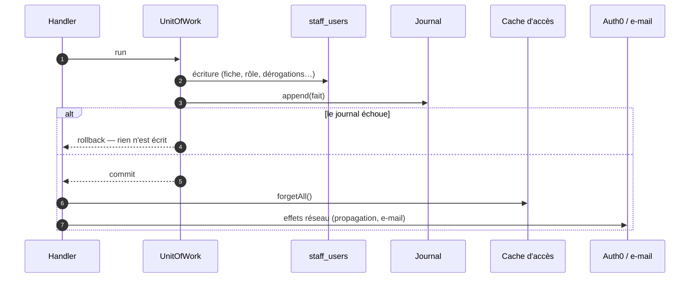

# Le journal de l'annuaire staff — qui a fait quoi sur l'équipe

> **Ce document décrit la journalisation de l'annuaire staff telle qu'elle
> tourne en production depuis le 2026-09-18.** Chaque geste sur une fiche de
> l'équipe ou sur un rôle écrit un fait au journal d'activité, dans la même
> transaction que le geste ; l'écran Journal du back-office le rend en phrase
> (« Hugo Heynard a créé Cécile Martin, Commercial »). L'auteur d'un droit
> individuel est l'identifiant de sa fiche, jamais son `sub` Auth0.
>
> Écrit au présent, **vérifié contre le code le 2026-09-18**. Ce qui est en
> construction ou reste ouvert est au [§9](#s9), et nulle part ailleurs.
>
> Il est né d'un plan, écrit puis contredit par `vitruve` le même jour ; son
> texte d'origine se relit par
> `git show 9420feb0:documentation/auth-inscription/plan-journal-de-l-annuaire.md`.
> Le modèle d'accès lui-même — rôles, dérogations, invitation — est dans
> [`../architecture-acces-staff.md`](../architecture-acces-staff.md).

## Table des matières

1. [Ce qui s'écrit au journal](#s1)
2. [Dans la transaction du geste](#s2)
3. [La charge utile de chaque fait](#s3)
4. [L'auteur d'un geste](#s4)
5. [L'écran Journal](#s5)
6. [Les dérogations ne se réécrivent plus](#s6)
7. [Ce qui le prouve](#s7)
8. [Comment on en est arrivé là](#s8)
9. [En cours, et ce qui reste ouvert](#s9)

---

## 1. Ce qui s'écrit au journal

Les types vivent dans `staff/directory/domain/staff-facts.ts` (`STAFF_FACTS`) et
`staff/permissions/domain/staff-role-facts.ts`, sur le modèle d'`ACCOUNT_FACTS`.
Ils se rangent dans le module **« Équipe »** du journal, par leurs préfixes
`staff_user.` et `staff_role.` (`b2b/growth/domain/activity-module.ts`).

| Type                                | Le geste                                                   | Sujet              |
| ----------------------------------- | ---------------------------------------------------------- | ------------------ |
| `staff_user.created`                | une fiche est créée                                        | `staff_user` / id  |
| `staff_user.invited`                | un lien d'accès part — invitation, ou nouveau mot de passe | `staff_user` / id  |
| `staff_user.password_link_issued`   | un lien est fabriqué pour être remis à la main             | `staff_user` / id  |
| `staff_user.identity_edited`        | nom, prénom, e-mail, téléphone ou fonction changent        | `staff_user` / id  |
| `staff_user.role_changed`           | le rôle change                                             | `staff_user` / id  |
| `staff_user.overrides_changed`      | les droits individuels changent                            | `staff_user` / id  |
| `staff_user.suspended`              | l'accès est suspendu                                       | `staff_user` / id  |
| `staff_user.reinstated`             | l'accès est rétabli                                        | `staff_user` / id  |
| `staff_user.deleted`                | la fiche est supprimée                                     | `staff_user` / id  |
| `staff_role.created`                | un rôle est créé à l'écran                                 | `staff_role` / clé |
| `staff_role.updated`                | ses droits ou son libellé changent                         | `staff_role` / clé |
| `staff_role.archived` / `.restored` | il est archivé, ou restauré                                | `staff_role` / clé |

**Un fait par changement réel.** Une édition de fiche qui ne change rien n'écrit
rien ; une édition qui change l'identité, le rôle et les dérogations en écrit
trois, chacune le sien. La clé d'idempotence (`type:subjectId:traceId`) les
distingue par leur type.

**La porte le tient.** `dev-toolbox/gates/journal-tracked.mjs` couvre
`apps/lfd-api/src/staff/` : un handler de l'annuaire qui écrit sans `Journal` et
sans `UnitOfWork` échoue en CI, sauf dérogation `@sans-journal` motivée (les
préférences d'affichage, la lecture d'une notification).

---

## 2. Dans la transaction du geste

Chaque fait s'écrit dans le **même `uow.run`** que l'écriture qu'il décrit
(`platform/database/unit-of-work.ts`) : une panne du journal annule le geste. Les
appels réseau — Auth0, e-mail — restent **hors** de la transaction, après le
commit.

Ce que ce placement garantit, geste par geste :

| Geste                      | Dans la transaction             | Après le commit                  | Si le journal tombe                                            |
| -------------------------- | ------------------------------- | -------------------------------- | -------------------------------------------------------------- |
| Création                   | la fiche + `created`            | ouverture de l'accès             | la fiche n'existe pas                                          |
| Invitation, renvoi         | `markInvited` + `invited`       | l'e-mail                         | **aucun e-mail ne part** ; un nouvel essai frappe un lien neuf |
| Édition                    | l'écriture locale + ses faits   | propagation de l'adresse à Auth0 | rien n'est modifié                                             |
| Suspension, rétablissement | le changement d'état + son fait | l'e-mail à la personne           | la porte ne bouge pas                                          |
| Suppression                | la suppression + `deleted`      | —                                | la fiche reste                                                 |

- **Le cache d'accès se vide après le commit**, jamais dedans : vidé avant, une
  requête concurrente le remplirait avec l'état d'avant, et une suspension
  mettrait 30 s à mordre. Il mord ainsi à la requête suivante.
- **Le lien d'accès est frappé chez Auth0 avant la transaction** : si le journal
  tombe ensuite, Auth0 a déjà invalidé le lien précédent. Un nouvel essai en
  frappe un autre.
- **La première entrée** (`invited → active`, constatée par le résolveur d'accès
  à chaque requête) n'est pas journalisée.

---

## 3. La charge utile de chaque fait

Des **libellés figés**, pas des clés : une fiche supprimée ou un rôle renommé
demain ne change pas la phrase d'hier. `Person = { firstName, lastName }` ;
`Grant = { resource, resourceLabel, action }` ; `Override = Grant & { effect }`.

| Type                                   | Charge utile                                                                                                                                                                                                               |
| -------------------------------------- | -------------------------------------------------------------------------------------------------------------------------------------------------------------------------------------------------------------------------- |
| `staff_user.created`                   | `{ person, roleLabel }`                                                                                                                                                                                                    |
| `staff_user.invited`                   | `{ person, kind: "invitation" \| "password_reset" }`                                                                                                                                                                       |
| `staff_user.password_link_issued`      | `{ person }` — **jamais le lien**                                                                                                                                                                                          |
| `staff_user.identity_edited`           | `{ person, previous: Person \| null, fields: string[], changes: { field, label, from, to }[] }` — chaque champ modifié avec sa valeur avant et après ; `fields` et `previous` restent pour les faits d'avant le 2026-09-18 |
| `staff_user.role_changed`              | `{ person, fromLabel, toLabel }`                                                                                                                                                                                           |
| `staff_user.overrides_changed`         | `{ person, added: Override[], removed: Override[], changed: Override[] }`                                                                                                                                                  |
| `staff_user.suspended` / `.reinstated` | `{ person }`                                                                                                                                                                                                               |
| `staff_user.deleted`                   | `{ person, roleLabel }` — la seule trace qui survit à la fiche                                                                                                                                                             |
| `staff_role.created`                   | `{ label, grants: Grant[] }`                                                                                                                                                                                               |
| `staff_role.updated`                   | `{ label, previousLabel: string \| null, added, removed, changed }`                                                                                                                                                        |
| `staff_role.archived` / `.restored`    | `{ label }`                                                                                                                                                                                                                |

**L'avant/après est complet, e-mail compris** (Hugo, 2026-09-18 : « c'est
important qu'on ait la trace complète sur les events »). C'est une entorse
assumée à la réserve d'origine : le journal est derrière le droit `activity`,
l'annuaire derrière `staff_access`, et quelqu'un qui aurait le premier sans le
second lit désormais l'ancienne et la nouvelle adresse. Les liens d'accès et les
`sub`, eux, ne sortent jamais.

Les libellés viennent du contrat (`STAFF_ROLE_LABELS`, `STAFF_RESOURCE_LABELS`)
pour la fiche, et **de la base** pour un rôle défini à l'écran — « Logistique »
n'existe pas dans le contrat.

La charge n'est pas un type partagé : l'API la construit, l'écran la relit
défensivement (`admin/journal/staff-line.ts`). Ce tableau est le seul contrat
écrit entre les deux.

---

## 4. L'auteur d'un geste

- **Dans le journal**, l'auteur est l'acteur du contexte de requête : son nom et
  sa fonction sont **figés à l'écriture** (`actor_name`, `actor_role`, par
  `PrismaActorNamer`) — le journal dit qui a agi ce jour-là et à quel titre.
  `actor_id` porte encore le `sub` Auth0 pour un acte staff : c'est le chantier
  ouvert au §9.
- **Sur un droit individuel**, l'auteur est `granted_by_staff_id` — l'id de la
  **fiche** de l'auteur, lu par `@StaffUserId()`, **sans clé étrangère** (une
  fiche se supprime, sa trace doit survivre), comme `grantedByStaffId` des
  dérogations d'heure limite. L'ancienne colonne `granted_by`, qui stockait le
  `sub`, est supprimée (`20260918140000_retrait_du_sub_des_derogations`).
- **Les droits individuels d'avant le 2026-09-18** ont reçu la fiche de leur
  dernier éditeur par rétro-remplissage (`20260918100000_…`) : avant, chaque
  édition réattribuait toutes les dérogations d'une fiche à celui qui la
  modifiait. La valeur est exacte à partir du déploiement.

---

## 5. L'écran Journal

Une ligne de l'équipe se compose d'un **titre**, d'une **phrase à la voix
active** qui nomme l'auteur et la personne, et de la **date lisible** (« 18
septembre 2026 à 14:32 ») ; la méta ne répète pas « par … » quand la phrase
nomme déjà l'auteur (`admin/journal/staff-line.ts`).

| Type                                | Titre                            | Phrase                                                                                                                                |
| ----------------------------------- | -------------------------------- | ------------------------------------------------------------------------------------------------------------------------------------- |
| `staff_user.created`                | Création d'un membre de l'équipe | Hugo Heynard a créé Cécile Martin, Commercial                                                                                         |
| `staff_user.invited`                | Invitation                       | Hugo Heynard a invité Cécile Martin à rejoindre le back-office                                                                        |
| — `kind: "password_reset"`          | Nouveau mot de passe             | Hugo Heynard a envoyé à Cécile Martin un lien pour choisir un nouveau mot de passe                                                    |
| `staff_user.password_link_issued`   | Lien remis à la main             | Hugo Heynard a fabriqué un lien d'accès pour Cécile Martin, à lui remettre en personne                                                |
| `staff_user.identity_edited`        | Fiche modifiée                   | Hugo Heynard a modifié la fiche de Cécile Martin : téléphone 06 11 22 33 44 → 07 55 66 77 88 ; fonction (vide) → Vendeuse             |
| `staff_user.role_changed`           | Changement de rôle               | Hugo Heynard a fait passer Cécile Martin de Commercial à Comptabilité                                                                 |
| `staff_user.overrides_changed`      | Droits individuels               | Hugo Heynard a changé les droits individuels de Cécile Martin — accordé : Tarification (écriture) — rendu au rôle : Alertes (lecture) |
| `staff_user.suspended`              | Accès suspendu                   | Hugo Heynard a suspendu l'accès de Cécile Martin                                                                                      |
| `staff_user.reinstated`             | Accès rétabli                    | Hugo Heynard a rétabli l'accès de Cécile Martin                                                                                       |
| `staff_user.deleted`                | Suppression d'un membre          | Hugo Heynard a supprimé la fiche de Cécile Martin (Commercial)                                                                        |
| `staff_role.created`                | Nouveau rôle                     | Hugo Heynard a créé le rôle Logistique                                                                                                |
| `staff_role.updated`                | Rôle modifié                     | Hugo Heynard a modifié le rôle Commercial : + Alertes (écriture)                                                                      |
| `staff_role.archived` / `.restored` | Rôle archivé / restauré          | Hugo Heynard a archivé le rôle Logistique                                                                                             |

- **Les mots des dérogations** : effet `allow` → « accordé », `deny` →
  « refusé », dérogation retirée → « rendu au rôle » — pas « retiré », qui se
  lirait comme un refus.
- **Un auteur sans nom** se dit selon sa nature : « Le système », « Un membre de
  l'équipe », « Un client » — jamais un identifiant.
- **Une reprise se dit reprise** : une charge `backfilled: true` termine la
  phrase par « (reprise) » ([`plan-reprise-du-journal-de-l-annuaire.md`](plan-reprise-du-journal-de-l-annuaire.md)).
- **La recherche** (barre en tête du journal, à partir de 2 caractères) trouve
  un fait par le nom de son auteur, par tout texte de sa charge — noms des
  personnes visées, valeurs avant/après, libellés — ou par l'identifiant exact
  de son sujet ; elle se combine au module, aux dates et à la pagination. Côté
  serveur, un seul constructeur de filtres (`activity-journal.where.ts`) sert
  toutes les requêtes du journal, avec ou sans recherche : `%`, `_` et `\` sont
  échappés, tout part en paramètres liés.
- **Le badge de module est un libellé** — « Équipe », « Comptes clients »,
  « Référentiel »… — pour tous les modules, et le filtre propose « Équipe ».

---

## 6. Les dérogations ne se réécrivent plus

À l'édition d'une fiche, le dépôt compare les dérogations demandées aux
dérogations stockées, par couple (ressource, action) — `override-diff.ts` :

- les retirées sont supprimées ;
- les nouvelles sont créées, avec l'auteur et la date du jour ;
- celles dont l'effet change sont mises à jour, avec l'auteur et la date du jour ;
- **les autres ne sont pas touchées** : elles gardent leur auteur et leur date.

Ce diff est la matière de `staff_user.overrides_changed`. Avant, un
`deleteMany` puis un `create` réattribuaient toutes les dérogations à l'éditeur
du jour, pour un simple changement de téléphone.

---

## 7. Ce qui le prouve

| Niveau   | Où                                                                                       | Ce qui est éprouvé                                                                                                                                  |
| -------- | ---------------------------------------------------------------------------------------- | --------------------------------------------------------------------------------------------------------------------------------------------------- |
| domaine  | `override-diff.spec.ts`, `staff-facts.spec.ts`, `staff-role-facts.spec.ts`               | le diff exact ; un fait par changement réel, aucun pour une édition vide                                                                            |
| dépôt    | `prisma-staff-user.overrides.spec.ts`, `prisma-staff-user.repository.spec.ts`            | dérogations inchangées intactes ; `granted_by_staff_id` = id de fiche ; `isSelf` par id                                                             |
| handlers | specs des handlers de `staff/`, double `platform/journal/__tests__/recording-journal.ts` | journal en panne ⇒ geste annulé **et** aucun e-mail ; cache vidé hors transaction                                                                   |
| e2e      | `test/staff-journal.e2e-spec.ts`                                                         | chaque geste produit son fait, nom de l'auteur figé ; suspension mordante à la requête suivante ; journal cassé ⇒ invitation et suspension annulées |
| écran    | `admin/journal/__tests__/staff-line.spec.ts`                                             | une phrase par type, les replis de l'auteur, la marque « (reprise) », le badge                                                                      |

---

## 8. Comment on en est arrivé là

Ouvert le 2026-09-18 sur trois demandes de Hugo : « qui a invité, créé,
suspendu : rien ne le dit, important » ; « granted by ne devrait pas stocker le
sub (fuite de donnée) mais l'identifiant staff id » ; « mes entrées de journal
[doivent être] lisibles avec des phrases humaines ».

| Déploiement | Fusion     | Ce qui est parti                                                                                         |
| ----------- | ---------- | -------------------------------------------------------------------------------------------------------- |
| 1           | `cd4cab2a` | les faits de l'annuaire, l'écran en phrases, les dérogations en diff, `granted_by_staff_id` rétro-rempli |
| 2           | `b2b8e729` | suppression de `granted_by`, après contrôle du rétro-remplissage en production (0 ligne manquée)         |
| 3           | `0adac7f4` | l'écran nomme le système et marque les reprises, préalable à la reprise                                  |

**Ce que `vitruve` a changé avant la construction** — trois objections
bloquantes : le journal pouvait bien être dans la transaction (l'`UnitOfWork`
existait, le plan disait le contraire) ; `granted_by` NOT NULL rendait la
bascule impossible ; la réécriture de l'historique du journal aurait effacé des
identités. Et parmi les sérieuses : l'acteur du contexte n'a pas été changé,
parce que cela aurait changé en silence l'unité de colonnes d'autres blocs ;
aucun e-mail d'invitation ne part derrière une erreur ; le cache se vide après
le commit ; la porte `journal-tracked` couvre `staff/`.

---

## 9. En cours, et ce qui reste ouvert

### Déployé depuis

- **L'avant/après, la recherche et la reprise de l'histoire** sont partis
  ensemble le 2026-09-18 (fusion `68a54034`) — la reprise :
  [`plan-reprise-du-journal-de-l-annuaire.md`](plan-reprise-du-journal-de-l-annuaire.md).
- **Le départ d'un membre et les adresses de fonction** sont en plan :
  [`../plan-depart-et-adresses-de-fonction.md`](../plan-depart-et-adresses-de-fonction.md).

### Les limites de la recherche

- **Sensible aux accents** : l'extension `unaccent` n'est pas installée, et
  « cecile » ne trouve pas « Cécile ».
- **Elle lit aussi les clés de la charge** : chercher « person », « label » ou
  « changes » ramène presque tout le journal. Chercher un nom, un numéro ou un
  libellé n'a pas ce défaut.
- **Aucun index ne la sert** : chaque recherche parcourt la table, paginée.
  Un index trigramme demanderait une migration — à faire le jour où le journal
  grossit assez pour que ça se sente.

### À relire

- **Une fiche en attente ou invitée passée à « active » à la main** écrit
  `staff_user.reinstated` : l'écran dit « a rétabli l'accès », approximatif pour
  une première activation manuelle.
- **La fonction de l'auteur n'apparaît pas** sur une ligne de l'équipe : la
  phrase nomme l'auteur, la méta ne répète plus « par Hugo Heynard
  (Administrateur) ».
- **Les noms ne sont pas en gras** : la phrase est une chaîne simple.

### Ouvert en TODO

- [`todo-le-sub-comme-auteur.md`](todo-le-sub-comme-auteur.md) — le `sub` Auth0
  sert encore d'auteur dans le journal (`actor_id`) et dans d'autres colonnes.
- [`../../todos/todo-doublon-du-journal-dans-une-transaction.md`](../../todos/todo-doublon-du-journal-dans-une-transaction.md)
  — un fait rejoué dans une transaction la ferait échouer au lieu d'être ignoré.
