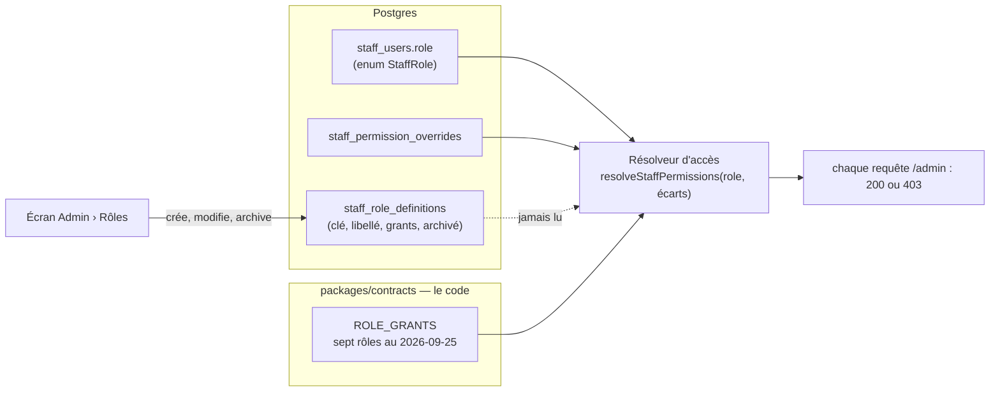

# Les rôles lus en base — pourquoi ils ne l'étaient pas, et la bascule

> Ouvert le 2026-09-25, à la demande de Hugo : « règle l'histoire des rôles qui
> sont lus dans le code au lieu de la db, fais-moi une doc explicative ».
> État : **bâti le 2026-09-25** (« basculer » ; le « resserrer », §4, reste à faire), contredit par vitruve le 2026-09-25 (trois objections
> bloquantes, corrigées ci-dessous : §3.1, §3.3, §3.4). Ce document explique l'existant, puis décrit la
> bascule. Il complète `architecture-acces-staff.md` §13.1, qui nommait le trou
> depuis le 2026-09-18.

## 1. Ce qui se passe aujourd'hui (vérifié le 2026-09-25)

Il y a **deux** listes de rôles, et une seule décide.



- **Le résolveur** (`apps/lfd-api/src/staff/permissions/prisma-staff-access.resolver.ts`,
  ligne ~112) lit `staff_users.role` — une valeur d'**enum** Postgres — et les
  écarts individuels, puis calcule les droits avec `ROLE_GRANTS`, une table
  **écrite dans le code**. Résultat mis en cache 30 s.
- **L'écran Admin › Rôles** écrit dans `staff_role_definitions`. Personne ne
  lit cette table pour décider.
- Conséquences :
  - **modifier un rôle à l'écran n'a aucun effet** ;
  - **un rôle créé à l'écran ne peut être porté par personne** : la fiche
    n'accepte que les valeurs de l'enum ;
  - **`superadmin` n'est porté par personne**. ⚠️ Y compris l'adresse de
    secours `dev@lafoliedouce.com` : `bootstrapAdmin()`
    (`src/staff/directory/domain/bootstrap-admin.ts`) lui donne `role:
"admin"`, pas `superadmin`. Ce qui a été dit dans la conversation du
    2026-09-25 (« dev@ est superadmin ») était **faux** ; c'était sans
    conséquence tant qu'`admin` couvre tout par le code, ça ne le sera plus
    quand `admin` deviendra éditable.

**Pourquoi c'est ainsi** : la migration `20260901140000_roles_definis` a posé
l'étape « **étendre** » d'une bascule en trois temps (`CLAUDE.md` §0) — la
table existe et se remplit, personne ne la lit. « Basculer » et « resserrer »
n'ont jamais suivi. Depuis, chaque nouveau droit a été écrit **deux fois** —
dans `ROLE_GRANTS` et, par migration, dans la table —, et un e2e vérifie que
les deux disent la même chose au moment de la migration.

## 2. Le danger de la bascule, avant son mécanisme

🔴 **Brancher le résolveur sur la table rend effectives, d'un coup, toutes les
éditions faites à l'écran depuis le 2026-09-01** — qui jusqu'ici ne faisaient
rien, et que personne n'a donc jamais vues à l'œuvre. Une case décochée par
curiosité en septembre retirerait un droit le jour du déploiement.

Et la table peut contenir des lignes **illisibles** : le 2026-09-25, la base de
dev portait `{"resource":"storefront"}`, un nom de ressource d'une version
locale abandonnée ; l'écran des rôles tombait en 500. Si le résolveur lit une
telle ligne, c'est **l'accès de tous ceux qui portent ce rôle** qui tombe.

D'où deux exigences, qui passent avant tout le reste :

1. **Un état des lieux de la production avant le déploiement** — requête en
   lecture seule, lancée par Hugo (les lectures de production sont les
   siennes) : pour chaque définition, ses `grants` comparés à `ROLE_GRANTS`,
   et les rôles créés à l'écran. Tout écart est tranché **avant** : gardé
   (c'était voulu) ou remis au contrat. La requête est au §6.
2. **Une ligne illisible ne fait tomber que ce rôle, et le dit** : le
   résolveur la traite comme « aucun droit par ce rôle » (les écarts
   individuels s'appliquent toujours), journalise l'erreur avec la clé, et le
   reste de l'annuaire continue.

## 3. La bascule

### 3.1 La fiche porte une clé de rôle

Migration **additive** :

- `staff_users.role_key TEXT NULL` (même type que `staff_role_definitions.key`), **clé étrangère** vers
  `staff_role_definitions(key)`, `ON DELETE RESTRICT` (une définition ne se
  supprime pas, elle s'archive) ;
- remplie depuis l'enum : `UPDATE staff_users SET role_key = role::text` ;
  avant, un `INSERT … ON CONFLICT DO NOTHING` garantit qu'une définition
  existe pour **chaque** valeur de l'enum, recopiée de `ROLE_GRANTS` — une
  fiche ne doit pas perdre son rôle faute de ligne ;
- `staff_users.role` perd son `NOT NULL` : une personne qui porte un rôle
  créé à l'écran n'a pas de valeur d'enum. L'ancien code, pendant la fenêtre
  de déploiement, ne rencontre pas de `NULL` : il n'en existe qu'après que le
  nouveau code a assigné un rôle créé à l'écran.
- 🔴 **Un déclencheur tient `role_key` synchrone de `role`** (`BEFORE INSERT OR
UPDATE OF role`, `role_key := role::text` quand `role` n'est pas nul). Sans
  lui, l'ancien code encore en service après la migration **modifie `role`
  sans toucher `role_key`** — le nouveau résolveur lirait une clé périmée, et
  un droit retiré resterait accordé —, et **crée des fiches sans
  `role_key`**. Le déclencheur disparaît au « resserrer », quand plus aucun
  code n'écrit `role`.
- ⚠️ **Le retour arrière se ferme à la première attribution d'un rôle créé à
  l'écran** : cette fiche a `role = NULL`, et l'ancien résolveur ferait
  `ROLE_GRANTS[null]`. Tant qu'aucun rôle hors enum n'est attribué, revenir au
  code précédent reste possible.

### 3.2 Le résolveur lit la définition

Dans une seule requête : la fiche, sa définition (`grants`, `archivedAt`), ses
écarts. Puis `resolveRolePermissions(roleKey, grants, écarts)` — la fonction
existe déjà (`packages/contracts/src/staff-role.ts`) et traite `superadmin`.

| Cas                                                         | Droits                                                                    |
| ----------------------------------------------------------- | ------------------------------------------------------------------------- |
| définition active et lisible                                | ses `grants` + écarts                                                     |
| définition archivée                                         | **aucun** droit par le rôle, écarts seuls                                 |
| `grants` illisibles                                         | **aucun** droit par le rôle, écarts seuls, erreur journalisée avec la clé |
| `role_key` nul (ne devrait plus exister après la migration) | `ROLE_GRANTS[role]` — **repli de transition**, retiré au « resserrer »    |
| adresse de secours (§3.4)                                   | `superadmin` : tout, quels que soient la fiche et la table                |

### 3.3 Éditer un rôle prend effet — tout de suite

- Toute écriture sur `staff_role_definitions` **vide le cache** du résolveur,
  comme le fait déjà une écriture sur l'annuaire. Sinon une édition mettrait
  jusqu'à 30 s à s'appliquer, et un retrait de droit aussi.
- **Archiver un rôle porté est déjà refusé** (`StaffRoleDefinition.archive`,
  `StaffRoleStillHeldError`) — mais le compte des porteurs
  (`prisma-staff-role.repository.ts`, `memberCount`) lit l'**enum** : il rend 0
  pour un rôle créé à l'écran, qui s'archiverait alors en retirant tous leurs
  droits en silence. Il bascule sur `role_key`.
- Le compte et l'archivage se font aujourd'hui hors de toute unité de travail :
  une attribution concurrente passe entre les deux. Désormais, archiver
  verrouille la ligne de définition (`SELECT … FOR UPDATE`) le temps de compter
  et d'écrire, et attribuer un rôle relit la définition active sous verrou
  partagé (`FOR SHARE`) dans la même transaction que l'écriture de la fiche.
- **Aucun rôle ne peut vider l'accès à l'annuaire.** La politique
  (`staff-access.policy.ts` : `LastStaffAdminError`, `SelfDemotionError`,
  `AdminOverrideRefusedError`) tient aujourd'hui sur la chaîne `"admin"`, qui
  ne garantit plus rien quand `admin` s'édite. Ses invariants deviennent : **il
  reste au moins une personne active qui tient `staff_access:write` par son
  rôle** (en dehors du secours) — refusé sinon, qu'on modifie une fiche, un
  rôle ou un écart ; et **on ne se retire pas `staff_access:write` à soi-même**,
  ni par sa fiche, ni en éditant le rôle qu'on porte.
- **« Tout de suite » vaut pour une instance.** Le cache est une `Map` en
  mémoire : avec plusieurs conteneurs, une édition met jusqu'à 30 s à
  s'appliquer sur les autres — défaut qui existe déjà pour l'annuaire, et que
  ce plan étend à un retrait de droit. **Assumé et écrit** ; le nombre
  d'instances en production est à confirmer par Hugo. Un retrait qui doit
  être immédiat partout passe par la suspension de la personne.

### 3.4 Le secours ne dépend pas de la table — mais de la fiche racine liée

Dès que `admin` est éditable, on peut s'en retirer `staff_access:write`.
Le secours : **la fiche racine** — celle que `ensureBootstrapAdmin`
(`prisma-staff-user.repository.ts`) crée au démarrage pour
`BOOTSTRAP_ADMIN_EMAIL` (défaut `dev@lafoliedouce.com`) — résout **toujours**
`superadmin`, dans le code, quels que soient son rôle et la table. C'est ce
que Hugo a dit le 2026-09-25 (« super administrateur c'est mon adresse de
fallback ») et ce que le code ne faisait pas (§1).

🔴 **L'ancrage est la fiche, jamais l'adresse du jeton.** Une revendication
`email` se fabrique : un compte Auth0 inscrit sans confirmation qui
annoncerait `dev@lafoliedouce.com` obtiendrait tout. Le résolveur trouve
donc d'abord la fiche par le chemin existant (`findStaff` : `sub` lié, ou
liaison par adresse **seulement** si `emailVerified === true` et la fiche pas
encore liée — règle du 2026-09-17 « une fiche liée appartient à son `sub` »),
et **c'est cette fiche**, si son adresse est celle de secours, qui reçoit
`superadmin`.

- `superadmin` reste **non attribuable** à l'écran (le `CHECK key <>
'superadmin'` de la table l'interdit déjà en base) : c'est la porte de
  secours, pas un rôle qu'on donne.
- Ses écarts sont ignorés (`resolveRolePermissions` le fait déjà).
- ⚠️ Avec `AUTH_ADMIN_DEV_BYPASS` (jamais ouvert, règle de Hugo), le garde
  dépose l'adresse de secours sur le poste local, qui deviendrait
  `superadmin` : les éditions d'`admin` ne s'y éprouveraient plus. Noté, pas
  corrigé — le mode reste fermé.

### 3.5 Attribuer un rôle

- Créer ou modifier une fiche accepte une **clé** de rôle, validée contre les
  définitions **actives** — plus contre l'enum. La fiche écrit `role_key`, et
  `role` quand la clé est une valeur de l'enum (sinon `NULL`), le temps de la
  transition.
- L'écran de la fiche propose la liste des définitions actives (libellés de
  la table, plus l'enum en dur).
- Le contrat : `StaffAccess.role` et `StaffMeView.role` deviennent une
  **chaîne** (clé de rôle) accompagnée de son libellé. L'union `StaffRole`
  est citée par ~31 fichiers (compte de vitruve, 2026-09-25) ; ceux qui
  lisent le rôle **d'une personne** passent à la clé : le journal
  (`staff-facts.ts` — `STAFF_ROLE_LABELS[created.role]`, `roleChangedFact` :
  le libellé vient de la définition, la charge porte une chaîne), les
  auteurs, `memberCount`, la politique, le front (libellés, onglet d'arrivée
  de la Supervision), les e2e. Ceux qui énumèrent les rôles **du contrat**
  (semis, `ROLE_GRANTS`) gardent l'union.

### 3.6 Ce que devient `ROLE_GRANTS`

**La valeur de départ**, plus l'autorité : il sème les définitions d'une base
neuve (harnais e2e, `ensureStaffRoleDefinitions`) et sert au repli de
transition. Les migrations de droits qui écrivaient les deux continuent tant
que le repli existe, puis n'écriront plus que la table.

## 4. Resserrer — un déploiement plus tard

Quand la production a tourné sur la clé : `role_key` passe `NOT NULL`, la
colonne `role` et le repli disparaissent, l'e2e « table ↔ contrat » devient
« la base neuve est semée depuis le contrat ». Plan à part, pas dans ce lot.

## 5. Tests

- **Le test qui manquait** : modifier une définition à l'écran change ce que
  la personne peut faire, **sans attendre** (cache vidé) — e2e, 403 → 200.
- Un rôle créé à l'écran, attribué, ouvre ce qu'il accorde et rien d'autre.
- Définition archivée → écarts seuls ; archiver un rôle porté → 409.
- `grants` illisibles sur un rôle → ses porteurs n'ont que leurs écarts, les
  autres rôles répondent normalement, l'erreur est journalisée.
- La fiche racine liée ouvre tout, même avec `admin` vidé en base et sa fiche
  sur un rôle archivé ; **un jeton qui annonce l'adresse de secours sans
  être lié à cette fiche, ou non vérifié, n'ouvre rien**.
- L'ancien code simulé (écriture de `role` seule) : `role_key` suit.
- Archiver pendant une attribution concurrente : l'un des deux attend,
  jamais un rôle archivé porté.
- Vider `staff_access:write` du dernier rôle qui le porte → refusé ; se le
  retirer à soi-même → refusé.
- Migration : chaque fiche a sa `role_key` égale à son enum ; une définition
  manquante est créée depuis le contrat.

## 6. L'état des lieux à lancer en production, avant le déploiement

Lecture seule. Elle liste les définitions, leurs droits, et combien de fiches
portent chaque rôle ; la comparaison au contrat se fait à la main contre
`ROLE_GRANTS`.

**À lancer après le déploiement des migrations du 2026-09-26** (droits
`comptoir`, `supervision`), pas avant : elles modifient la table.

```sql
-- les définitions, leurs droits, leurs porteurs
SELECT d.key,
       d.label,
       d.archived_at,
       d.grants,
       (SELECT count(*) FROM public.staff_users u WHERE u.role::text = d.key) AS porteurs
FROM public.staff_role_definitions d
ORDER BY d.key;

-- les rôles portés par des fiches SANS définition (le §3.1 les créera)
SELECT u.role::text AS role, count(*) AS porteurs
FROM public.staff_users u
LEFT JOIN public.staff_role_definitions d ON d.key = u.role::text
WHERE d.key IS NULL
GROUP BY u.role;
```

Tout écart entre `grants` et `ROLE_GRANTS` est une édition faite à l'écran qui
**prendra effet** au déploiement. À trancher un par un avant.
