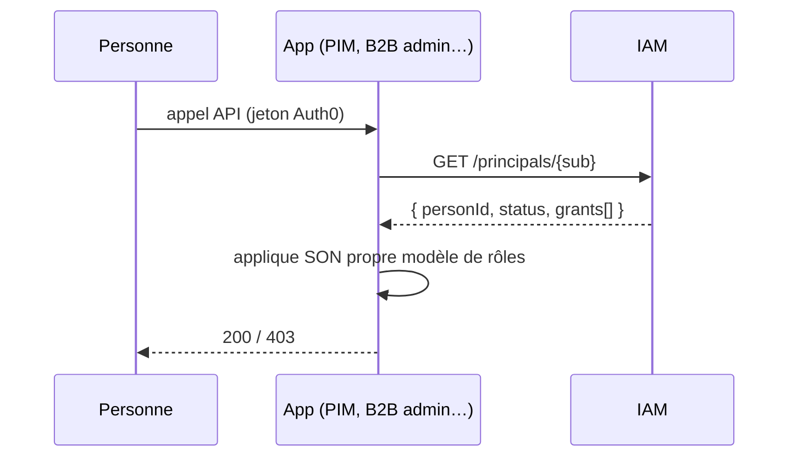

# IAM (« Access ») — les personnes de la suite et leurs droits

**État : 📐 doc-first.** Rien n'est codé. Ce document fixe le modèle et les
frontières avant qu'un écran ne fige la mauvaise réponse.

> **Décision du 2026-08-12 — la cible reste, le calendrier bouge.** Le modèle
> d'accès staff se construit **d'abord dans le backend B2B**, pas dans un backend
> IAM dédié : voir [`../b2b/architecture-acces-staff.md`](../b2b/architecture-acces-staff.md).
> La couture de sortie est un point unique (`GET /admin/me`) dont la forme est
> déjà celle prévue ici, si bien que la migration décrite en « Ordre de mise en
> œuvre » reste valable telle quelle — elle change de moment, pas de nature.

- **Sigle** (code, dossiers, identifiants) : `iam`
- **Nom** (écrans, tuile, Auth0) : **Access**

---

## Ce que l'app est

Le lieu unique où l'on répond à deux questions, pour toute la suite interne :

1. **Qui** fait partie de l'équipe ?
2. **Jusqu'où** chacun va, dans chaque outil ?

Elle ne fait rien d'autre. Elle ne connaît ni les produits, ni les commandes, ni
les clients — elle connaît des **personnes** et des **droits**.

---

## Les quatre décisions

### 1. Auth0 ne sert qu'à ouvrir la porte

Auth0 prouve **une identité** : « ce porteur est bien ce `sub` ». Point final.

Les droits vivent **dans notre base**. Ce n'est pas un détail d'implémentation,
c'est ce qui rend le système opérable : accorder un accès devient une écriture en
base, visible, datée, attribuable, testable sans réseau — au lieu d'un clic dans
un tableau de bord tiers dont rien ne reste dans le dépôt.

Conséquence directe : **la claim `permissions` cesse d'être la source de vérité**.
Le shell la lit aujourd'hui pour dessiner son launcher
([`auth.facade.ts`](../../apps/lfc-suite-shell/src/app/auth/auth.facade.ts)) ;
il interrogera IAM à la place. Il faudra le migrer, pas le laisser lire deux
sources — deux vérités divergent toujours, et celle qui perd est celle qu'on
regarde.

**Ce qui reste chez Auth0** : les connexions (`lfc-staff`), les mots de passe, le
MFA, l'autorisation par application sur les audiences. Ce qui n'y est plus : qui a
le droit de quoi.

### 2. Un backend dédié

`lfc-IAM-backend`, base séparée, comme les deux autres. La règle du monorepo
s'applique sans exception : **un backend ne lit jamais la base d'un autre**
([CLAUDE.md §1](../../CLAUDE.md)).

Le loger dans le B2B aurait été plus rapide d'une semaine et faux pour toujours :
le PIM aurait dû lire une base de commerce pour savoir qui a le droit d'éditer un
produit, et la dépendance serait devenue impossible à démêler au 3ᵉ outil.

Son audience Auth0 est `SUITE_AUTH0_AUDIENCE_IAM` — une de plus, selon la règle
déjà posée : **une audience par surface adressée**, jamais partagée.

### 3. Access absorbe `staff_users`

La moitié de cette app existe déjà, au mauvais endroit :
[`StaffUser`](../../apps/lfc-B2B-platform-backend/prisma/schema.prisma) porte
identité + `scopes` (`commercial` / `comptabilite` / `admin`) + un `auth0Id`
nullable, dans la base **commerce**.

Elle migre vers IAM, et disparaît du B2B. Deux annuaires de personnel, c'est deux
endroits où créer un collaborateur, et un jour où l'un des deux n'est plus à jour.

Ce que le B2B garde : le droit de **vérifier** un accès, jamais de l'accorder.

### 4. La tuile Access est une app de la suite comme les autres

Iframe sous le shell, jeton relayé par le bridge, permission `app:iam`. Aucun
privilège de structure — c'est son contenu qui est sensible, pas son hébergement.

---

## Le modèle

Trois notions, pas une de plus tant qu'un besoin réel n'en réclame une quatrième.

```
Person ──< Grant >── (app, role)
```

### `Person` — un être humain

Identité, e-mail (clé humaine unique), état (`active` / `suspended`), et
`auth0Id` **nullable**.

Nullable, parce que l'ordre naturel est : on crée la personne, **puis** on lui
ouvre un compte. Une fiche sans compte est un état légitime — l'arrivante de
lundi prochain, le prestataire qu'on prépare. Ce que ça interdit : qu'une
personne existe _uniquement_ chez Auth0.

**`suspended` ferme tout, immédiatement, sans rien détruire.** C'est le geste du
départ : on ne supprime pas une personne dont le nom est attaché à des décisions
datées ailleurs.

### `Grant` — un droit, dans une app, à un niveau

Un `Grant` dit : « telle personne, dans telle app, a tel rôle ». Trois colonnes,
une ligne par droit.

Pourquoi pas un tableau de scopes sur la personne, comme aujourd'hui ? Parce
qu'un droit a une **vie propre** : il est accordé à une date, par quelqu'un,
parfois pour une durée. Un tableau ne sait rien dire de tout ça, et le jour où on
veut savoir « qui a donné l'accès compta à Marc, et quand ? », la réponse n'existe
nulle part.

Chaque `Grant` porte donc `grantedAt` et `grantedBy`. C'est le minimum pour qu'un
accès soit **imputable**.

### `Role` — un niveau, défini par l'app qui le comprend

`admin`, `editor`, `viewer` : le vocabulaire est celui d'IAM. Ce que chacun
autorise **précisément** appartient à l'app cible, pas à IAM.

C'est la frontière qui décide de tout le reste. IAM dit « Marc est `editor` sur
le PIM » ; c'est le PIM qui sait qu'un `editor` peut modifier une fiche mais pas
publier. Faire descendre cette connaissance dans IAM en ferait un dieu qu'il
faudrait redéployer à chaque nouvelle permission d'une app tierce.

---

## Comment une app lit les droits

Les apps ne _demandent pas la permission_ à chaque geste — elles reçoivent
l'identité et le niveau, et tranchent chez elles.



**Le jeton porte l'identité, jamais les droits.** Un jeton vit une heure ; un
droit retiré doit prendre effet tout de suite. Mettre les droits dans le jeton,
c'est accepter qu'un accès révoqué survive jusqu'à l'expiration — inacceptable
pour un départ.

Le prix est un appel par requête, payé par un **cache court côté app**
(30 s d'ordre de grandeur). C'est le bon compromis : assez court pour qu'une
révocation soit ressentie comme immédiate, assez long pour qu'IAM ne devienne pas
le point de passage de chaque clic de la suite.

**IAM est un point de défaillance unique** : si IAM est à terre, plus personne
n'entre nulle part. On l'assume plutôt que de le cacher derrière un mode dégradé
qui laisserait passer du monde. Un `403` faux est réparable ; un `200` faux ne
l'est pas.

---

## Ce que ce document ne tranche pas

- **Les rôles réels de chaque app.** IAM fournit le vocabulaire ; PIM et B2B
  admin doivent dire ce que chaque niveau autorise chez eux. Aucun des deux ne
  l'a écrit.
- **Le provisioning Auth0.** Créer la personne dans IAM et lui ouvrir un compte
  (invitation, mot de passe initial) restent deux gestes. Les coudre — un bouton
  « inviter » qui appelle la Management API — est une tranche à part entière.
- **La journalisation.** `grantedAt`/`grantedBy` rendent l'état courant
  imputable, pas son historique. Un vrai journal des accès (qui a retiré quoi,
  quand) viendra quand il sera demandé, pas avant.
- **Les groupes.** Accorder à une équipe plutôt qu'à une personne est la
  généralisation évidente — et prématurée tant qu'on compte les collaborateurs
  sur une main.
- **La suspension en cascade.** Une personne `suspended` perd l'accès à la suite ;
  ce que deviennent ses objets en cours (RDV posés, brouillons) appartient à
  chaque app.

---

## Ordre de mise en œuvre

Le passage du B2B à IAM est le moment délicat : il touche à qui peut entrer dans
le back-office, sur un système qui vient tout juste de commencer à marcher.

1. **Backend IAM** — `Person`, `Grant`, la lecture `/principals/{sub}`, ses
   tests. Personne ne le consomme encore : rien ne peut casser.
2. **Front Access** — créer une personne, accorder, retirer. L'app devient
   utilisable avant d'être branchée, ce qui permet de saisir l'équipe réelle et
   de vérifier le modèle sur des vrais cas.
3. **Migration de `staff_users`** — reprise des lignes vers IAM, puis le B2B lit
   IAM. `staff_users` **survit en lecture** le temps de la bascule ; on la
   supprime quand plus rien ne l'interroge, pas avant.
4. **Le shell lit IAM** — le launcher cesse de lire la claim `permissions`.
5. **PIM** — dernier servi, parce qu'il n'a aujourd'hui aucun modèle de rôles à
   respecter : c'est le plus simple, donc celui qui apprend le moins.
