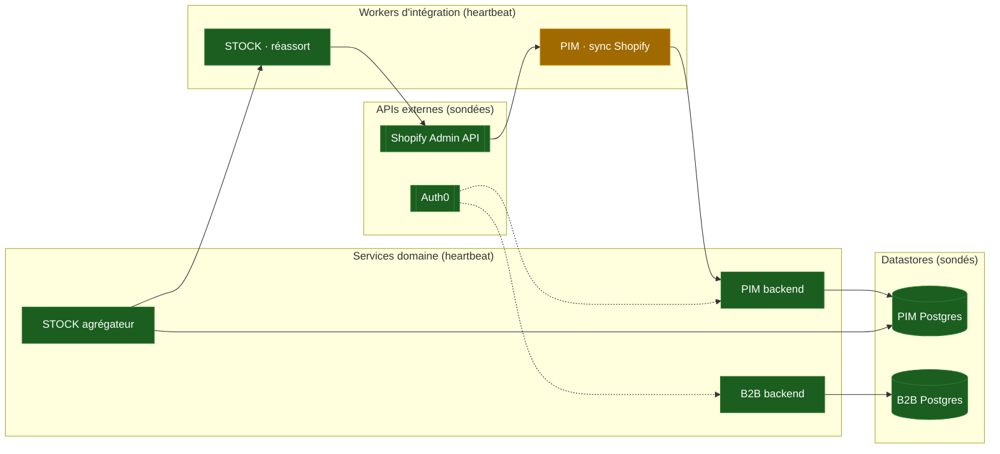
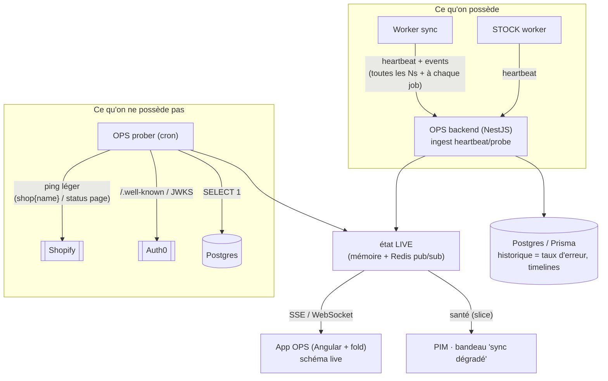

# Suite LFC — OPS « Ecosystem Health » (design, doc-first)

Ce document fixe la **cible** d'une app **OPS** de la suite : une vue **santé de
l'écosystème** — un schéma vivant où l'on voit d'un coup d'œil les **APIs
externes** (Shopify…), les **workers d'intégration** (sync PIM…) et les
**services domaine** (STOCK…), chacun avec son **état courant** et ses
dépendances. On écrit le design et le **contrat** d'abord ; l'app vient quand la
flotte le justifie (§9). Revue adversariale en fin de doc (§10).

Complément de [`architecture-suite-gateway-scaling.md`](architecture-suite-gateway-scaling.md)
(comment tout parle) : ici, **comment on sait que tout va bien**.

---

## 1. Le besoin

La suite passe de « une app » à « une flotte » : PIM + son worker de sync
Shopify, backend B2B, bientôt **STOCK** (réassort), demain d'autres canaux. Trois
questions n'ont aujourd'hui **aucune réponse centralisée** :

- Est-ce que le worker de sync Shopify **tourne** ? Sa file est-elle **en
  retard** ? Combien d'erreurs sur la dernière heure ?
- **Shopify** est-il **joignable / dégradé** en ce moment (et donc « ce n'est pas
  nous ») ?
- Quand une chose casse, **quelle dépendance** est la cause (un nœud rouge en
  explique un autre) ?

Chaque app répond aujourd'hui **pour elle-même**, en silo. La cible : **une vue
écosystème**, où la santé est une **propriété observable de la topologie**, pas
une inspection manuelle app par app.

---

## 2. Périmètre — l'invariant qui structure tout

Deux états à **ne jamais mélanger** :

|                       | Qui **possède** la vérité | Exemples                                                                                   | OPS en fait quoi             |
| --------------------- | ------------------------- | ------------------------------------------------------------------------------------------ | ---------------------------- |
| **État DOMAINE**      | **chaque app**            | binding produit synchronisé, dernier hash poussé, stock d'une réf                          | **rien** — il n'y touche pas |
| **État OPÉRATIONNEL** | **OPS (observe)**         | worker up/down, profondeur de file, taux d'erreur, dernier heartbeat, joignabilité Shopify | **agrège & affiche**         |

**Conséquence directe** (et la réponse à « le PIM devient lecteur ») : le PIM
**publie** des signaux opérationnels et **lit** la santé agrégée pour afficher un
bandeau « worker Shopify dégradé ». Il **ne** devient **pas** lecteur de son
propre état domaine — ses `ShopifyProductBinding` restent sa vérité, dans son
Postgres. OPS **observe**, il ne **possède** pas le métier.

### Ce que OPS ne fera **jamais** (frontière)

- **Pas** une source de vérité métier ni un store de données domaine (pas de
  binding, pas de stock, pas de commande dedans).
- **Pas** un orchestrateur : il **n'agit pas** (pas de « relancer le worker »
  depuis OPS en v1 — lecture seule ; les actions viendront, murées, plus tard).
- **Pas** un APM/traces complet (pas de spans par requête) : c'est une **carte de
  santé**, pas Datadog. Métriques agrégées, pas la télémétrie fine.
- **Pas** un point de défaillance de la flotte : si OPS tombe, **les workers
  continuent** (§10). OPS n'est jamais dans le chemin critique.

---

## 3. La cible — la carte de l'écosystème

Chaque **nœud** porte un `kind` (api externe / worker / service / datastore) et
un `status` (`up` / `degraded` / `down` / `unknown`). Les **arêtes** = « dépend
de ». Un nœud rouge en amont **explique** un nœud dégradé en aval.



Lecture : ci-dessus, `sync Shopify` est **dégradé** ; son amont `Shopify Admin
API` est **up** → donc la cause est **chez nous** (file en retard, erreurs), pas
chez Shopify. C'est **ça**, la valeur : la **causalité** en un coup d'œil.

---

## 4. Le modèle d'état — **push** pour ce qu'on possède, **probe** pour l'externe

Décision (§ choix produit) : **push-first**. Chaque worker/service **pousse** son
heartbeat ; les dépendances **externes** (Shopify, Auth0) ne peuvent pas pousser
→ OPS les **sonde**. Deux mécanismes, un seul modèle de nœud.



- **Push (workers, services)** : un heartbeat périodique (**même à vide** — voir
  §10, « silence ≠ mort ») + des **events** de cycle de vie (`job.started` /
  `job.ok` / `job.failed`, `deploy`). Portés par le **contrat** (§5).
- **Probe (Shopify, Auth0, Postgres)** : un **cron OPS** émet, pour chaque
  dépendance externe, un enregistrement **de la même forme** qu'un heartbeat — un
  ping bon marché (`query { shop { name } }` pour Shopify, lecture JWKS pour
  Auth0, `SELECT 1` pour un datastore). L'externe devient un **nœud comme un
  autre**, juste alimenté « du dehors ». **C'est ce qui met la santé Shopify sur
  la carte.**

### Où vit l'état (dans la **suite**, pas en bespoke Cloudflare)

L'app OPS suit **le stack de la suite** : **backend NestJS + front Angular +
fold**, comme le PIM et le B2B. Donc pas de Durable Object / D1 : l'état vit dans
le backend Nest, avec les mêmes primitives que les autres backends.

| Besoin                                                  | Support (Nest)                                                                                               | Pourquoi                                                  |
| ------------------------------------------------------- | ------------------------------------------------------------------------------------------------------------ | --------------------------------------------------------- |
| **État LIVE** par nœud + fan-out temps réel             | **mémoire du process** + **Redis pub/sub** (l'infra Redis existe déjà : BullMQ, adaptateur socket multi-pod) | cohérent, multi-pod, WebSocket/SSE vers l'UI sans polling |
| **Historique** (taux d'erreur 1h, timelines, incidents) | **Postgres via Prisma**                                                                                      | fenêtres glissantes, mêmes outils que le reste            |
| **Ingest** (heartbeats + probes)                        | **contrôleur NestJS** (`/ops/ingest`) muré staff                                                             | une app suite normale, pas un edge worker                 |

> Les **briques surveillées**, elles, peuvent être n'importe quoi (Cloudflare
> Worker de sync, service Nest, cron Cloud Run) : elles **poussent** vers l'ingest
> OPS via HTTP. OPS n'impose pas leur runtime, seulement le **contrat** (§5).

---

## 5. Le contrat — `@lfd/ops-contract`

Même patron que [[project_lfd_pim_contracts]] : un package **type-only + shapes**,
consommé par tout worker et par OPS. **C'est le livrable pas cher à fort levier**
(§9) : on le câble dans chaque worker à sa naissance, l'app OPS devient un simple
lecteur plus tard.

```ts
// Formes (esquisse — le doc, pas le code)
type NodeKind = "external-api" | "worker" | "service" | "datastore";
type HealthStatus = "up" | "degraded" | "down" | "unknown";

interface Heartbeat {
  node: string; // id stable du nœud (ex. 'pim.sync-shopify')
  at: string; // ISO
  status: HealthStatus; // ce que le nœud dit de lui-même
  detail?: string;
  metrics?: {
    queueDepth?: number;
    inFlight?: number;
    lastJobAt?: string;
    errorRate1m?: number; // 0..1
  };
}

interface LifecycleEvent {
  node: string;
  at: string;
  kind: "job.started" | "job.ok" | "job.failed" | "deploy" | "config.changed";
  ref?: string; // id de job / sha de déploiement
  message?: string;
}

// Ce que OPS REND (agrégé) — jamais poussé tel quel :
interface NodeHealth {
  node: string;
  kind: NodeKind;
  status: HealthStatus; // dérivé (voir staleness §10)
  since: string; // depuis quand ce status
  lastHeartbeatAt: string | null;
  dependsOn: readonly string[];
  metrics?: Heartbeat["metrics"];
  lastError?: { at: string; message: string };
}
```

Côté émetteur, un **mini-client** (le seul « code » réutilisable) :

```ts
const ops = createOpsReporter({ node: "pim.sync-shopify", sink });
await ops.heartbeat("up", { queueDepth: 12 }); // périodique, même à vide
await ops.event("job.failed", { ref: jobId, message });
```

`sink` = un simple **`fetch` HTTP** vers l'ingest OPS NestJS (`/ops/ingest`),
authentifié par un token de service. La brique émettrice n'a besoin que de
**l'URL + le contrat** — quel que soit son runtime (Cloudflare Worker, service
Nest, cron). Batch/retry best-effort : un heartbeat perdu n'est pas critique
(le suivant corrige ; l'absence prolongée devient `unknown`, §8/§10).

### Topologie = **manifeste déclaré**, pas deviné

Les nœuds et arêtes vivent dans un **manifeste** (comme le registre d'apps de la
suite existe déjà) : `{ node, kind, dependsOn, probe? }`. Déclaré, versionné,
revu. On **ne devine pas** la topologie du trafic (bruit, faux liens). La 3ᵉ
occurrence d'un besoin de découverte auto déclenchera la discussion, pas avant.

---

## 6. Le rôle de « lecteur » — appliqué

- **App OPS** : lit l'état **live** (WebSocket/SSE depuis le backend Nest), rend le
  schéma + overlay santé + drill-down (metrics, derniers events, dernière erreur).
- **PIM (et autres apps)** : lisent un **slice** santé (`NodeHealth` de leurs
  propres nœuds) pour un **bandeau** (« sync Shopify dégradé — file en retard »).
  Le PIM **n'apprend pas** de OPS l'état de ses bindings : il apprend l'état de
  son **worker**. Domaine vs opérationnel (§2), toujours.

---

## 7. L'app OPS dans la suite

**Stack = celui de la suite**, aligné sur PIM/B2B : **backend NestJS**, **front
Angular**, **fold-ng** pour le chrome. Aucune techno bespoke — OPS est une app
suite comme les autres.

- **Tuile staff** sous `lfc-suite-shell` (comme le B2B admin), **audience staff
  uniquement** (§10 sécurité).
- **Backend NestJS** = ingest (heartbeats + probes) + prober cron + état live
  (mémoire + Redis) + historique (Prisma/Postgres) + flux live (SSE/WS). Ne
  détient **que** de l'état opérationnel **re-dérivable** (§2).
- **Front Angular + fold** = le **schéma live de toutes les briques** (lib de
  graphe / rendu type mermaid) + overlay santé (badges fold up/degraded/down) +
  cartes de nœud (drill-down : métriques, derniers events, dernière erreur) +
  timeline d'incidents. `signal`/`toSignal` sur le flux live, conventions front
  identiques aux autres apps.

---

## 8. Contrat de santé — dérivation du `status`

Le `status` **rendu** d'un nœud n'est pas juste « ce qu'il a dit » :

1. **`down`** : le nœud a rapporté `down`/`degraded`, **ou** un probe échoue.
2. **`unknown` (périmé)** : `now - lastHeartbeatAt > TTL` → on **ne sait pas**
   (le nœud n'a pas parlé). **Distinct de `down`** — voir §10.
3. **`degraded`** : `errorRate1m` au-dessus d'un seuil, ou file au-dessus d'un
   seuil, ou une **dépendance** `down` (propagation amont → aval).
4. **`up`** : heartbeat récent + métriques sous seuils.

Seuils dans le **manifeste** par nœud (un worker de réassort tolère une file plus
grande qu'un worker de sync interactif).

---

## 9. Plan de câblage progressif (le **pas cher d'abord**)

On ne bâtit pas l'app OPS tant que la flotte est jeune. On **investit dans la
couture stable** maintenant :

| Étape | Quoi                                                                          | Quand                                    |
| ----- | ----------------------------------------------------------------------------- | ---------------------------------------- |
| **0** | **Ce doc** + `@lfd/ops-contract` (shapes + `createOpsReporter`)               | **maintenant**                           |
| **1** | 1ᵉʳ émetteur : le **worker de sync Shopify du PIM** pousse heartbeat + events | quand le worker existe                   |
| **2** | **Prober Shopify** (+ Auth0, Postgres) → nœuds externes sur la carte          | avec l'étape 1                           |
| **3** | Backend OPS Nest : ingest + état live (Redis) + historique (Prisma)           | idem                                     |
| **4** | **App OPS** (schéma live)                                                     | quand **≥3 nœuds vivants** valent la vue |
| **5** | Bandeaux « lecteur » dans le PIM (slice santé)                                | après l'app                              |
| **6** | Actions murées (relancer/mettre en pause)                                     | **différé**, hors v1                     |

Règle « généraliser sur le 2ᵉ usage réel » : le **contrat** est écrit une fois et
sert le 1ᵉʳ worker ; l'**app** attend d'avoir de quoi la remplir.

---

## 10. Revue adversariale — ce qui casse

- **Silence ≠ mort.** Un worker qui n'émet plus est peut-être **mort**, ou juste
  **oisif** (aucun job). Sans plancher, on afficherait « down » à tort à chaque
  nuit calme. **Mitigation** : heartbeat **périodique même à vide** ; l'absence
  au-delà du TTL est `unknown` (« on ne sait pas »), **pas** `down`. Un vrai
  `down` est **rapporté** ou **sondé**, jamais **déduit du silence**.
- **Qui surveille OPS ?** OPS tombé = on est **aveugle** (pas en panne, aveugle).
  **Mitigation** : OPS **hors chemin critique** (les workers tournent sans lui) ;
  un **uptime externe** (ping tiers) sur OPS lui-même ; l'état live persiste dans
  **Redis**, donc un backend OPS redémarré le **retrouve** — c'est un **lecteur**
  re-démarrable, pas le détenteur unique.
- **Faux positif Shopify.** Un probe qui tape une route lente ≠ Shopify en panne.
  **Mitigation** : ping **léger et stable** (`shop { name }`), seuils + **N échecs
  consécutifs** avant `down`, et croiser avec la **status page** Shopify si
  besoin. Ne jamais crier au loup sur un timeout isolé.
- **Coût / cardinalité.** Un heartbeat par worker toutes les N secondes × écriture
  Postgres = ça chiffre. **Mitigation** : le live va dans **Redis** (pas
  d'écriture disque par battement) ; Postgres ne reçoit que les **events** et des
  **agrégats** (fenêtres), pas chaque heartbeat.
- **Sécurité.** OPS expose la **topologie interne** + des messages d'erreur →
  **staff only** (audience Auth0 staff, comme le B2B admin), jamais exposé
  client. Les messages d'erreur techniques ne fuient pas de secret (déjà la règle
  du `AppErrorFilter`).
- **Contrat qui ment.** Un worker peut rapporter `up` en étant cassé (bug dans son
  propre heartbeat). **Mitigation** : croiser **auto-déclaré** (heartbeat) et
  **observé du dehors** (probe / taux d'erreur mesuré côté ingest) — deux angles,
  comme la vérification adversariale ; un `up` déclaré + un `errorRate1m` élevé
  mesuré = **degraded**, la mesure gagne.

---

## 11. Décisions ouvertes (à trancher avant l'étape 3)

1. **État live multi-pod** : mémoire process + **Redis pub/sub** (l'infra existe)
   suffit-elle, ou faut-il un « board » persistant Redis (hash par nœud) pour
   qu'un pod qui redémarre retrouve l'état sans attendre le prochain heartbeat ?
   Défaut proposé : **Redis hash `ops:node:<id>` + pub/sub** pour le fan-out.
2. **Fenêtre d'historique** en Postgres : 24 h ? 7 j ? (coût vs utilité des
   timelines). Purge par cron.
3. **Rendu du schéma** : mermaid généré côté front (simple, statique-ish) vs lib
   de graphe interactive (zoom, drag) — trancher au moment de l'app (étape 4).
4. **La caisse / le POS** est-il un nœud OPS un jour (santé de l'encaissement) ou
   hors périmètre ? (à cadrer quand la caisse entre dans la suite.)

```

```
