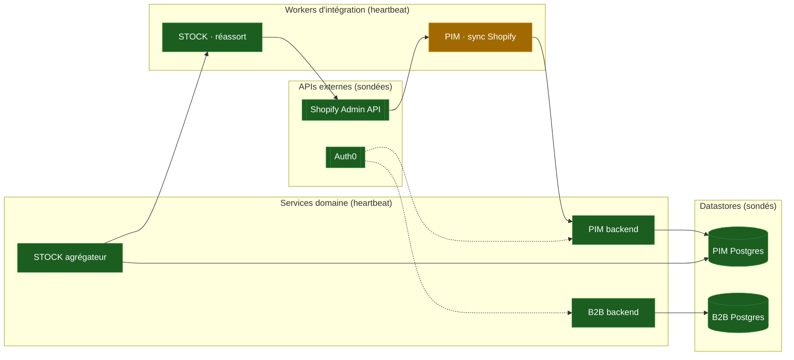
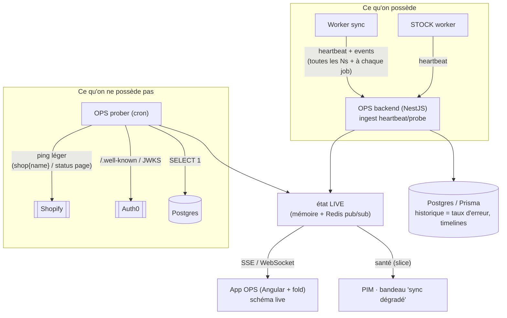

# Suite LFC — OPS « Ecosystem Health » (design, doc-first)

Ce document fixe la **cible** d'une app **OPS** de la suite : une vue **santé de
l'écosystème** — un schéma vivant où l'on voit d'un coup d'œil les **APIs
externes** (Shopify…), les **workers d'intégration** (sync PIM…) et les
**services domaine** (STOCK…), chacun avec son **état courant** et ses
dépendances. On écrit le design et le **contrat** d'abord ; l'app vient quand la
flotte le justifie (§9). Revue adversariale en fin de doc (§10).

Complément de [`architecture-suite-gateway-scaling.md`](architecture-suite-gateway-scaling.md)
(comment tout parle) : ici, **comment on sait que tout va bien**.

---

## 1. Le besoin

La suite passe de « une app » à « une flotte » : PIM + son worker de sync
Shopify, backend B2B, bientôt **STOCK** (réassort), demain d'autres canaux. Trois
questions n'ont aujourd'hui **aucune réponse centralisée** :

- Est-ce que le worker de sync Shopify **tourne** ? Sa file est-elle **en
  retard** ? Combien d'erreurs sur la dernière heure ?
- **Shopify** est-il **joignable / dégradé** en ce moment (et donc « ce n'est pas
  nous ») ?
- Quand une chose casse, **quelle dépendance** est la cause (un nœud rouge en
  explique un autre) ?

Chaque app répond aujourd'hui **pour elle-même**, en silo. La cible : **une vue
écosystème**, où la santé est une **propriété observable de la topologie**, pas
une inspection manuelle app par app.

---

## 2. Périmètre — l'invariant qui structure tout

Deux états à **ne jamais mélanger** :

|                       | Qui **possède** la vérité | Exemples                                                                                   | OPS en fait quoi             |
| --------------------- | ------------------------- | ------------------------------------------------------------------------------------------ | ---------------------------- |
| **État DOMAINE**      | **chaque app**            | binding produit synchronisé, dernier hash poussé, stock d'une réf                          | **rien** — il n'y touche pas |
| **État OPÉRATIONNEL** | **OPS (observe)**         | worker up/down, profondeur de file, taux d'erreur, dernier heartbeat, joignabilité Shopify | **agrège & affiche**         |

**Conséquence directe** (et la réponse à « le PIM devient lecteur ») : le PIM
**publie** des signaux opérationnels et **lit** la santé agrégée pour afficher un
bandeau « worker Shopify dégradé ». Il **ne** devient **pas** lecteur de son
propre état domaine — ses `ShopifyProductBinding` restent sa vérité, dans son
Postgres. OPS **observe**, il ne **possède** pas le métier.

### Ce que OPS ne fera **jamais** (frontière)

- **Pas** une source de vérité métier ni un store de données domaine (pas de
  binding, pas de stock, pas de commande dedans).
- **Pas** un orchestrateur : il **n'agit pas** (pas de « relancer le worker »
  depuis OPS en v1 — lecture seule ; les actions viendront, murées, plus tard).
- **Pas** un APM/traces complet (pas de spans par requête) : c'est une **carte de
  santé**, pas Datadog. Métriques agrégées, pas la télémétrie fine.
- **Pas** un point de défaillance de la flotte : si OPS tombe, **les workers
  continuent** (§10). OPS n'est jamais dans le chemin critique.

---

## 3. La cible — la carte de l'écosystème

Chaque **nœud** porte un `kind` (api externe / worker / service / datastore) et
un `status` (`up` / `degraded` / `down` / `unknown`). Les **arêtes** = « dépend
de ». Un nœud rouge en amont **explique** un nœud dégradé en aval.



Lecture : ci-dessus, `sync Shopify` est **dégradé** ; son amont `Shopify Admin
API` est **up** → donc la cause est **chez nous** (file en retard, erreurs), pas
chez Shopify. C'est **ça**, la valeur : la **causalité** en un coup d'œil.

---

## 4. Le modèle d'état — **push** pour ce qu'on possède, **probe** pour l'externe

Décision (§ choix produit) : **push-first**. Chaque worker/service **pousse** son
heartbeat ; les dépendances **externes** (Shopify, Auth0) ne peuvent pas pousser
→ OPS les **sonde**. Deux mécanismes, un seul modèle de nœud.



- **Push (workers, services)** : un heartbeat périodique (**même à vide** — voir
  §10, « silence ≠ mort ») + des **events** de cycle de vie (`job.started` /
  `job.ok` / `job.failed`, `deploy`). Portés par le **contrat** (§5).
- **Probe (Shopify, Auth0, Postgres)** : un **cron OPS** émet, pour chaque
  dépendance externe, un enregistrement **de la même forme** qu'un heartbeat — un
  ping bon marché (`query { shop { name } }` pour Shopify, lecture JWKS pour
  Auth0, `SELECT 1` pour un datastore). L'externe devient un **nœud comme un
  autre**, juste alimenté « du dehors ». **C'est ce qui met la santé Shopify sur
  la carte.**

### Où vit l'état (dans la **suite**, pas en bespoke Cloudflare)

L'app OPS suit **le stack de la suite** : **backend NestJS + front Angular +
fold**, comme le PIM et le B2B. Donc pas de Durable Object / D1 : l'état vit dans
le backend Nest, avec les mêmes primitives que les autres backends.

| Besoin                                                  | Support (Nest)                                                                                               | Pourquoi                                                  |
| ------------------------------------------------------- | ------------------------------------------------------------------------------------------------------------ | --------------------------------------------------------- |
| **État LIVE** par nœud + fan-out temps réel             | **mémoire du process** + **Redis pub/sub** (l'infra Redis existe déjà : BullMQ, adaptateur socket multi-pod) | cohérent, multi-pod, WebSocket/SSE vers l'UI sans polling |
| **Historique** (taux d'erreur 1h, timelines, incidents) | **Postgres via Prisma**                                                                                      | fenêtres glissantes, mêmes outils que le reste            |
| **Ingest** (heartbeats + probes)                        | **contrôleur NestJS** (`/ops/ingest`) muré staff                                                             | une app suite normale, pas un edge worker                 |

> Les **briques surveillées**, elles, peuvent être n'importe quoi (Cloudflare
> Worker de sync, service Nest, cron Cloud Run) : elles **poussent** vers l'ingest
> OPS via HTTP. OPS n'impose pas leur runtime, seulement le **contrat** (§5).

---

## 5. Le contrat — `@lfd/ops-contract`

Même patron que [[project_lfd_pim_contracts]] : un package **type-only + shapes**,
consommé par tout worker et par OPS. **C'est le livrable pas cher à fort levier**
(§9) : on le câble dans chaque worker à sa naissance, l'app OPS devient un simple
lecteur plus tard.

```ts
// Formes (esquisse — le doc, pas le code)
type NodeKind = "external-api" | "worker" | "service" | "datastore";
type HealthStatus = "up" | "degraded" | "down" | "unknown";

interface Heartbeat {
  node: string; // id stable du nœud (ex. 'pim.sync-shopify')
  at: string; // ISO
  status: HealthStatus; // ce que le nœud dit de lui-même
  detail?: string;
  metrics?: {
    queueDepth?: number;
    inFlight?: number;
    lastJobAt?: string;
    errorRate1m?: number; // 0..1
  };
}

interface LifecycleEvent {
  node: string;
  at: string;
  kind: "job.started" | "job.ok" | "job.failed" | "deploy" | "config.changed";
  ref?: string; // id de job / sha de déploiement
  message?: string;
}

// Ce que OPS REND (agrégé) — jamais poussé tel quel :
interface NodeHealth {
  node: string;
  kind: NodeKind;
  status: HealthStatus; // dérivé (voir staleness §10)
  since: string; // depuis quand ce status
  lastHeartbeatAt: string | null;
  dependsOn: readonly string[];
  metrics?: Heartbeat["metrics"];
  lastError?: { at: string; message: string };
}
```

Côté émetteur, un **mini-client** (le seul « code » réutilisable) :

```ts
const ops = createOpsReporter({ node: "pim.sync-shopify", sink });
await ops.heartbeat("up", { queueDepth: 12 }); // périodique, même à vide
await ops.event("job.failed", { ref: jobId, message });
```

`sink` = un simple **`fetch` HTTP** vers l'ingest OPS NestJS (`/ops/ingest`),
authentifié par un token de service. La brique émettrice n'a besoin que de
**l'URL + le contrat** — quel que soit son runtime (Cloudflare Worker, service
Nest, cron). Batch/retry best-effort : un heartbeat perdu n'est pas critique
(le suivant corrige ; l'absence prolongée devient `unknown`, §8/§10).

### Topologie = **manifeste déclaré**, pas deviné

Les nœuds et arêtes vivent dans un **manifeste** (comme le registre d'apps de la
suite existe déjà) : `{ node, kind, dependsOn, probe? }`. Déclaré, versionné,
revu. On **ne devine pas** la topologie du trafic (bruit, faux liens). La 3ᵉ
occurrence d'un besoin de découverte auto déclenchera la discussion, pas avant.

---

## 6. Le rôle de « lecteur » — appliqué

- **App OPS** : lit l'état **live** (WebSocket/SSE depuis le backend Nest), rend le
  schéma + overlay santé + drill-down (metrics, derniers events, dernière erreur).
- **PIM (et autres apps)** : lisent un **slice** santé (`NodeHealth` de leurs
  propres nœuds) pour un **bandeau** (« sync Shopify dégradé — file en retard »).
  Le PIM **n'apprend pas** de OPS l'état de ses bindings : il apprend l'état de
  son **worker**. Domaine vs opérationnel (§2), toujours.

---

## 7. L'app OPS dans la suite

**Stack = celui de la suite**, aligné sur PIM/B2B : **backend NestJS**, **front
Angular**, **fold-ng** pour le chrome. Aucune techno bespoke — OPS est une app
suite comme les autres.

- **Tuile staff** sous `lfc-suite-shell` (comme le B2B admin), **audience staff
  uniquement** (§10 sécurité).
- **Backend NestJS** = ingest (heartbeats + probes) + prober cron + état live
  (mémoire + Redis) + historique (Prisma/Postgres) + flux live (SSE/WS). Ne
  détient **que** de l'état opérationnel **re-dérivable** (§2).
- **Front Angular + fold** = le **schéma live de toutes les briques** (lib de
  graphe / rendu type mermaid) + overlay santé (badges fold up/degraded/down) +
  cartes de nœud (drill-down : métriques, derniers events, dernière erreur) +
  timeline d'incidents. `signal`/`toSignal` sur le flux live, conventions front
  identiques aux autres apps.

---

## 8. Contrat de santé — dérivation du `status`

Le `status` **rendu** d'un nœud n'est pas juste « ce qu'il a dit » :

1. **`down`** : le nœud a rapporté `down`/`degraded`, **ou** un probe échoue.
2. **`unknown` (périmé)** : `now - lastHeartbeatAt > TTL` → on **ne sait pas**
   (le nœud n'a pas parlé). **Distinct de `down`** — voir §10.
3. **`degraded`** : `errorRate1m` au-dessus d'un seuil, ou file au-dessus d'un
   seuil, ou une **dépendance** `down` (propagation amont → aval).
4. **`up`** : heartbeat récent + métriques sous seuils.

Seuils dans le **manifeste** par nœud (un worker de réassort tolère une file plus
grande qu'un worker de sync interactif).

---

## 9. Plan de câblage progressif (le **pas cher d'abord**)

On ne bâtit pas l'app OPS tant que la flotte est jeune. On **investit dans la
couture stable** maintenant :

| Étape | Quoi                                                                          | Quand                                    |
| ----- | ----------------------------------------------------------------------------- | ---------------------------------------- |
| **0** | **Ce doc** + `@lfd/ops-contract` (shapes + `createOpsReporter`)               | **maintenant**                           |
| **1** | 1ᵉʳ émetteur : le **worker de sync Shopify du PIM** pousse heartbeat + events | quand le worker existe                   |
| **2** | **Prober Shopify** (+ Auth0, Postgres) → nœuds externes sur la carte          | avec l'étape 1                           |
| **3** | Backend OPS Nest : ingest + état live (Redis) + historique (Prisma)           | idem                                     |
| **4** | **App OPS** (schéma live)                                                     | quand **≥3 nœuds vivants** valent la vue |
| **5** | Bandeaux « lecteur » dans le PIM (slice santé)                                | après l'app                              |
| **6** | Actions murées (relancer/mettre en pause)                                     | **différé**, hors v1                     |

Règle « généraliser sur le 2ᵉ usage réel » : le **contrat** est écrit une fois et
sert le 1ᵉʳ worker ; l'**app** attend d'avoir de quoi la remplir.

---

## 10. Revue adversariale — ce qui casse

- **Silence ≠ mort.** Un worker qui n'émet plus est peut-être **mort**, ou juste
  **oisif** (aucun job). Sans plancher, on afficherait « down » à tort à chaque
  nuit calme. **Mitigation** : heartbeat **périodique même à vide** ; l'absence
  au-delà du TTL est `unknown` (« on ne sait pas »), **pas** `down`. Un vrai
  `down` est **rapporté** ou **sondé**, jamais **déduit du silence**.
- **Qui surveille OPS ?** OPS tombé = on est **aveugle** (pas en panne, aveugle).
  **Mitigation** : OPS **hors chemin critique** (les workers tournent sans lui) ;
  un **uptime externe** (ping tiers) sur OPS lui-même ; l'état live persiste dans
  **Redis**, donc un backend OPS redémarré le **retrouve** — c'est un **lecteur**
  re-démarrable, pas le détenteur unique.
- **Faux positif Shopify.** Un probe qui tape une route lente ≠ Shopify en panne.
  **Mitigation** : ping **léger et stable** (`shop { name }`), seuils + **N échecs
  consécutifs** avant `down`, et croiser avec la **status page** Shopify si
  besoin. Ne jamais crier au loup sur un timeout isolé.
- **Coût / cardinalité.** Un heartbeat par worker toutes les N secondes × écriture
  Postgres = ça chiffre. **Mitigation** : le live va dans **Redis** (pas
  d'écriture disque par battement) ; Postgres ne reçoit que les **events** et des
  **agrégats** (fenêtres), pas chaque heartbeat.
- **Sécurité.** OPS expose la **topologie interne** + des messages d'erreur →
  **staff only** (audience Auth0 staff, comme le B2B admin), jamais exposé
  client. Les messages d'erreur techniques ne fuient pas de secret (déjà la règle
  du `AppErrorFilter`).
- **Contrat qui ment.** Un worker peut rapporter `up` en étant cassé (bug dans son
  propre heartbeat). **Mitigation** : croiser **auto-déclaré** (heartbeat) et
  **observé du dehors** (probe / taux d'erreur mesuré côté ingest) — deux angles,
  comme la vérification adversariale ; un `up` déclaré + un `errorRate1m` élevé
  mesuré = **degraded**, la mesure gagne.

---

## 11. Décisions ouvertes (à trancher avant l'étape 3)

> **Mise à jour 2026-08-19.** Trois points sont tranchés plus bas : la troisième
> source d'observation (§12, la passerelle via Analytics Engine), ce que
> « plafond machine » veut dire et pourquoi le coût en sort (§13), et l'hébergement
> du backend OPS dans `lfd-api` avant la mise en service (§14). Les jalons sont au §15.

1. **État live multi-pod** : mémoire process + **Redis pub/sub** (l'infra existe)
   suffit-elle, ou faut-il un « board » persistant Redis (hash par nœud) pour
   qu'un pod qui redémarre retrouve l'état sans attendre le prochain heartbeat ?
   Défaut proposé : **Redis hash `ops:node:<id>` + pub/sub** pour le fan-out.
2. **Fenêtre d'historique** en Postgres : 24 h ? 7 j ? (coût vs utilité des
   timelines). Purge par cron.
3. **Rendu du schéma** : mermaid généré côté front (simple, statique-ish) vs lib
   de graphe interactive (zoom, drag) — trancher au moment de l'app (étape 4).
4. **La caisse / le POS** est-il un nœud OPS un jour (santé de l'encaissement) ou
   hors périmètre ? (à cadrer quand la caisse entre dans la suite.)

```

```

---

## 12. La passerelle devient un observateur (Workers Analytics Engine)

Décidé le 2026-08-19. Le design d'origine connaissait deux sources : le **push**
(heartbeat, ce qu'un nœud dit de lui-même) et le **probe** (ce qu'on constate du
dehors sur ce qu'on ne possède pas). Il en manquait une troisième, et c'est la
plus fiable pour nos propres briques : **ce que la passerelle voit passer**.

Elle est le seul chemin (§ `ops/securite-frontiere-de-confiance.md`) : rien
n'atteint un backend sans traverser `lfc-suite-gateway`. Elle sait donc, sans
rien demander à personne, combien de requêtes sont parties vers chaque backend,
combien sont revenues en erreur, et en combien de temps.

### Ce que ça répare dans le modèle

L'invariant « **silence ≠ mort** » (§10) protège d'un faux positif la nuit, au
prix d'un trou : un backend réellement mort reste `unknown` indéfiniment. La
passerelle lève l'ambiguïté, et c'est une **preuve**, pas une déduction :

| Trafic vu par la passerelle | Heartbeat | Verdict    |
| --------------------------- | --------- | ---------- |
| aucun                       | muet      | `idle`     |
| présent, réponses normales  | muet      | `degraded` |
| présent, **5xx / 502**      | muet      | **`down`** |

Un 502 rendu par la passerelle a un sens particulier : il signifie « upstream
injoignable » — c'est **elle** qui l'a fabriqué, pas le backend. C'est le signal
le plus propre qu'un container ne répond plus.

### Pourquoi Analytics Engine et pas un compteur

Un compteur (Durable Object, KV) impose de décider **à l'écriture** ce qu'on
saura lire : une granularité, une fenêtre, des dimensions. On se trompe toujours,
et on ne peut pas revenir en arrière sur le passé.

Analytics Engine écrit des **points**, et l'agrégation se fait **à la lecture**,
en SQL. L'écriture ne bloque pas la requête (`writeDataPoint` est synchrone et
non-bloquant côté Worker), le coût est celui de l'échantillonnage, et une
question qu'on n'avait pas prévue reste posable sur les données déjà écrites.

C'est exactement le compromis que le design demande : **métriques agrégées, pas
de télémétrie fine** — la finesse existe à l'écriture, mais personne ne lit
jamais une requête individuelle.

### Le point de donnée

Un par requête traversée, dimensions choisies pour ce qu'on veut **grouper**, pas
pour ce qu'on aimerait fouiller :

- `indexes` : le nœud cible (`b2b`, `pim`) — c'est la clé d'échantillonnage,
  donc la dimension qu'on ne veut jamais perdre.
- `blobs` : classe de statut (`2xx`/`4xx`/`5xx`/`502-gateway`), préfixe de route.
- `doubles` : durée en ms, et `1` (le compteur).

**Jamais d'identifiant client, jamais d'IP, jamais de chemin complet.** La
passerelle est le seul endroit qui voit l'IP réelle ; ce n'est pas une raison
pour l'écrire quelque part. Un préfixe de route suffit à savoir _quoi_ est
lent — savoir _qui_ n'est pas la question d'une carte de santé.

### Le rate-limit enfin visible

`ops/README.md` établit que **le seul rate-limit qui fonctionne est le throttler
NestJS** — celui de l'edge Cloudflare est inerte, et il n'y a ni zone ni WAF.
Cette défense mord aujourd'hui **sans que personne ne le sache**. Les `429`
comptés par la passerelle la rendent observable : c'est le premier vrai bénéfice
de sécurité de tout ce chantier.

---

## 13. Le « plafond machine » — dire ce que ça veut dire avant de l'animer

L'app doit colorer les liens selon qu'on approche du plafond. Encore faut-il que
le plafond existe.

**Ce n'est pas un débit.** Les containers Cloudflare ne facturent ni ne limitent
à la requête : ils facturent le **temps d'instance allumée** (vCPU·s, GiB·s), et
`lfd-api` tourne en `max_instances: 1`, `instance_type: "basic"` (¼ vCPU, 1 Gio).
Dix requêtes par heure ou dix mille : **le coût est le même**. Un « prix par
requête » serait un nombre précis et faux.

Le vrai plafond est la **saturation d'une instance unique** : la concurrence en
vol face à ce qu'un ¼ de vCPU peut absorber. Il se lit sur trois signes, dont
aucun n'est suffisant seul :

1. **La latence qui décroche** — p95 mesuré par la passerelle. Le premier signe,
   toujours ; une file d'attente se voit avant de déborder.
2. **La concurrence en vol** — rapportée par le nœud lui-même (`inFlight` du
   heartbeat, déjà au contrat) et corroborée par la passerelle.
3. **Les rejets** — 429 du throttler, 502 quand l'instance ne répond plus.

D'où la règle de rendu : **la couleur d'un lien vient d'un rapport
d'occupation, pas d'un compteur de hits.** Un trait qui rougit parce que le
trafic monte alors que tout va bien serait pire qu'inutile — il apprendrait à
ignorer la couleur.

Et on garde la discipline adversariale du §10 : `inFlight` est **auto-déclaré**,
la latence est **observée**. Si les deux divergent, la mesure gagne.

> **Le coût, lui, n'est pas dans cette carte.** « Ça va mal » et « ça coûte
> cher » se regardent à des moments différents et se trompent différemment. Une
> surface FinOps séparée, alimentée par l'API de facturation Cloudflare et les
> factures tierces (Postgres, Resend, Auth0), et annoncée comme une **estimation**.
> Hors périmètre v1.

---

## 14. Où vit le backend OPS — dans `lfd-api`, en pré-release

Décidé le 2026-08-19, et **assumé comme provisoire**.

Le design plaçait OPS comme une app de la suite. Avant la mise en service, on
l'héberge dans `lfd-api` — pour une raison qui vaut plus que la commodité :
**l'annuaire staff et son mur y sont déjà**. `staff_users`, les rôles, les
dérogations, `StaffAccessResolver` et son cache : OPS a besoin d'exactement ça,
et le recréer ailleurs signifierait deux vérités sur qui est staff.

### Ce que ça impose au découpage

`src/ops/` devient un **cinquième bloc**, à inscrire dans `BLOCK_OF` du gate
`lint:context-boundaries` — qui échoue sur un dossier inconnu, exprès. Sa ligne
dans la matrice est la plus stricte possible :

```
ops → platform          (rien d'autre)
personne → ops
```

OPS **observe**, il ne possède aucun métier : il n'a donc rien à lire chez
`b2b`, `pim` ou `staff`. Le mur staff lui arrive comme aux autres, par le port
`StaffAccessResolver` déclaré dans `platform` et lié dans `appBootstrap`.
Une ressource `ops` s'ajoute à l'enum `StaffResource` (Prisma + contrats +
migration), exactement comme `catalog` en B2d.

### Le prix, et la sortie

Deux choses à ne pas perdre de vue :

- **OPS ne doit jamais être dans le chemin critique** (§10). Hébergé dans le
  même processus, la tentation d'un appel synchrone existe : aucune lecture OPS
  ne doit se trouver sur le trajet d'une requête métier.
- **La sortie est un déménagement de bloc**, c'est-à-dire l'opération qu'on sait
  déjà faire : B2c a déplacé le référentiel entier. Un bloc qui ne lit que
  `platform` et que personne n'importe est précisément celui qui part le plus
  facilement.

---

## 15. La dérivation, telle qu'elle est écrite

Trois principes, dans cet ordre — J4 les implémente en une fonction pure
(`deriveHealth`), et chaque règle est verrouillée par un test qui dit sa raison.

1. **La preuve l'emporte sur la déclaration.** Ce que la passerelle a vu bat ce
   qu'un nœud dit de lui-même. Un `up` auto-déclaré démenti par les erreurs
   mesurées est un `degraded`.
2. **Le silence n'est pas la mort.** Un nœud muet SANS trafic est `unknown`,
   jamais `down`. La seule preuve de mort est un `502` fabriqué par la
   passerelle : elle n'a pas obtenu de réponse. Un `5xx` du backend ne compte
   pas — il a répondu, mal.
3. **On ne dégrade pas pour un silence qu'on n'attendait pas.** `expectsHeartbeat`
   est déclaré par nœud, et faux par défaut. Sans lui, toutes les briques
   — dont aucune n'émet encore — seraient éternellement orange, et une carte
   durablement orange enseigne à ignorer sa couleur. Même faute que compter les
   429 comme des erreurs, à un autre endroit.

### Le rouge se désigne, il ne se propage pas

Le §8 évoquait une **propagation** d'un `down` vers les dépendants. Elle n'est
pas implémentée, et c'est une décision : propager peindrait toute la carte à
partir d'un seul incident et **cacherait la cause au lieu de la montrer**. Un
nœud que le trafic prouve vivant reste `up` même si ce dont il dépend est tombé
— c'est un fait, pas une opinion.

À la place, `NodeHealth.dependencyDown` **nomme** la dépendance tombée. La carte
garde un seul point rouge et des liens qui expliquent ; l'écran décide de les
souligner.

### Ce que la carte rend aujourd'hui

Dix nœuds déclarés, deux observés (`b2b`, `pim` — les identifiants que la
passerelle indexe). Les huit autres sont `unknown` / `no-evidence` : ils
attendent leurs sondes. C'est volontairement visible — un nœud absent de la
réponse serait indistinguable d'un nœud qui va bien.

---

## 16. L'écran — ce qu'il encode, et ce qu'il refuse

Il vit dans le **back-office** (`/sante`), derrière son propre périmètre
`ops:read` : regarder la flotte n'est pas la régler, et le jour où l'un s'ouvre
à quelqu'un l'autre n'a aucune raison de suivre.

### Deux encodages, séparés exprès

| Ce qu'on voit              | Ce que ça dit                                                 |
| -------------------------- | ------------------------------------------------------------- |
| **Couleur** d'un lien      | l'**occupation** de la brique visée — sa proximité du plafond |
| **Vitesse** des pointillés | le **débit**, et rien d'autre                                 |

C'est la règle du §13 rendue visible. Le volume s'exprime, mais dans la seule
dimension qui ne peut alarmer personne : un trait qui rougirait parce que le
trafic monte alors que tout va bien apprendrait à ignorer la couleur.

L'occupation se lit sur le pire de deux plafonds — la **latence** (une file
d'attente se voit avant de déborder) et les **rejets** (un nœud qui refuse est
par définition à son plafond). On retient le maximum, jamais la moyenne :
moyenner diluerait un rejet massif dans une latence honnête. La **concurrence en
vol** manquera jusqu'au J6 — d'où le champ `basis`, qui dit sur quoi la jauge se
prononce plutôt que de laisser croire à une jauge de CPU.

### Trois refus

- **Il ne juge pas.** Les statuts viennent du serveur, où la dérivation est pure
  et testée. Un second jeu de règles dans le front donnerait deux vérités sur ce
  que « ça va » veut dire, et c'est toujours la mauvaise qui s'affiche.
- **Il ne parle pas qu'en couleurs.** Chaque nœud porte son statut **en toutes
  lettres** et une bande latérale — une seconde forme, pas une teinte. Une carte
  qui n'encode qu'en couleur est illisible pour une partie de ceux qui la
  regardent, et invérifiable en capture d'écran.
- **Il ne cache pas sa source.** Tant qu'Analytics Engine n'est pas configuré,
  un bandeau dit **en haut** que les chiffres sont une répétition. Un tableau de
  bord branché sur un double qui se tait est pire qu'un tableau absent.

Et le mouvement n'est jamais la seule information : sous
`prefers-reduced-motion`, l'animation s'arrête et rien n'est perdu.

---

## 17. Les jalons

| Jalon      | Quoi                                                                                                                                                                                               | Dépend de |
| ---------- | -------------------------------------------------------------------------------------------------------------------------------------------------------------------------------------------------- | --------- |
| **J1** ✅  | Dataset Analytics Engine + `writeDataPoint` dans la passerelle (hors du chemin de réponse), sous tests — **fait le 2026-08-19**                                                                    | —         |
| **J2** ✅  | Contrat : `TrafficWindow` dans `@lfd/ops-contract` (requêtes, erreurs serveur, 429, 502 passerelle, p95) — **fait le 2026-08-19**                                                                  | J1        |
| **J3** ✅  | Bloc `src/ops/` dans `lfd-api` : entrée `BLOCK_OF`, ressource staff `ops` + migration, lecteur SQL d'AE derrière un port (+ le double de répétition), endpoint staff-only — **fait le 2026-08-19** | J2        |
| **J4** ✅  | Manifeste de topologie déclaré (nœuds + arêtes) et dérivation du `status` — **fait le 2026-08-19**                                                                                                 | J3        |
| **J5** ✅  | Écran : schéma live, liens animés par **occupation** (§13), staff-only — **fait le 2026-08-19**                                                                                                    | J4        |
| **J6**     | Heartbeat des backends (`inFlight`, `errorRate1m`) pour croiser l'auto-déclaré et l'observé                                                                                                        | J3, en // |
| **J7** ✅  | Détail **par requête** : quelles surfaces prennent la charge (AE groupé par nœud+surface, tableau sous la carte) — **fait le 2026-08-19**                                                          | J5        |
| **J8** ✅  | Relevés par nœud (`readings`), fronts sur la carte, axe vertical — **fait le 2026-08-19**                                                                                                          | J5        |
| **J9** ✅  | Les sondes : Postgres, Auth0, Resend, Stripe, Shopify — **fait le 2026-08-19**                                                                                                                     | J4        |
| **J10** ✅ | Les fronts sondés **en deux temps** (§18) : shell HTML + point d'entrée — **fait le 2026-08-19**                                                                                                   | J9        |

### Lire la fenêtre — deux pièges d'Analytics Engine

Le contrat les rend explicites parce qu'ils ne se voient pas :

- **`requests` se lit `SUM(_sample_interval)`, pas `COUNT(*)`.** Analytics
  Engine échantillonne quand le volume monte et porte le poids de chaque point
  dans cette colonne. Un `COUNT(*)` rendrait le nombre de points **conservés** :
  un chiffre juste, réponse à une autre question.
- **`p95Ms` se pondère du même poids.** Une latence calculée sur un échantillon
  non pondéré ment dès le premier délestage — et ment vers le bas, donc rassure
  à tort.

Et une décision de fond : **les `429` ne sont pas des erreurs.** Le throttler qui
refuse est le système qui fonctionne. Les compter dans le taux ferait rougir la
carte au moment précis où elle devrait rassurer — et pousserait un jour quelqu'un
à relâcher la seule défense qui marche pour « faire repasser le tableau au vert ».

### Vérifier le J1 sans déployer

En local il n'y a ni dataset ni API SQL. Le binding `TRAFFIC` est donc absent, et
la passerelle **journalise** le point au lieu de l'écrire — construit par la même
fonction pure, donc au format exact de ce qui partira en production :

```bash
pnpm suite:dev:gateway
```

Puis, en naviguant dans la suite, le terminal de la passerelle donne une ligne
par requête traversée :

```
ops b2b 2xx admin/orders upstream 12ms
ops b2b 429 orders upstream 3ms
ops pim 5xx catalogue gateway 5000ms
```

La dernière est celle qui compte : `gateway` en origine signifie que le
back-end **n'a pas répondu** — c'est le seul cas qui autorisera `down`.

Un binding absent en **production** produirait les mêmes lignes, et c'est
voulu : une erreur de configuration muette se traduirait par une carte de santé
vide qu'on croirait calme.

Le J1 est autonome et sans risque : la passerelle écrit, personne ne lit encore.
Rien n'est visible avant J5, et c'est voulu — on accumule d'abord de quoi
remplir l'écran, sinon il naîtrait vide et mentirait.

## 18. Les fronts — « servi », et pas « en marche »

Les quatre fronts sont la seule famille de nœuds que **rien** ne pouvait
éclairer. Ce sont des Pages statiques : la passerelle ne les voit jamais — elles
l'appellent, elles ne la traversent pas — et elles n'émettent aucun battement.
Déclarés depuis J8, ils restaient gris en permanence.

### Pourquoi pas un `200` sur la racine

C'est **le vert qui ment**. Cloudflare sert le shell HTML même quand le build est
cassé : bundle absent, mauvais projet Pages, `base-href` faux. Page blanche chez
le client, carte verte chez nous — et le soupçon part alors chercher un incident
ailleurs, ce qui coûte plus cher que de n'avoir rien affiché du tout.

### La sonde en deux temps

1. la racine rend `200` avec un `content-type` HTML ;
2. le premier `<script src>` **de même origine** qu'elle référence répond
   (demandé en un octet, via `Range` — un bundle pèse des mégaoctets et la sonde
   tourne à chaque rafraîchissement).

Aucun nom de bundle n'est écrit dans le code : il est **lu dans le HTML rendu**,
donc la sonde suit les empreintes de build toute seule. C'est ce qui la rend
tenable — une sonde qu'un déploiement normal fait rougir est une sonde qu'on
éteint. Les scripts tiers sont ignorés : la panne d'une balise de mesure n'est
pas la nôtre, et la compter comme telle rendrait la carte rouge pour le compte
d'autrui.

### Deux mots à part : `deploy-ok` / `deploy-broken`

Un front n'est pas « en marche », il est **servi**. Cette sonde ne dit rien du
démarrage de l'application : un runtime qui explose au boot la passe. Rendre
`probe-ok` ici promettrait ce que personne n'a vérifié — et la carte ne vaut que
ce que ses mots tiennent. Le seul témoin honnête de « ça marche » viendrait du
**navigateur du client** (un battement émis au boot) ; il implique un endpoint
public non authentifié et une décision de vie privée, et il n'est pas fait.

En cas d'échec, le **constat** de la sonde remonte dans `lastError` et s'affiche
sous « À regarder » : « injoignable » et « point d'entrée `main-A1B2.js` : 404 »
appellent deux gestes différents, et un statut seul ne les distingue pas.

### La cible vient de `@lfd/endpoints`

`PROD_FRONT_ORIGINS` — la **même** table que l'allowlist CORS. Une seule vérité :
si un projet Pages est renommé, les deux bougent ensemble ou aucun ne bouge.
C'est exactement la panne silencieuse qu'a coûtée `lfc-b2b` → `lfc-b2b-eu7`.

La **Suite** n'a pas encore d'adresse de production : sans cible, pas de sonde,
et elle reste grise. Grise est exact ; verte serait inventé. Les sondes de fronts
sont dérivées de la topologie, pas listées à la main — l'ajouter tiendra en une
ligne dans la carte, et en aucune dans le module.

## 19. Le forfait Prisma — quel schéma mange les opérations

Prisma Postgres facture à l'**opération**, et une opération est _un appel de
client ORM_ — pas une instruction SQL, quel que soit son temps de calcul. Le
forfait Starter (10 €/mois) en inclut **1 000 000**, puis 0,0080 $ par millier.

### Ce que la topologie ne change pas

Un schéma Postgres est un **espace de noms** : ni quota, ni compteur, ni ligne de
facture. Dix schémas ou un seul, la facture est identique. Les **bases** non plus
ne coûtent rien — mille sont incluses.

C'est une correction utile pour B4 (« une base, quatre schémas ») : cette
consolidation ne se justifie **pas** par le prix. Ses raisons restent les
bonnes — une transaction peut traverser deux schémas, jamais deux bases ; une
jointure aussi. Le seul levier sur la facture est le **nombre d'appels ORM
émis**.

### Pourquoi compter chez nous

Le tableau de bord de Prisma compte par base. Il ne sait rien des schémas — ils
n'existent pas dans sa comptabilité. Deux façons de combler le trou :

- **`pg_stat_user_tables`, groupé par `schemaname`.** Gratuit, la colonne existe
  déjà. Mais elle compte des **accès de table** : une requête avec `include` en
  touche trois. Un chiffre juste, réponse à une autre question — et qui finirait
  par servir à décider.
- **Une extension de client Prisma** sur `$allOperations`. C'est **exactement
  l'unité facturée**. C'est ce qui est fait.

### Les décisions du compteur

- **On compte ce qui est TENTÉ, pas ce qui réussit.** Prisma facture l'aller :
  une requête qui lève est déjà payée. Compter après le `await` sous-estimerait
  la facture précisément les jours d'incident.
- **Le comptage ne peut pas échouer un appel.** Il incrémente une entrée de
  `Map` avant de déléguer — rien n'attend, rien ne jette.
- **Un régime, pas un cumul.** Le relevé est en opérations par minute, avec une
  projection mensuelle : « 42 par minute » ne se compare à rien, « 1,8 M par
  mois » se compare au million inclus. Un cumul depuis le démarrage serait
  incomparable d'un déploiement au suivant.
- **Le SQL brut a son seau.** `$queryRaw`, `$executeRaw` et `$transaction`
  n'ont pas de modèle ; ils sont facturés comme les autres, et les taire ferait
  mentir le total — or c'est le total qui approche la facture.

### Les deux pièges, et leurs garde-fous

**`$extends` rend un NOUVEAU client.** Exposer le client nu sous son jeton
laisserait tout marcher — sauf le comptage, à zéro et silencieux. Le module
fournit donc le client **compté** sous `PrismaService`, et deux tests e2e
échouent si le branchement saute.

**La table modèle → schéma est écrite à la main**, faute de DMMF exploitable au
runtime en Prisma 7. Un modèle ajouté dans `growth` serait compté sous `public`,
la répartition serait fausse, et **le total resterait juste** — donc rien ne le
dirait. Un test relit `schema.prisma` et compare.

### Le trou connu

Le **référentiel** a sa propre base et n'est pas compté : son client vit dans le
bloc `pim`, il n'est pas encore branché dans `AppModule`, et son schéma est
unique — il n'y aurait rien à répartir. Ses opérations puisent pourtant dans le
**même** forfait. Le jour où il sera branché, il prendra le compteur en
injection : `pim → platform` est autorisé, c'est une ligne.

## 20. La carte en échine — ce que la géométrie encode

Trois couloirs, et la nature d'un nœud décide du sien :

- **au centre, l'échine** — fronts, passerelle, API. C'est le chemin d'une
  requête, de bas en haut : « je clique, et… » ;
- **à gauche, ce qu'on GARDE** — bases et stockage R2. Ensemble, parce qu'ils se
  perdent ensemble et qu'on les regarde ensemble ;
- **à droite, ce qu'on APPELLE** — Auth0, Stripe, Resend, Shopify.

Une seule profondeur les aurait tous posés sur la même ligne : ce sont tous des
feuilles du graphe. Or **une panne de tierce dégrade une fonction, une base
perdue arrête tout** — les mélanger fait chercher au mauvais endroit, ce qui est
exactement ce qu'une carte de diagnostic ne doit pas provoquer.

Les deux ailes **s'empilent** au lieu de s'étaler. Quatre tiers côte à côte
doublaient la largeur de la toile, et une toile deux fois plus large se rend deux
fois plus petite : les chiffres devenaient illisibles. C'est un choix de rendu,
pas une affirmation sur le graphe — ils restent tous à la même profondeur.

Le couloir est déduit du `kind` par une **table exhaustive** : un `NodeKind`
ajouté au contrat ne compile pas tant qu'il n'a pas choisi son côté. Atterrir au
centre par défaut aurait été le comportement le plus discret et le plus faux.

### Chaque brique porte sa mesure

L'objectif est qu'aucune carte ne soit muette. L'état au 2026-08-19 :

| Nœud                      | Mesure principale                                           |
| ------------------------- | ----------------------------------------------------------- |
| Gateway                   | requêtes par seconde                                        |
| API                       | charge par module (B2B, PIM, OPS, Staff)                    |
| Database — LFD            | opérations Prisma /min + répartition, connexions, taille    |
| Auth0                     | actifs 30 j (ou identités) et part du plafond gratuit       |
| Stripe · Resend · Shopify | latence de la sonde                                         |
| Stockage R2               | latence de la sonde — les opérations A/B attendent un jeton |
| Fronts                    | aucune : leur sonde dit « servi », elle ne compte rien      |

La **latence de sonde** est le repli universel : c'est le seul chiffre qu'un
tiers donne sans qu'on demande rien à personne. Elle n'est rendue que si la sonde
a **abouti** — sur un échec, la « latence » est le délai d'attente, et afficher
2500 ms ferait passer un service injoignable pour un service lent.

## 21. Deux défauts corrigés, et ce qui reste ouvert

### Les appels sortants ne dépendaient plus de rien de raisonnable

Chaque lecture de l'écran relançait **tout** : quatre sondes tierces, trois
sondes de front à deux requêtes chacune, le décompte Auth0. Une douzaine
d'appels, toutes les quinze secondes, **multipliés par le nombre de personnes
ayant l'écran ouvert**.

Ce qui finit par arriver n'est pas une facture, c'est pire : un `429` chez Auth0
ou Stripe, que la carte rendrait « accès refusé » — un incident inventé par
l'outil censé les détecter, au moment précis où on le consulte.

Ce qui sort de chez nous passe donc par un cache à **30 s**, alors que l'écran se
rafraîchit toutes les 15. Délibéré : le trafic change d'une seconde à l'autre et
se relit à chaque fois ; l'état d'un tiers, non — et rien de ce qu'on ferait
d'une information fraîche de quinze secondes plutôt que trente ne serait
différent. Deux lectures simultanées **partagent le même appel**, sinon deux
onglets laisseraient passer exactement la rafale que le cache empêche. Un échec
n'est pas mémorisé : garder une panne en cache la ferait durer plus longtemps
que la panne.

### `since` annonçait une durée et rendait « maintenant »

Il était recalculé à chaque lecture. Or « down depuis trois minutes » et « down
depuis six heures » n'appellent pas le même geste : le premier dit qu'on le
regarde arriver, le second que personne n'a rien vu passer.

Le service garde le dernier état rendu et **reconduit** l'instant du constat tant
que le statut tient. En mémoire du processus, comme les séries d'échecs : un
redémarrage rajeunit un incident, il n'en invente pas. La durée s'affiche sous
« À regarder », datée sur l'instant de la RÉPONSE et non sur l'horloge du
navigateur — les deux dérivent, et une durée négative ferait douter du reste.

### Les tests n'appellent plus l'internet

`/admin/ops/health` déclenchait, depuis la CI, une douzaine d'appels vers Auth0,
Stripe, Shopify, Resend et les fronts Pages. Lent, dépendant du réseau de
quelqu'un d'autre, et capable de faire échouer un test pour une panne qui n'est
pas la nôtre. Les sondes et le lecteur Auth0 sont **surchargés dans la suite**,
pas débranchés par un reniflage de `NODE_ENV` : un service qui se comporte
autrement en test n'est plus le service qu'on teste.

### Ce qui reste ouvert, et pourquoi

- **Aucune mémoire longue.** Pas de tendance, pas de « est-ce pire qu'hier ».
  Analytics Engine garde trois mois et on n'interroge que cinq minutes. Une
  courbe par nœud est presque gratuite (même requête, groupée par tranche) ; un
  journal des transitions en base rendrait `since` résistant au redémarrage.
- **Personne n'est prévenu.** OPS est un écran qu'il faut ouvrir. Le canal
  existe (mailer + cloche staff) ; ce qui manque est la **calibration**, et
  brancher des alertes sans elle fabrique du bruit — un canal bruyant s'ignore,
  la même faute que la carte durablement orange.
- **OPS partage le sort de ce qu'il surveille.** Si l'API tombe, l'écran tombe
  avec elle et ne dira jamais qu'elle est tombée. Compromis assumé (§14) ; la
  sortie est déjà dessinée — le bloc est muré, son déménagement est un `git mv`.
- **Le battement (J6) n'existe pas.** `expectsHeartbeat`, `heartbeat-fresh` et
  `heartbeat-stale` sont dans le contrat et n'ont jamais tiré. Ce n'est pas un
  mensonge — c'est un jalon planifié dont le trafic couvre aujourd'hui le
  besoin — mais il reste à faire ou à retirer.
- **`P95_SATURATED_MS = 1000`** est choisi, pas mesuré : l'occupation est une
  intuition tant qu'aucun palier réel ne l'étalonne.
- **R2 classe A/B** (jeton Cloudflare) et **catégories d'e-mails Resend**
  (webhook) restent bloqués sur des gestes hors du dépôt.

## 22. La courbe par nœud

Vingt-quatre heures en tranches d'une demi-heure, sous chaque carte qui a une
histoire. Elle répond à **une** question — _est-ce pire que tout à l'heure ?_ —
et à aucune autre : ni axes, ni graduations, ni étiquettes. Une vignette qu'il
faut déchiffrer n'est plus une vignette, c'est un graphique, et un graphique se
remet à plus tard.

**Vingt-quatre heures** parce que c'est le plus court intervalle qui rende la
comparaison honnête : à six heures, on prend un creux de nuit pour une
amélioration.

**Deux tracés, deux faits.** L'aire dit le volume ; le trait dit les échecs, et
n'apparaît que s'il y en a. Les échecs ont leur **propre échelle** — sur celle du
volume, deux ordres de grandeur en dessous, ils seraient écrasés sur la ligne de
base et invisibles. C'est assumé : on y cherche une bosse, pas une valeur. Le
dernier point est souligné, parce que c'est « maintenant » et que c'est de lui
qu'on lit vers la gauche.

**Les tranches vides ne sont pas comblées.** Analytics Engine ne rend que ce qui
existe ; inventer des zéros dessinerait une chute là où il n'y a qu'une absence
de mesure — exactement le mensonge qu'une courbe rend convaincant.

### Ce qu'elle ne couvre pas, et pourquoi

**Seuls les nœuds observés par la passerelle ont une courbe** — aujourd'hui
l'API. Les tiers, les fronts et la base n'en ont pas : **rien ne garde leur
histoire**. Les verdicts de sonde et le décompte Auth0 vivent en mémoire du
processus et meurent avec lui. Leur donner une courbe supposerait de les écrire
quelque part, c'est-à-dire la mémoire longue qui reste ouverte au §21.

### Un point à vérifier au premier déploiement

Le regroupement en tranches est écrit `intDiv(toUInt32(timestamp), n) * n`
plutôt qu'avec `toStartOfInterval` : Analytics Engine n'expose qu'un
sous-ensemble de ClickHouse, et la forme primitive n'utilise que de
l'arithmétique entière. Cette requête n'a **jamais tourné contre le vrai
dataset** — rien n'est déployé. Son échec est toléré (la courbe disparaît,
l'écran reste complet) et journalisé en `warn` : **c'est cette ligne de log
qu'il faudra regarder** au premier déploiement.

## 23. Le schéma `ops` — la mémoire de la carte

OPS avait un mur logique (`ops → platform`, et personne n'importe `ops`) sans
pendant en base. Il a désormais son **schéma Postgres**, et une table :
`ops.node_status_log`.

Un schéma plutôt que des tables dans `public`, pour la même raison qui a fait du
bloc un bloc : le jour où OPS partira dans sa propre app, ce qui lui appartient
est déjà rassemblé — et d'ici là, aucun autre contexte n'a de raison d'y écrire.

### Une ligne par transition, jamais un échantillon

À quinze secondes de cadence, échantillonner ferait des dizaines de milliers de
lignes par jour pour répéter quatre-vingt-dix-neuf fois la même chose. Une
transition en fait quelques dizaines — et ce sont exactement celles qu'on relit.
À ce rythme, la croissance est de l'ordre de quelques milliers de lignes par an :
aucune purge n'est prévue, et ce serait de l'ingénierie contre un problème qui
n'existe pas.

### Ce que ça répare

**`since` survit au redémarrage.** Le service relit le dernier état de chaque
nœud à sa première lecture, puis tient sa mémoire à jour. Sans cette relecture,
un redéploiement rajeunissait tous les incidents : « down depuis 6 h » redevenait
« depuis à l'instant », c'est-à-dire un chiffre faux au moment précis où sa durée
était l'information.

L'hydratation se fait à la **première lecture**, pas au constructeur : au boot,
ce serait une requête pour un écran que personne n'ouvrira peut-être jamais.

### Trois précautions

**L'écriture n'est pas attendue.** Le journal est un effet de bord du
diagnostic, pas son objet : une base lente ne doit pas ralentir l'écran qui sert
justement à comprendre pourquoi elle est lente. Un échec est journalisé en
`warn` et perd une ligne d'historique — jamais l'écran.

**On relit en vérifiant, pas en affirmant.** Les colonnes sont du texte : un
statut retiré du contrat ne doit pas rendre illisible l'historique écrit avant
lui. Une valeur d'hier que le contrat d'aujourd'hui ne connaît plus retombe sur
« on ne sait pas » — ce qui est la vérité — plutôt que d'être promue de force.
`HEALTH_REASONS` existe désormais en **valeurs** dans le contrat, exprès : un
`as HealthReason` sur une colonne aurait fait passer pour une raison connue tout
ce qu'une version antérieure a pu y déposer.

**`DISTINCT ON` en SQL brut**, parce que Prisma ne l'exprime pas. Un `groupBy`
suivi d'une relecture par nœud ferait N+1 requêtes au démarrage — le seul
endroit de l'application où le nombre de requêtes suivrait le nombre de nœuds de
la carte.

### Ce que ça débloque, et qui reste à faire

- **une frise de disponibilité** pour les nœuds sans trafic — tiers, fronts,
  base : ils n'ont pas de volume à tracer, mais ils ont une histoire, et c'est
  leur vraie métrique (§22 ne couvre qu'eux par l'absence) ;
- **des alertes calibrables** : après quelques jours de journal, on saura combien
  de transitions par semaine un seuil produit, au lieu de le deviner.

## 24. Outillage tiers — ce qu'on prend, ce qu'on laisse

OPS répond à « combien, à quelle vitesse, ça dérive ». Il ne répondra jamais à
« **qu'est-ce qui a cassé, où, pour qui** » : agréger, c'est jeter le détail —
c'est même le but. Une métrique dit qu'il y a 3 % de `5xx` ; elle ne dira pas
lesquels, ni sur quelle ligne, ni pour quel client.

### Ce qu'on prend : Sentry, et rien d'autre

| Palier gratuit (vérifié le 2026-08-19) |                         |
| -------------------------------------- | ----------------------- |
| Erreurs                                | 5 000 / mois            |
| Spans (traces)                         | 5 M                     |
| Replays de session                     | 50                      |
| Logs                                   | 5 Go                    |
| Moniteur uptime · cron                 | 1 · 1                   |
| Rétention                              | 30 jours                |
| ⚠️ Sièges                              | **un seul utilisateur** |

Il comble **les deux trous que ce document a laissés ouverts** :

- **le témoin dans le navigateur** (§18) — `deploy-ok` dit qu'un front est servi,
  jamais qu'il démarre. Le SDK navigateur est ce témoin, et il n'a pas fallu
  inventer un endpoint public pour l'obtenir ;
- **la calibration des alertes** (§21) — « première occurrence d'une erreur
  jamais vue » est un signal **naturellement peu bruyant**. Il n'y a pas de seuil
  à deviner, donc pas de canal qui s'apprend à s'ignorer.

### Ce qu'on laisse, et pourquoi

**Prometheus / Grafana métriques.** Ce serait racheter ce qu'on a, en moins bien :
Analytics Engine garde **trois mois**, le palier gratuit de Grafana en garde
**quatorze jours**. Et un Prometheus « gratuit » est un container facturé à
l'uptime. Les 100 k tests synthétiques de Grafana redeviendront intéressants le
jour où l'on voudra sonder depuis plusieurs régions — pas avant.

**Un magasin de logs centralisés.** Un magasin de logs répond à « je ne sais pas
ce que je cherche » ; un **fil d'Ariane** répond à « qu'est-ce qui a mené là », et
c'est la question qu'on se pose. Les fils sont capturés en mémoire et expédiés
**seulement avec l'erreur** : pas d'erreur, rien de stocké, aucune requête à
deviner.

Ce qu'ils ne couvriront jamais — une requête qui **n'échoue pas** (un `200` avec
le mauvais prix), et la corrélation entre deux requêtes — n'est pas un problème
de logs : c'est le **journal d'événements métier**, qui existe déjà. Un log dit
ce que le code a fait ; le journal dit ce qui s'est passé, et c'est le second qui
se relit dans six mois.

### Les jalons

| Jalon  | Quoi                                                                                                                                                                | Dépend de |
| ------ | ------------------------------------------------------------------------------------------------------------------------------------------------------------------- | --------- |
| **S1** | Le fil visible de bout en bout : le `traceId` W3C (déjà posé à l'ingress) rendu en **en-tête** de réponse, gardé par les fronts, affiché dans leur message d'erreur | —         |
| **S2** | Sentry backend, branché sur `AppErrorFilter` : **seules les erreurs techniques** partent ; scrubbing PII ; `traceId`, route, type d'acteur en tags                  | S1        |
| **S3** | Les fils d'Ariane métier : commande posée, paiement, e-mail émis, publication Shopify — les étapes qui rendent un parcours relisible                                | S2        |
| **S4** | Sentry sur les trois fronts + **source maps** uploadées au build, sans quoi les stacks Angular sont illisibles                                                      | S1        |
| **S5** | Le moniteur uptime externe sur la passerelle — celui qui survit à l'API, et répond au défaut de fond du §21                                                         | —         |
| **S6** | La boucle : nouvelle issue → e-mail staff, et le lien depuis l'écran OPS                                                                                            | S2, S4    |

### Les trois pièges, décidés d'avance

**Le quota se brûle en une heure, pas en un mois.** Sentry compte les
**événements**, pas les issues : une boucle envoie 5 000 fois la même chose. Le
filtre vit dans `AppErrorFilter`, qui catégorise déjà — une `BusinessError`
(« ce SIRET existe déjà ») **n'est pas un incident**, c'est le système qui
fonctionne, exactement comme un `429`. Elle ne part pas. Ça protège le quota et,
plus important, ça garde la boîte lisible.

**Les données personnelles.** E-mails, SIRET, adresses, et Stripe à côté. Le
scrubbing se règle **avant** le premier événement : ce qui est parti est parti,
et c'est du RGPD, pas du confort.

**Un seul siège.** Le jour où quelqu'un d'autre doit voir les erreurs, le palier
gratuit ne suit pas. À savoir avant de construire une habitude dessus.

## 25. Fork ouvert — les erreurs backend, maison ou Sentry

**Non tranché.** Les deux branches sont défendables, et l'une n'est pas une
version pauvre de l'autre. Écrit ici pour que la décision se prenne sur des
faits, le jour où elle se prendra.

### Ce que « maison » donne, et qui est sous-estimé

Une table `ops.error_log` dans le schéma qu'on vient de créer, un crochet dans
`AppErrorFilter` — qui **catégorise déjà** — et l'écran qui existe. De l'ordre de
deux cents lignes, plus cinquante pour regrouper par empreinte (classe d'erreur

- premières frames) et transformer quatre cents événements en trois issues. La
  boucle « nouvelle issue → e-mail » réutilise le mailer staff.

Sur trois points maison est **meilleur**, pas seulement moins cher :

- **rien ne sort.** E-mails, SIRET, adresses, contexte Stripe restent chez nous.
  Le scrubbing cesse d'être un réglage qu'on peut rater — il n'y a rien à
  scrubber ;
- **on peut joindre.** « Cette erreur a touché quelles commandes, quelles
  sociétés ? » devient une requête SQL. Aucun service tiers ne répondra jamais à
  ça ;
- **ni quota, ni siège.** Les 5 000 événements et l'utilisateur unique sortent du
  raisonnement.

### Les quatre choses que maison ne donnera pas

1. 🔴 **Le magasin meurt avec ce qu'il observe.** Même défaut que la carte, en
   pire : si Postgres tombe ou si le container ne démarre pas, l'erreur qui
   l'explique **ne peut pas s'écrire**. Aveugle à l'instant précis où il faut
   voir. Un service tiers reçoit parce qu'il est ailleurs.
2. 🔴 **Les source maps du front.** Une stack Angular minifiée est illisible.
   Les rendre lisibles suppose de stocker les source maps par build et d'écrire
   un symbolicateur — ce n'est pas un week-end, et c'est le code le moins
   réutilisable qu'on écrira jamais.
3. **Le SDK navigateur.** `window.onerror` fait vingt lignes ; les fils
   d'Ariane, la file hors-ligne, l'échantillonnage et le fait de ne pas casser
   la page en cassant font un produit.
4. **Le temps, pendant qu'on lance.** L'argument le plus fort, et il n'est pas
   technique.

### La ligne proposée (à confirmer)

**Maison pour le backend, Sentry pour le front, et rien d'autre.** Ça achète
exactement la partie difficile — le témoin dans le navigateur, symbolicé — et
garde chez nous la partie riche, jointe à nos données. Le quota Sentry ne servant
plus qu'aux fronts, les 5 000 deviennent confortables.

Le prix est **deux endroits où regarder**. Il est réel et se paie une fois : le
`traceId` relie les deux, et l'écran OPS peut porter le lien vers l'issue. Ça
reste moins cher que d'écrire un symbolicateur. Le point 1 reste ouvert côté
backend, et c'est acceptable : la carte dit déjà qu'une base est injoignable, par
une autre voie que la base.

### Ce qui ferait basculer

| Si…                                             | Alors                                                                                                |
| ----------------------------------------------- | ---------------------------------------------------------------------------------------------------- |
| une **deuxième personne** doit voir les erreurs | le siège unique tombe → tout-maison redevient cohérent                                               |
| on passe à **plusieurs services**               | la corrélation cross-service est là où le tiers creuse l'écart → tout-Sentry                         |
| on veut **lancer vite**                         | tout-Sentry en une demi-journée, remplacer le backend par du maison ensuite — l'inverse est plus dur |

## 26. Le canal courrier — de l'envoi au rebond

Le nœud Resend avait une sonde et rien d'autre. Or la sonde dit que Resend
**répond** ; elle ne dira jamais que nos e-mails **arrivent**. Ce n'est pas la
même question, et c'est la seconde qui coûte cher quand la réponse est non : un
envoi qui part sans arriver ne fait échouer personne, ne remonte nulle part, et
une cliente attend une invitation qui ne viendra jamais.

### L'émission devait précéder la réception

`send()` rendait `void` et jetait l'identifiant Resend. Un événement « rebondi »
donne un identifiant fournisseur ; sans trace côté émission, rien n'y
correspond — on apprend qu'un e-mail a échoué sans savoir lequel, pour qui, ni
de quel gabarit. Le webhook aurait été **muet d'avance**.

`send()` rend donc un accusé (élargir un retour `void` ne casse aucun appelant),
et un décorateur d'app consigne l'envoi dans `ops.mail_send`. Le décorateur vit
dans l'app et non dans `@lfd/mailer` : le paquet est partagé et n'a pas à
connaître Prisma, ni l'idée qu'une app tienne un registre.

### Le mur du webhook

Route **publique** — Resend n'a pas de jeton Auth0 — mais **authentifiée par
signature**. Sans preuve d'origine, n'importe qui déclarerait que nos e-mails
rebondissent, et cet écran le croirait.

La vérification Svix est pure et testée à part : secret `whsec_` décodé,
`{id}.{timestamp}.{corps brut}` en HMAC-SHA256, comparaison à **temps constant**,
fenêtre de cinq minutes contre le rejeu. L'en-tête peut porter **plusieurs**
signatures — c'est ce qui permet de tourner un secret sans coupure, et en
refuser une rendrait la rotation impossible sans perdre des événements.

### Trois décisions de traitement

- **Jamais de `5xx`.** Le code de retour dit à Resend s'il doit réessayer. Même
  un événement illisible est acquitté : aucune reprise ne le rendra lisible.
- **L'unicité est portée par la base.** Un `findFirst` suivi d'un `create`
  laisserait passer deux livraisons simultanées du même événement, et compterait
  deux rebonds pour un.
- **Un statut ne recule pas.** Les webhooks n'ont aucune garantie d'ordre : un
  « envoyé » tardif effacerait le rebond, c'est-à-dire la seule information qui
  demandait une action.

`email.opened` et `email.clicked` sont écartés : ils disent ce qu'une personne a
fait de son courrier, ce qui ne nous regarde pas, et représenteraient
l'essentiel du volume pour une information dont aucune décision ne dépend.

### Les relevés du nœud

Sur **sept jours** et non vingt-quatre heures : le courrier transactionnel est
rare, zéro envoi sur une journée est le cas normal, et un relevé qui affiche
zéro la plupart du temps cesse d'être lu — puis cesse d'alerter le jour où le
zéro veut dire quelque chose.

| Relevé      | Ce qu'il porte                                                 |
| ----------- | -------------------------------------------------------------- |
| **Envoyés** | tout ce qui est parti, avec « dont N délivrés, N sans retour » |
| **Rejetés** | rebonds **et** plaintes, avec le gabarit le plus touché        |

« Sans retour » n'est pas un échec : Resend n'a pas encore dit. Le compter comme
un rejet ferait rougir le canal pour une lenteur. Une plainte, en revanche,
compte **avec** les rebonds : la personne a reçu et n'en voulait pas, ça ne se
range pas avec les succès. Et nommer le gabarit fautif est ce qui transforme
« 3 rejets » — qui envoie chercher — en « surtout `customer.access-opened` »,
qui se règle : c'est la liste d'invitations qu'il faut nettoyer.

Aucun envoi sur la fenêtre ⇒ **aucun relevé**, même règle que le débit de la
passerelle : un zéro qui ressemble à une mesure est pire qu'une absence.

### On VÉRIFIE la déclaration, on ne la crée pas

L'API Resend sait créer un webhook (`webhooks.create`). On ne s'en sert pas au
démarrage, et c'est une décision : déclarer depuis le code **mute l'état d'un
tiers à chaque boot**. Un poste local, une CI ou un déploiement d'essai lancé
avec la clé de production repointerait le vrai webhook vers lui-même — et les
rebonds de la production partiraient sur un portable. La création reste un geste
délibéré ; la **vérification**, elle, tourne à chaque démarrage et à chaque
lecture de la carte.

Ce qu'elle attrape, et que rien d'autre ne dit :

| Constat                               | Pourquoi c'est grave                                                                          |
| ------------------------------------- | --------------------------------------------------------------------------------------------- |
| aucun webhook déclaré                 | aujourd'hui indiscernable d'un canal parfait                                                  |
| **déclaré mais DÉSACTIVÉ**            | Resend éteint un endpoint qui échoue trop — personne n'a rien changé, et plus rien ne revient |
| `email.bounced` absent des événements | les livraisons arrivent, tout paraît vert, les rebonds ne viennent jamais                     |
| deux endpoints actifs                 | il en reste un d'avant un changement d'adresse ; on ne sait plus lequel fait foi              |

Le jugement porte sur **le chemin de notre route**, pas sur l'adresse complète :
l'hôte public change (passerelle aujourd'hui, domaine demain) alors que le
chemin nous appartient. Exiger l'adresse exacte demanderait un réglage de plus à
tenir à jour — et un réglage qu'on oublie fait sonner une fausse alerte, ce qui
est pire que de ne pas vérifier.

Le résultat sort à deux endroits : une **erreur au démarrage** (sans bloquer le
boot — un tiers lent ne doit pas retarder l'ouverture du port) et un relevé
**« Retour »** sur le nœud, posé **avant** les volumes. C'est voulu : un webhook
désactivé rend « Rejetés : 0 » indiscernable d'un canal parfait — le chiffre le
plus rassurant de l'écran, et le plus faux.

Ne pas pouvoir demander (pas de clé, Resend muet) rend **aucun relevé** : ne
rien savoir n'est pas savoir que c'est cassé.

### Ce qu'il reste à faire, hors dépôt

1. déclarer le webhook chez Resend vers `…/api/b2b/webhooks/resend`
   (`sent`, `delivered`, `delivery_delayed`, `bounced`, `complained`) ;
2. poser le `whsec_…` en Secret GitHub sous `RESEND_WEBHOOK_SECRET`.

Sans le secret, la route refuse tout et le démarrage l'annonce en **dégradé** :
les e-mails partent, mais on n'apprend jamais lesquels ont rebondi. Et si la
déclaration est oubliée ou se désactive, la vérification ci-dessus le dira —
c'est précisément le trou qu'elle bouche.

## 27. Ce qui reste — état au 2026-08-19

Une seule liste, pour ne pas relire tout le document. Chaque ligne renvoie à la
section qui porte le raisonnement.

### 🔴 Hors dépôt — rien ne marche sans, et personne d'autre ne peut le faire

| Geste                                                         | Sans lui                                                               | Où              |
| ------------------------------------------------------------- | ---------------------------------------------------------------------- | --------------- |
| `DATABASE_PIM_URL` en Secret GitHub                           | le container ne démarre pas                                            | Secrets         |
| `RESEND_WEBHOOK_SECRET` (après création du webhook, §26)      | la route de retour refuse tout                                         | Secrets         |
| `CLOUDFLARE_ANALYTICS_TOKEN`                                  | OPS rend la répétition, et le dit                                      | Secrets         |
| Périmètre `read:stats` sur l'app M2M Auth0 (§24 — facultatif) | on affiche les identités, un **majorant**, au lieu des actifs facturés | dashboard Auth0 |

### La séquence du webhook Resend, dans l'ordre (§26)

1. déployer l'API ;
2. `curl -i -X POST https://<passerelle>/api/b2b/webhooks/resend` → attendre
   **401**, pas 404. Le 401 prouve que le contrôleur est là _et_ que le mur
   tient ;
3. créer le webhook (dashboard ou `webhooks.create`) avec les **cinq**
   événements — surtout pas `opened`/`clicked` ;
4. poser le `whsec_…` en Secret, redéployer.

⚠️ **Ne pas inverser 2 et 3.** Un endpoint qui répond 404 fait échouer Resend,
qui réessaie puis **désactive** — précisément le cas silencieux que le contrôle
de démarrage sait détecter, et qu'il vaut mieux ne pas provoquer soi-même.

### À vérifier au premier déploiement, pas avant

- **La requête d'histoire n'a jamais tourné** contre le vrai dataset (§22). Son
  échec est toléré — la courbe disparaît, l'écran reste complet — et journalisé
  en `warn` : c'est cette ligne qu'il faut regarder.
- **Les sondes de fronts** n'ont jamais tourné contre les vraies Pages (§18).
  `lfc-b2b-eu7` est vérifiée ; les deux autres se prononceront à l'ouverture de
  l'écran.

### Décidé, pas fait

| Sujet                                                        | Où  | Note                                        |
| ------------------------------------------------------------ | --- | ------------------------------------------- |
| **Erreurs backend : maison ou Sentry**                       | §25 | fork ouvert, les deux branches écrites      |
| **S1** — le `traceId` rendu en en-tête, gardé par les fronts | §24 | presque gratuit, utile même sans Sentry     |
| **S4** — Sentry front + source maps                          | §24 | la partie qu'on ne veut pas écrire soi-même |
| **S5** — moniteur uptime externe                             | §24 | répond au défaut de fond ci-dessous         |
| **S6** — nouvelle issue → e-mail                             | §24 | dépend de S2/S4                             |

### Ouvert, et assumé

- **OPS partage le sort de ce qu'il surveille** (§14, §21). Si l'API tombe,
  l'écran tombe avec elle et ne dira jamais qu'elle est tombée. Le bloc est
  muré : son déménagement sera un `git mv`, pas une réécriture. **S5 est le
  correctif partiel** — une sonde qui vit ailleurs.
- **Aucune alerte** (§21). Le canal existe (mailer + cloche staff) ; ce qui
  manque est la **calibration**. Le journal de statuts (§23) l'apportera : après
  quelques jours, on saura combien de transitions par semaine un seuil produit.
  Brancher avant, c'est fabriquer du bruit — et un canal bruyant s'ignore.
- **Le battement (J6) n'existe pas** (§21). `expectsHeartbeat`,
  `heartbeat-fresh` et `heartbeat-stale` sont dans le contrat et n'ont jamais
  tiré. À faire ou à retirer — le trafic couvre le besoin aujourd'hui.
- **`P95_SATURATED_MS = 1000`** est choisi, pas mesuré : l'occupation reste une
  intuition tant qu'aucun palier réel ne l'étalonne.
- **Les fronts n'ont pas de témoin navigateur** (§18). `deploy-ok` dit qu'un
  front est _servi_, jamais qu'il _démarre_. S4 le comble.
- **R2 classe A/B** : bloqué sur un jeton Cloudflare au périmètre _Account
  Analytics Read_.
- **Le référentiel n'est pas compté** dans les opérations Prisma (§19) : son
  client vit dans `pim`, pas encore branché. Ses opérations puisent pourtant
  dans le même forfait.
- **État en mémoire** : séries d'échecs des sondes, compteur d'opérations. Perdu
  au redémarrage, faux à plusieurs instances. Sans conséquence à cette échelle ;
  ira dans Redis le jour où OPS tournera à plusieurs.

### Une gêne connue, hors OPS

Les suites e2e de `lfd-api` ont un **flake inter-suites** : un test échoue au
premier passage, une suite différente à chaque fois, et repasse seul. Il n'est
pas dans OPS, il est antérieur, et il n'a jamais été diagnostiqué.
