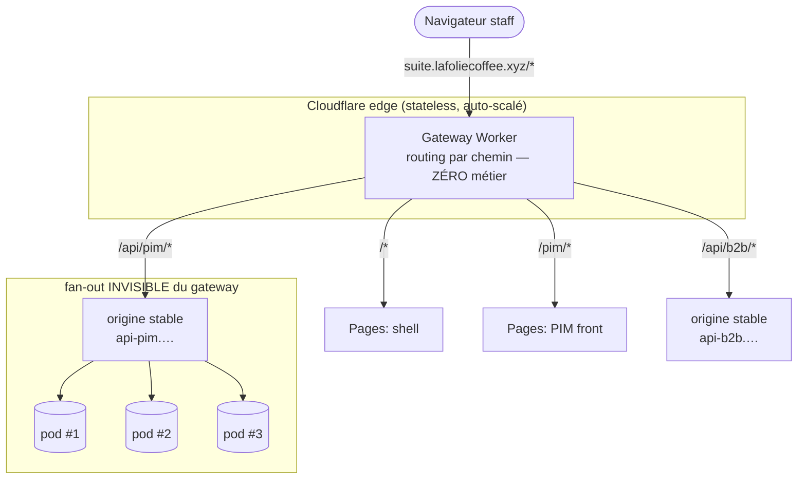
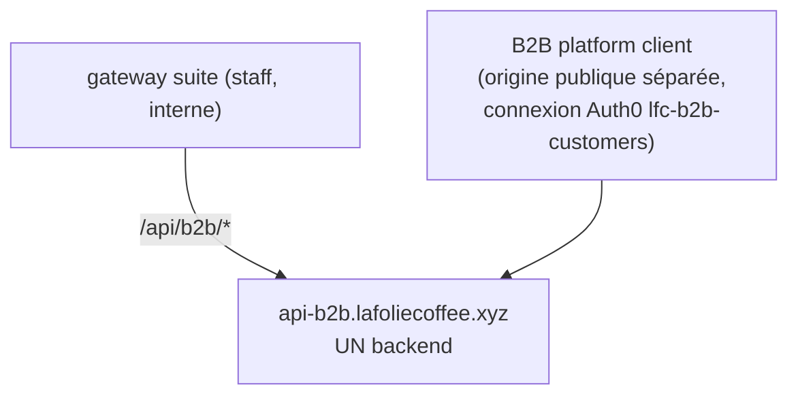

# Suite LFC — passerelle single-origin & scaling horizontal (plan de bataille)

> 🟡 **Partiellement dépassé le 2026-08-13.** La passerelle est en place et
> constitue désormais la seule porte d'entrée — mais elle route par **préfixe de
> chemin** vers des _service bindings_, et non par sous-domaine : le compte
> Cloudflare n'a aucune zone. La « Phase 4 » (routes sur la zone réelle) attend
> toujours un domaine. Les trois invariants du plan (origine stable, sans état,
> JWT) tiennent. État réel : [`../ops/architecture-deploiement.md`](../ops/architecture-deploiement.md).

Ce document fixe la **cible de topologie réseau** de la suite interne
(`lfc-suite-shell` + apps hostées + backends) et le **plan de bataille** pour y
arriver, avec une **revue adversariale** en fin de doc (§9) : on écrit d'abord ce
qui peut casser, ensuite on planifie.

Complément de [`apps/lfc-suite-shell/ARCHITECTURE.md`](../../apps/lfc-suite-shell/ARCHITECTURE.md)
(le _pourquoi_ de l'iframe). Ici : **comment tout parle**, et comment ça tient
sous charge.

---

## 1. Le problème

Aujourd'hui, un port est écrit **en dur à plusieurs endroits** :

| Numéro             | Où il apparaît                                                                                                        |
| ------------------ | --------------------------------------------------------------------------------------------------------------------- |
| `7315` (PIM front) | `angular.json` (serve) · `suite-config.dev.ts` (URL iframe **+** allowlist bridge) · `lfc-PIM-backend/main.ts` (CORS) |
| `7316` (B2B front) | `angular.json` (serve) · `lfc-B2B-platform-backend/main.ts` (CORS)                                                    |
| `3200` (B2B back)  | `.env` (`PORT`)                                                                                                       |

Chaque duplication = un **drift** possible : on change un port, une des copies
lâche en silence (l'iframe charge mais le token est refusé, ou le CORS bloque).
Et en **prod**, chaque front est un projet Cloudflare Pages avec **sa propre
origine `*.pages.dev`** → CORS partout, allowlist iframe à maintenir, cookies
tiers bloqués pour l'auth silencieuse.

**Cible** : une **source de vérité unique** en dev (registre de ports) et **une
seule origine** en prod (passerelle), pour que « tout parle » soit une propriété
de la topologie, pas une discipline manuelle.

---

## 2. La cible : une passerelle Cloudflare (Worker)

Sur Cloudflare, le « reverse proxy » n'est pas un nginx : c'est un **Worker**
posé sur le domaine de la suite, qui route **par préfixe de chemin** vers chaque
upstream (projets Pages + backends). Config-as-code, déployée en CI.

Ce que ça achète, **une fois tout sous la même origine** :

- **plus de CORS** (le backend ne voit qu'une origine) ;
- **plus d'allowlist iframe qui drift** (même origine) ;
- **ports des backends internes**, invisibles du navigateur ;
- un **point WAF / rate-limit** gratuit à l'edge.

> ⚠️ « même origine » a un coût sur l'isolation de l'iframe — c'est le fork du §4.

---

## 3. Deux invariants non négociables (à ne jamais violer)

### Invariant A — Le gateway route vers une **origine stable**, jamais une instance

L'upstream est un **hostname** (`api-pim.lafoliecoffee.xyz`), pas une IP de pod.
Le **fan-out vers N réplicas se passe DERRIÈRE cette origine** (load balancer /
Cloud Run / Service K8s). Passer de 1 à 10 pods = **zéro ligne** au gateway.

### Invariant B — Les backends sont **stateless** ; tout état partagé est externalisé

Le proxy est compatible scaling horizontal **si et seulement si** le backend ne
garde rien en RAM de process :

| Exigence                                                                     | État LFC                                                                   |
| ---------------------------------------------------------------------------- | -------------------------------------------------------------------------- |
| Auth sans session serveur (n'importe quel pod sert n'importe quelle requête) | ✅ Auth0 = **JWT self-contained**                                          |
| Fichiers hors disque local                                                   | ✅ KBIS sur **R2/S3**                                                      |
| Compteurs rate-limit / files / pub-sub partagés                              | ⚠️ **Redis** (Phase 2 différée) — **prérequis du scaling**, pas une option |
| Pas d'affinité de connexion                                                  | ✅ en JWT ; ⚠️ dès l'ajout de **WebSocket** → adapter Redis obligatoire    |

> **Le jour où on scale, ce qui bloque n'est pas le gateway : c'est le premier
> `Map` resté en mémoire de process.** Le rate-limit et le realtime sont les deux
> candidats. Redis n'est pas cosmétique — c'est la condition de N > 1.

---

## 4. Le fork à trancher : single-origin **vs** sous-domaines par app

« Tout sous la même origine » n'est pas gratuit : same-origin ⇒ **l'iframe a
accès DOM complet au shell**. Deux options réelles, à décider **avant** de coder
le gateway :

|                                  | **A. Single-origin** (`suite…/pim/`)         | **B. Sous-domaines** (`pim.suite…`, `api.suite…`) |
| -------------------------------- | -------------------------------------------- | ------------------------------------------------- |
| CORS                             | disparaît                                    | allowlist contrôlée (1 origine par app)           |
| Cookies tiers / auth silencieuse | first-party, **relais de token supprimable** | tiers → **relais de token conservé**              |
| Isolation iframe                 | ❌ same-origin, app = accès total au parent  | ✅ cross-origin, isolation navigateur gardée      |
| Verdict                          | OK **outils internes staff** de confiance    | requis si une app est moins fiable / tierce       |

**Recommandation** : voir §10 D-1. La décision a basculé vers **B (sous-domaines)**
une fois deux faits posés : le relais de token est gardé (D-3, l'argument auth de
A tombe) et le backend B2B a un consommateur public cross-origin par conception
(ci-dessous, l'argument « pas de CORS » de A tombe aussi).

### Périmètre — le B2B platform _client_ reste HORS suite

Deux mondes à ne jamais confondre :

- **Suite interne** (`suite…`) = **staff** : PIM + **B2B admin**. C'est ce que
  gouverne D-1.
- **B2B platform client** (`boutique…`) = **clients, public** : **shell séparé**,
  hors suite, modèle de confiance opposé. D-1 ne le touche pas.

Le vrai couplage est **sous** les frontends : **un seul backend B2B, deux
frontends, deux niveaux de confiance.**

**Invariant C — la confiance vient du JWT, pas de l'origine.** Le backend B2B :

- **ne peut jamais « supprimer le CORS »** — il a un consommateur cross-origin
  **public** (la boutique) par conception. Ça **enterre A** pour D-1, définitivement.
- **n'est pas « possédé » par le gateway** — deux chemins y mènent (gateway staff
  _et_ boutique publique). Le gateway route du trafic, il n'encapsule pas le backend.
- **sépare staff et client par l'authz** (connexions Auth0 distinctes —
  `lfc-b2b-customers` côté client —, audiences/rôles, mur `company_id`), **pas par
  le réseau**. Corollaire : le backend matérialise **deux surfaces** (ex.
  `/admin/*` vs `/shop/*`, scopes disjoints), car exposé à deux niveaux de
  confiance en même temps.

---

## 5. Modèle de tokens — deux choses opposées derrière le même mot

|              | **Token de déploiement (CI)**                                             | **Token d'auth runtime (Auth0)**                                 |
| ------------ | ------------------------------------------------------------------------- | ---------------------------------------------------------------- |
| Rôle         | pousser le code sur Cloudflare                                            | authentifier une requête navigateur → API                        |
| Granularité  | **1 par déployable** (rotation/révocation indépendantes)                  | **1 audience par backend**                                       |
| Vit dans     | secret GitHub Actions                                                     | mémoire du navigateur (jamais en CI)                             |
| Le gateway ? | **oui** — `CLOUDFLARE_API_TOKEN_GATEWAY` (scope _Workers Scripts · Edit_) | **non** — il ne fait que **forwarder** le header `Authorization` |

Le gateway ne détient **aucun secret Auth0**. Il ne sait rien de l'auth
applicative — il relaie l'`Authorization` tel quel.

---

## 6. Plan de bataille (phases ordonnées)

> Ordre **impératif** : on ne proxifie pas vers du vide. Les backends doivent
> avoir une **origine hébergée** avant que le gateway existe (cf. §9 AD-6).

**Phase 0 — Hébergement des backends (bloquant).**
Déployer les NestJS sur **Cloudflare Containers** (D-2, tranché) : instance
`basic`, **1 réplica chaud** (min-instance=1) + scale-to-zero au-delà. Livrable :
`api-pim.…` et `api-b2b.…` répondent `/health`, une **origine stable** par
service (Invariant A). **Sans ça, rien en aval** (on ne proxifie pas vers du vide).

**Phase 1 — Registre de ports/URLs (dev). ✅ FAIT.**
Package workspace **`@lfd/endpoints`** = source de vérité unique (localhost).
`suite-config.dev.ts` (→ `DEV_URLS`) et les CORS dev des backends PIM/B2B (→
`DEV_CORS_ORIGINS`) **en dérivent** au lieu de recopier le port. Le package
expose `browser`→source (bundler shell) et `import`→`dist` (Node backends). Les
ports de serve dans `angular.json` (JSON non importable) restent mais alignés sur
`DEV_PORTS` ; les tests du shell épinglent `7315` = garde-fou. Zéro changement de
comportement.

**Phase 2 — Redis (prérequis scaling).**
Externaliser rate-limit (+ futur pub/sub) dans Redis. Tant que ce n'est pas
fait, **les backends restent épinglés à 1 instance** — le documenter comme un
plafond conscient, pas un défaut silencieux.

**Phase 3 — Validation de config au boot.**
Schéma zod sur `process.env` côté backends : URL/port manquant ⇒ **crash au
démarrage**, jamais un CORS qui échoue à la 1ʳᵉ requête. « Fail fast » > « fail
mystérieux ».

**Phase 4 — Gateway Worker (prod).**
`gateway/wrangler.toml` (routes + carte d'upstreams en `[vars]`) + worker de
routing trivial + workflow `deploy_gateway.yml` calqué sur
`deploy_b2b_frontend_platform.yml`. Déploiement **canary + rollback**
(`wrangler versions` / `rollback`).

**Phase 5 — Bascule single-origin.**
Monter PIM sous `suite…/pim/`. L'iframe devient same-origin → **retirer le relais
de token** (l'app partage la session first-party du shell), le bridge se réduit à
la sync d'URL. Garder un fallback documenté vers l'option B (§4) si une app
future doit être isolée.

---

## 7. Prérequis & hypothèses à vérifier (avant Phase 4)

- Le domaine `lafoliecoffee.xyz` est une **zone Cloudflare** (DNS chez CF), sinon
  les `routes` du Worker ne s'attachent pas.
- **Cloudflare Containers** (D-2) expose **une URL stable** par service, avec
  autoscale + scale-to-zero derrière (Invariant A).
- Un `/health` existe sur chaque backend (Phase 0) pour les probes et le canary.

---

## 8. Automatisation prod (CI/CD)

En prod, **le registre dev ne sert plus** — et c'est voulu : il n'y a **pas de
ports exposés** (chaque backend est une origine stable, Invariant A). Ce qui
« se met en place tout seul », c'est la **CI/CD self-bootstrap**, sur le patron
déjà en place pour le B2B front (`.github/workflows/deploy_b2b_frontend_platform.yml`).

### Un workflow par déployable (push `main` → deploy)

Chaque déployable a **son** workflow : build → `wrangler … deploy` →
**la ressource Cloudflare se crée si absente** (`… create … || true`, idempotent).
Un **token de déploiement par app** + l'`ACCOUNT_ID` partagé (cf. §5, tokens CI ≠
tokens Auth0).

| Déployable                  | Cible Cloudflare     | Commande                              | Statut                        |
| --------------------------- | -------------------- | ------------------------------------- | ----------------------------- |
| Shell, PIM front, B2B front | **Pages** (statique) | `wrangler pages deploy`               | B2B fait ; shell/PIM à cloner |
| PIM back, B2B back          | **Containers** (D-2) | `wrangler … deploy` (image + service) | à écrire (Phase 0)            |
| Gateway                     | **Worker**           | `wrangler deploy`                     | à écrire (Phase 4)            |

1ᵉʳ push = la ressource se crée ; pushs suivants = mise à jour. **Zéro clic
dashboard.**

### La config prod = as-code, versionnée

Là où le dev a `@lfd/endpoints`, la prod a **deux fichiers versionnés**, déployés
comme du code (revus en PR) :

- `suite-config.ts` — URLs Pages des fronts (déjà là) ;
- le `wrangler.toml` du gateway — `[vars]` = carte des upstreams backend.

> **Anti-drift (AD-5).** Dev (registre TS) et prod (ces fichiers) sont deux
> sources. On ferme le risque en **générant** le `[vars]` prod depuis une
> déclaration unique, **ou** par un **test CI** qui vérifie qu'ils concordent.

### Le genuinely-manuel : les secrets (une fois par environnement)

Ne se commit **jamais**, ne s'auto-génère pas : `DATABASE_URL` (prod = **Neon**,
Postgres managé), creds Auth0, tokens Cloudflare. Posés **une fois** comme
_secrets_ (GitHub Actions pour le deploy ; `wrangler secret put` / dashboard pour
le runtime des containers). Les **origines CORS prod** viennent de ces env (Phase
3, validation zod qui _crashe_ si une URL manque), **pas** du registre dev.

### Ordre de déploiement (imposé par le plan)

Backends (containers, `/health`, origine stable) **d'abord**, gateway **ensuite**
(AD-6 : on ne proxifie pas vers du vide). Miroir exact des Phases 0 → 4.

---

## 9. Revue adversariale

On attaque le plan. Verdict : **tenu** (le plan répond) · **à corriger** (le doc
a été amendé) · **risque accepté** (connu, borné).

| #         | Attaque                                                                                                                                           | Verdict                    | Réponse                                                                                                                                                                                                                                                |
| --------- | ------------------------------------------------------------------------------------------------------------------------------------------------- | -------------------------- | ------------------------------------------------------------------------------------------------------------------------------------------------------------------------------------------------------------------------------------------------------ |
| **AD-1**  | Le gateway est un **nouveau SPOF** : un bug de routing tue shell + toutes apps + toutes API d'un coup.                                            | **risque accepté + borné** | CF Worker = pas de SPOF _matériel_ (edge), mais SPOF _logique_ réel. Mitigation : worker **trivial** (routing pur, zéro métier), tests, **canary + `wrangler rollback`**. On échange N points de défaillance CORS contre 1 point trivial et versionné. |
| **AD-2**  | **Double hop** navigateur → Worker → Pages : proxifier un projet Pages par `fetch` **casse le cache CDN natif** de Pages et ajoute de la latence. | **à corriger**             | Vrai piège. Pour le **statique**, ne pas `fetch`-proxy : attacher les fronts par **custom-domain / route Pages** (sert depuis le cache edge), et ne router par Worker que **`/api/*`**. Le §6 Phase 5 est amendé en ce sens.                           |
| **AD-3**  | Single-origin fait **tomber l'isolation** : une app hostée compromise a accès DOM total au shell (tokens, session).                               | **tenu (fork §4)**         | Décision explicite : A réservé aux **outils internes staff** de confiance ; option B (sous-domaines) documentée et gardée en fallback si une app moins fiable entre. Jamais A côté client.                                                             |
| **AD-4**  | **WebSocket / SSE** à travers le Worker : upgrades + connexions longues mal supportées / coûteuses.                                               | **risque accepté**         | Aucun realtime aujourd'hui. Le jour venu : router le WS sur un **sous-domaine dédié** qui **bypasse** le proxy, + adapter Redis (Invariant B). Noté, pas résolu d'avance.                                                                              |
| **AD-5**  | **Deux sources de vérité** pour les URLs : registre TS (dev) **et** `wrangler.toml [vars]` (prod) → re-drift.                                     | **à corriger**             | Assumer la frontière build-time (dev) / deploy-time (prod) mais **générer le `[vars]` depuis le registre** (ou un test qui compare les deux). Ajouté au livrable Phase 4.                                                                              |
| **AD-6**  | Le plan **suppose des backends hébergés** (`api-pim.…`) qui **n'existent pas** — ils tournent en dev-local. Le gateway proxifie vers du vide.     | **à corriger (bloquant)**  | C'est la faille n°1. Le §6 met **Phase 0 = hébergement backend** en tête, explicitement bloquante. Rien en aval sans une origine qui répond.                                                                                                           |
| **AD-7**  | JWT stateless = **révocation non immédiate** : à l'échelle, un user révoqué garde l'accès jusqu'à expiration du token.                            | **risque accepté**         | Inhérent au stateless (le prix du scaling). Borné par **TTL court** + kill-switch `deleteAllRefreshTokensForUser`. Compromis conscient, pas un oubli.                                                                                                  |
| **AD-8**  | **Cold start** (scale-to-zero) : la 1ʳᵉ requête après inactivité échoue/traîne — « tout parle » cassé au réveil.                                  | **à corriger**             | `min-instances ≥ 1` sur les services chauds, `/health` + retry côté appelant. La sonde `AppFrame` (déjà durcie, retry) couvre le front ; l'API a besoin de son propre garde-fou.                                                                       |
| **AD-9**  | Le point d'entrée unique est aussi un **choke unique** (DDoS, abus).                                                                              | **tenu (bénéfice)**        | À l'inverse : concentrer le trafic à l'edge CF **active** WAF + rate-limiting managés en un endroit. Le single-origin _aide_ ici.                                                                                                                      |
| **AD-10** | `wrangler routes` exige que le domaine soit une **zone Cloudflare** — si le DNS est ailleurs, rien ne s'attache.                                  | **à corriger**             | Ajouté en **prérequis §7**, à vérifier avant Phase 4.                                                                                                                                                                                                  |

**Bilan de la revue.** Le plan **tient dans sa structure**, mais trois corrections
étaient nécessaires et ont été intégrées : (1) **backends hébergés d'abord**
(AD-6, Phase 0 bloquante), (2) **ne pas `fetch`-proxifier le statique** pour ne
pas tuer le cache Pages (AD-2), (3) **une seule source d'URLs** dérivée en prod
(AD-5). Les risques restants (SPOF logique, isolation same-origin, révocation
JWT, cold start, WS futur) sont **bornés et assumés**, pas ignorés.

---

## 10. Décisions

- **D-3 — Relais de token : GARDÉ.** ✅ _(décidé)_ L'auth reste le relais
  postMessage, **quelle que soit l'origine**. Conséquence : l'auth est
  **découplée du fork §4** — plus besoin de same-origin pour la faire marcher.

- **D-1 — Fork §4 : B (sous-domaines).** ✅ _(tranché)_ Deux arguments de A sont
  tombés : (1) D-3 garde le relais → A ne « supprime » plus le relais ; (2) le
  backend B2B a un consommateur public cross-origin (Invariant C) → A ne
  « supprime » pas le CORS non plus. Il ne restait à A que le coût (perte
  d'isolation iframe). **B : sous-domaines, isolation cross-origin gardée, CORS
  réglé par l'allowlist du gateway.**

- **D-2 — Hébergement backend : Cloudflare Containers.** ✅ _(tranché)_ Le
  sous-fork Workers vs Containers est clos en faveur de **Containers** : le
  NestJS existant **tourne tel quel** (vrai process Node), **Redis reste
  classique** (pas de réécriture vers CF Queues/Durable Objects), Prisma
  Accelerate inchangé. On renonce aux _service bindings_ des Workers (lien
  gateway→backend en HTTP via l'origine stable, Invariant A) — coût acceptable
  vu l'enjeu de shipper sans toucher au backend.

  **Coût (tarifs Cloudflare, cf. §11).** CPU facturé **à l'usage réel** ; seuls
  **mémoire + disque** courent tant que le conteneur est **réveillé** ; **endormi
  = $0** (mais cold start au réveil). Instance réaliste NestJS+Prisma =
  **`basic`** (1/4 vCPU, 1 GiB, 4 GB) — la `lite` (256 MiB) est trop juste pour
  booter Nest.

  | Unité                              | Coût /mois                                        |
  | ---------------------------------- | ------------------------------------------------- |
  | **1 conteneur `basic` chaud 24/7** | **≈ $7** (mémoire ~$6.6 + disque ~$0.7 + CPU ~$0) |
  | 2 backends (PIM + B2B) chauds      | ≈ $14                                             |
  | Socle Workers Paid (obligatoire)   | $5                                                |
  | **Total base**                     | **≈ $19**                                         |

  **Motif de scaling « 1 chaud + N à la demande ».** L'unité de coût du fan-out
  (Invariant A) est le **conteneur-chaud** : chaque réplica chaud supplémentaire
  ≈ **+$7/mo**. Inutile de garder chaud *tous* les réplicas : **1 réplica chaud**
  (min-instance=1, pas de cold start sur le trafic de base) **+ des réplicas en
  scale-to-zero** montés seulement sous pic (facturés à la seconde d'éveil). À
  charge normale on reste à ~$7/backend ; on ne paie les extras que pendant les
  pointes réelles. À l'échelle actuelle (solo, outils internes), le coût est une
  **erreur d'arrondi** — il n'a pas décidé, l'ingénierie l'a fait.

Rien en Phase 4+ ne démarre avant que la **Phase 0** (backends sur Containers,
`/health`, origine stable) soit faite. Le §6 Phases 1→3 (registre, Redis,
validation boot) est **indépendant** et peut avancer tout de suite.

---

## 11. Références (tarifs Cloudflare Containers)

Source : [Cloudflare Containers — Pricing](https://developers.cloudflare.com/containers/pricing/)
(relevé le 2026-07-31 ; **à revérifier**, ces tarifs bougent).

- **Socle** : Workers Paid **$5/mo** requis.
- **Facturation** : mémoire + disque courent tant que l'instance est **réveillée**
  (ressources provisionnées) ; **CPU à l'usage réel** ; endormie = $0. Charges
  démarrent à la 1ʳᵉ requête / démarrage manuel, s'arrêtent à la mise en veille.
- **Tarifs au-delà des franchises** : mémoire $0.0000025/GiB-s · CPU
  $0.000020/vCPU-s · disque $0.00000007/GB-s.
- **Franchises incluses (compte)** : 25 GiB-h mémoire · 375 vCPU-min · 200 GB-h
  disque · 1 To egress (NA/EU).
- **Types** : `lite` (1/16 vCPU, 256 MiB, 2 GB) · **`basic`** (1/4, 1 GiB, 4 GB)
  · `standard-1..4` (jusqu'à 4 vCPU, 12 GiB, 20 GB).
