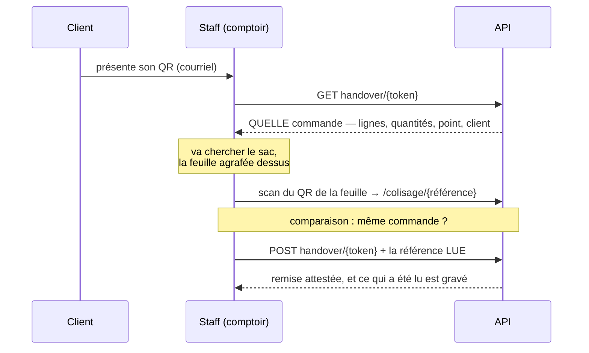

# TODO — revue de l'écran « retrait boutique »

**Ouverte le 2026-09-11**, au bout du chantier qui a construit cet écran — file,
rail, scan, dialogue, mise en page étroite. La revue porte donc sur du code écrit
le jour même, et quatre de ses six constats ont été introduits par ce chantier.

Un contradicteur (`auditeur-de-justifications`) a tourné en parallèle sur les
commentaires du périmètre : il a rendu **trois justifications fausses, écrites
dans la journée**. Elles sont corrigées (commit `1c605441`) et ne figurent ici
que pour ce qu'elles apprennent — dernière section.

Périmètre relu : `apps/lfc-B2B-admin-frontend/src/app/handover-shop/`,
`apps/lfd-api/src/handover/`, la part de `apps/lfd-api/src/b2b/orders/` qui sert
la remise, `packages/contracts/src/order-handover.ts`.

---

## 1. ✅ Les montants traversaient le comptoir — clos le 2026-09-11

### Le fait, tel qu'il était

Tout le contexte tient la même règle, et l'écrit trois fois :

- `HandoverQueueEntry` — « **Aucun montant** : on ne facture pas au comptoir, et
  un total affiché là serait lu comme une somme à encaisser » ;
- `OrderHandoverView` — « Aucun montant, délibérément — même raison que sur le
  bon de livraison : celui qui remet un colis coche des articles, il n'a pas à
  faire apparaître un prix négocié devant la personne qui attend » ;
- `sheet-panel` — « Aucun montant : on ne facture pas au comptoir. »

Les deux vues de remise tiennent la promesse : ni l'une ni l'autre ne porte de
prix. **Le rail, lui, ne passe par aucune des deux.** Il appelle
`AdminOrdersService.byId()`, qui rend l'`OrderView` du client — la même vue que
celle servie à l'acheteur, avec `unitPriceMillicents`, `lineTotalCents`,
`vatShares` et `totalCents`. Le bon de commande se construit ensuite sur ce même
objet.

### Pourquoi c'est un défaut et pas un détail

La règle n'est donc **pas un contrat : c'est une convention de gabarit.** Les
montants arrivent sur le poste, en mémoire, avec quelqu'un en face ; seul le
`.html` décide de ne pas les écrire. Le jour où un `@for` de trop les affiche,
rien ne rougit — ni le typecheck, ni une porte, ni un test, puisque aucun ne
regarde ce qui n'est pas rendu.

C'est exactement l'asymétrie que le reste du contexte a su tenir. La remise a
**deux** vues faites pour elle ; le rail en a contourné la raison d'être en
réutilisant une troisième, faite pour un autre lecteur.

### La sortie

Une vue de remise pour la commande OUVERTE — les lignes, les quantités, les SKU,
rien d'autre — servie par le contexte `handover`, à côté de `OrderHandoverView`
qui fait déjà ce travail pour le chemin du scan. Le rail cesse alors de dépendre
de `admin/orders/:id`, c'est-à-dire d'une route dont la forme est décidée par le
back-office commercial : une colonne ajoutée là-bas ne doit pas atterrir sur un
comptoir.

⚠️ Ne pas « corriger » en masquant côté écran. Masquer laisserait la donnée
voyager, et la prochaine surface la réafficherait pour la même raison que
celle-ci l'a chargée : parce qu'elle était disponible.

### ✅ Ce qui a été fait

`GET admin/handover/order/:id` rend l'`OrderHandoverView` — la vue du scan,
atteinte par une **troisième clé**. Le port du commerce publie `byOrderId` à
côté de `byToken` et `byReference`, et les trois restent distinctes : le scan
trouve par un **secret**, la saisie par un **numéro imprimé**, le rail par un
**identifiant que la file vient de rendre**. Les fondre ferait accepter un
identifiant là où le secret est la protection.

Deux champs ont dû rejoindre la vue, tous deux sans montant : `note` (elle est
sur le bon qu'on coche — « sans sésame », « par la cour ») et
`fulfillmentMethod`, **typé** `FulfillmentMethod` dès l'entrée, ce qui règle au
passage la moitié du point 2 pour cette vue-là.

Le créneau, lui, ne l'a pas rejointe : il vient de la **ligne de file**, que le
rail a déjà sous la main. La vue de remise sert d'abord l'écran du scan, qui n'a
pas de file derrière lui — l'y ajouter l'aurait fait grossir pour un seul de ses
deux lecteurs.

**Ce qui tient la promesse maintenant :**

- la **forme** : il n'y a plus de montant à ne pas afficher ;
- un **e2e** (`production-batch.e2e-spec.ts`) qui lit les octets réellement
  servis et échoue si `Cents`, `Millicents`, `vatRate`, `vatShares`, `pricing`
  ou `currency` y reparaît un jour ;
- un **cas front** qui ne fournit plus `AdminOrdersService` au rail : un rail
  qui recommencerait à le demander échoue à l'injection au lieu de repartir
  chercher des montants en silence.

⚠️ Le premier jet de l'e2e interdisait aussi « total » — et il a échoué, sur le
bon champ : `totalUnits` est un compte de PIÈCES, précisément ce que le comptoir
recompte à voix haute. Le mot est resté dans la liste des exclusions commentées.

⚠️ Ce qui reste attaché au commerce : le **PDF** du bon (`sheetPdf`). C'est
juste — ce sont des octets que le serveur compose, le document complet que le
client a reçu, et le bouton dit qu'il est tarifé.

---

## 2. ✅ L'alarme de retard tenait à une chaîne — clos le 2026-09-11

### Le fait

`packages/contracts/src/order-handover.ts` :

```ts
export interface HandoverQueueWindowView {
  readonly start: string | null;
  readonly end: string;
  readonly source: string; // ← ensemble fermé, typé ouvert
}

export interface HandoverQueueEntryView {
  readonly fulfillmentMethod: string; // ← idem
}
```

Le port côté serveur, lui, les connaît :
`HandoverQueueWindow.source: "default" | "override"` et
`HandoverQueueOrder.fulfillmentMethod: "pickup" | "delivery"`. L'union existe ;
elle est perdue en traversant le contrat.

Le front compare ces chaînes à des littéraux :

```ts
// handover-queue.ts
const REQUESTED_SOURCE = 'override';
if (window === null || window.source !== REQUESTED_SOURCE) { … }   // pas de retard

// handover-detail.ts
return entry.fulfillmentMethod === 'delivery' ? 'Livraison' : 'Retrait';
```

### Pourquoi c'est le plus cher des deux

`HandoverQueueWindow` porte son propre avertissement, et il dit la conséquence :

> 🔴 **La provenance n'est pas un détail.** `source: "default"` veut dire que
> l'heure vient du réglage du point, recopiée à la commande — une heure
> d'OUVERTURE, pas une promesse. Le backfill du 2026-08-15 en a posé une sur
> l'intégralité des commandes antérieures : calculer un retard dessus
> déclencherait une alarme sur tout le portefeuille d'un coup.

⚠️ **Cet avertissement était lui-même FAUX**, et ne l'a été découvert que le
2026-09-11, en cherchant pourquoi le semis porte une commande sans créneau. Le
backfill du 2026-08-15 a posé une provenance avec `value: null` — aucun créneau
— et l'écrit dans son propre en-tête : « en inventer une ferait promettre un
créneau que personne n'a arrêté ». Aucune alarme n'était possible.

Ce qui est vrai est plus étroit et plus utile : un **retrait ne prend aucun
défaut** (le serveur le refuse, les heures d'un point étant une contrainte
d'ouverture partagée), donc au comptoir `source` vaut toujours `"override"`. La
garde de `isLate` ne filtre rien aujourd'hui ; elle se garde pour le jour où la
saisie staff aura un créneau. Les deux JSDoc sont corrigés et datés.

⚠️ **Le raisonnement du point 2 tient malgré tout** : il ne dépendait pas de
l'alarme mais de la faute de frappe, qui inverse la condition dans les deux
sens. Une raison fausse peut soutenir une bonne décision — c'est ce qui la rend
difficile à repérer.

Une faute de frappe dans ce littéral — `'overide'`, `'override '` — compile,
passe le lint, et **allume l'alarme sur tout le portefeuille**. Les tests ne la
voient pas : ils construisent leurs fixtures avec le même littéral, donc ils
échouent ensemble ou réussissent ensemble.

### La sortie

Exporter les deux unions depuis `@lfd/contracts` et les faire porter par la vue.
Le coût est d'une ligne par type ; le gain est qu'une faute de frappe redevient
une erreur de compilation au lieu d'un comportement. C'est la hiérarchie du
dossier : rendre **inexprimable** plutôt que vérifier.

⚠️ Resserrer un champ d'un contrat **déjà servi** est un rétrécissement, pas un
ajout : `string` → union refuse des valeurs qu'un client pouvait envoyer. Ici le
champ est en LECTURE seule (le serveur l'écrit, le front le lit), donc le
resserrement ne peut casser que notre propre front — mais la règle des trois
déploiements s'applique si un jour il entre dans une écriture.

### ✅ Ce qui a été fait

**Quatre** champs, pas deux : `source` et `fulfillmentMethod` portent désormais
`FulfillmentSource` et `FulfillmentMethod` — qui existaient **déjà dans ce
paquet**, trois fichiers plus loin —, et les deux `handedOverVia` portent
`HandoverVia`.

🔴 Ce dernier vivait dans le domaine du SERVEUR pendant que le contrat disait
`string` : deux définitions du même ensemble, dont une qui ne définissait rien.
Il a déménagé dans `@lfd/contracts`, et le domaine le réexporte — un seul
endroit dit ce qu'une attestation peut valoir.

La même correction est descendue d'un cran : `AttestedHandover.via`, le port qui
ALIMENTE la vue, disait `string` lui aussi. La colonne est un `text`, donc
l'adaptateur la referme explicitement — et du côté sûr : tout ce qui n'est pas
exactement `scan` devient `manual`, jamais l'inverse. Une ligne écrite à la main
hors du domaine ne doit pas passer pour l'attestation forte.

**Ce qui tient la règle maintenant**, et c'est le point : trois cas éprouvent le
COMPILATEUR, pas un comportement.

```ts
type Rejects<TUnion, TValue> = TValue extends TUnion ? false : true;
const rejected: Rejects<FulfillmentSource, "overide"> = true;
```

Si le champ redevenait `string`, `'overide' extends string` serait vrai, le type
vaudrait `false`, et `const … : false = true` refuserait de compiler. Vérifié en
isolation : avec l'union la ligne compile, avec `string` elle rend `TS2322`.

⚠️ Écrit ainsi et non avec `@ts-expect-error` parce que `lint:no-type-escapes`
refuse cette directive comme les autres — et elle a raison : une directive se
relit mal et s'oublie. La règle ne s'élargit pas, on trouve l'autre chemin.

---

## 3. ✅ Le scanner de la barre ignorait le point ouvert — clos le 2026-09-11

### Le fait

L'écran est devenu mono-point le 2026-09-11 : un onglet par point de retrait,
plus d'onglet « Tous les points », des compteurs qui suivent l'onglet, et les
livraisons écartées de la file (`atTheCounter`).

Le bouton « Scanner un code » de la barre appelle `scan(null)` : le dialogue
n'attend alors **aucune** commande en particulier et atteste ce que le code
désigne — y compris un sac de l'autre point, y compris une livraison que la file
ne montre plus.

### Pourquoi c'est une incohérence de flux

Ce n'est pas le scan qui est fautif : un comptoir prend ce qui se présente, et
le code résout la commande tout seul. C'est que **l'écran affirme un périmètre
que son geste principal ne respecte pas.** Avant, la vue d'ensemble existait :
l'opérateur voyait la ligne quelque part. Aujourd'hui l'en-tête dit « Le Labo »,
les trois compteurs disent « Le Labo », et le scan remet un sac du Village sans
qu'une ligne de l'écran ne l'ait jamais annoncé.

### La sortie

Ne pas interdire — **nommer**. Le dialogue sait déjà refuser en nommant deux
commandes quand le code ne correspond pas à celle qu'on a ouverte ; il lui
manque de dire « cette commande est au Village » ou « c'est une livraison »
avant d'attester. Le refus existe ; c'est l'avertissement qui manque.

### ✅ Ce qui a été fait

`ScanDialogData` porte `openTab`, et `outsideTheCounter` — dans
`handover-queue.ts`, avec les autres règles pures — rend la phrase ou `null`.
Le dialogue l'affiche **au-dessus** de l'accusé, en `warning`, et **laisse la
confirmation offerte** : `mismatch` barre le bouton, cet avertissement non.

🔴 **Ce que la phrase sert vraiment** n'est pas d'empêcher une fausse remise.
Si le client s'est trompé de point, la marchandise est à l'autre bout : le sac
n'est pas dans le rack, l'opérateur cherche, et sans cette phrase il ne sait pas
s'il cherche mal ou si le sac n'a jamais existé. Elle lui donne la réponse et ce
qu'il dit au client — d'où les DEUX points nommés, comme les deux numéros du
refus de code.

Et elle n'interdit pas parce qu'un sac transporté d'un point à l'autre, un
client redirigé par téléphone, une livraison rattrapée au comptoir sont des
remises **légitimes**. Même permissivité que `handoverBlocker`, même raison : le
monde réel prime sur la machine à états.

Sept cas dans `handover-queue.spec.ts`, dont deux où **ne rien dire est la
bonne réponse** : sous l'onglet « Sans point de retrait », une commande sans
point est chez elle — ces commandes sont antérieures aux points et se remettent
bien en boutique, c'est tout l'objet de cet onglet ; et quand l'écran n'affirme
aucun périmètre (`openTab` vide), il n'y a rien à démentir.

---

## 4. ✅ Une règle métier écrite trois fois — clos le 2026-09-11

`handoverBlocker` (`handover/domain/services/handover.ts`) dit ce qui empêche
une remise. La même règle est réécrite deux fois côté front :

```ts
// queue-table.ts  ET  handover-detail.ts, à l'identique
return entry.state !== "handed_over" && entry.state !== "cancelled";
```

Le serveur reste l'autorité, et c'est juste — l'écran n'évite qu'un aller-retour
dont il connaît la réponse. Mais les deux copies devraient être **une** fonction
de `handover-queue.ts`, qui existe précisément pour ça et héberge déjà
`lateMinutes`, `rowTone` et `queueCounters` sous la promesse « éprouvables une
par une, alors qu'un gabarit ne se teste qu'en le rendant ».

Coût si on ne le fait pas : le jour où un troisième état apparaît, deux fichiers
doivent changer et un seul le sera.

### ✅ Ce qui a été fait

`stillRemittable(state)` vit dans `handover-queue.ts` ; les deux composants
l'appellent. La raison de sa **permissivité** est écrite au-dessus d'elle et non
laissée à deviner : elle laisse passer une commande que le fournil n'a pas
déclarée prête, exactement comme `handoverBlocker`, parce que renvoyer un client
physiquement là — colis prêt — au motif qu'un écran d'atelier n'a pas été cliqué
serait pire. Sans cette phrase, le prochain lecteur la « corrigera » en exigeant
`ready`.

🔴 **Et le cinquième état ne passera plus en silence.** Un `default:` aurait
choisi à la place du lecteur ; un cas de spec fait constater l'élargissement au
COMPILATEUR :

```ts
type Covers<TUnion, TKnown> = [TUnion] extends [TKnown] ? true : false;
const covered: Covers<HandoverQueueState, "handed_over" | "ready" | "expected" | "cancelled"> =
  true;
```

Un membre de plus rend la condition fausse, donc `false` n'est plus assignable à
`true`, et `tsc` refuse (TS2322). Vérifié en isolation : la ligne exacte
compile, la ligne élargie échoue — le contrôle porte bien sur l'ensemble et non
sur la forme de l'écriture. Même device que le point 2, et même raison : aucun
test de comportement ne voit une union grandir.

---

## 5. ✅ `OrderReader` publiait les besoins de ses voisins — clos le 2026-09-11

### Le fait, tel qu'il était

Dix verbes sur un seul port, et vingt-et-un fichiers qui en dépendaient sans
jamais en appeler plus de deux. Chaque ajout obligeait **huit doublés** à
déclarer une méthode qu'aucun n'appelle.

Le coût dangereux était ailleurs : le doublé du spec du rappel n'implémentait
que `findById`, donc la classe était invalide — `tsc` la refusait (TS2655) — et
**la suite était verte depuis sa création**, parce que `ts-jest` transpile sans
typechecker. Un doublé pouvait dériver de son port sans que rien ne rougisse.

### 🔴 Ce que le premier plan faisait de travers

J'avais proposé de DÉCOUPER le port en ports par usager — `HandoverOrders`,
`ProductionOrders`, `AdminOrders` — publiés par `b2b/orders`. Hugo a objecté que
le commerce deviendrait alors « connaisseur des besoins des autres contextes ».

Il avait raison, et l'objection invalide le plan. Un contexte qui publie un port
par consommateur **connaît ses consommateurs** : c'est la dépendance qui revient
par l'autre bout, celle que le §3 interdit pour `production → b2b`.

Pire : les besoins étaient **déjà déclarés au bon endroit**.
`handover/channels/commerce/` porte `HandoverSubjectReader` et
`HandoverQueueReader` ; `production/channels/commerce/` porte `DayOrdersReader`.
Les quatre verbes du commerce étaient une **seconde déclaration du même besoin,
du mauvais côté**.

### ✅ Ce qui a été fait

Le port n'a pas été découpé, il a **rétréci** : dix verbes → six, tous des
lectures que `b2b` fait pour lui-même.

Les deux adaptateurs interrogent Prisma eux-mêmes — ce que
`PrismaDayOrdersReader` faisait déjà, sans rien ajouter à `OrderReader`. Le
`select` reste partagé dans `handover-order.query.ts`, **interne à
`infrastructure/`** : aucun port ne le nomme, aucun contexte ne l'importe. Ce
que la délégation protégeait — « le dupliquer ferait diverger les écrans du
comptoir au premier champ ajouté » — demandait un `select` partagé, pas une
surface publique.

🔴 **Et la revue se trompait sur un point.** Elle affirmait que ces verbes
n'avaient aucun appelant dans le commerce. `MarkOrderFulfilledHandler` appelait
`findHandoverByReference` — la lecture COMPLÈTE que fait la remise, lignes
comprises — pour n'en tirer qu'un identifiant, un numéro et un destinataire. Il
a maintenant `findAuthorByReference`, qui lit trois colonnes. Le verbe large
lisait quinze fois trop, et personne ne l'avait vu parce qu'il « marchait ».

### Ce qui reste

Les six verbes restants sont tous des lectures propres à `b2b`. Les découper
serait une question **intra-contexte**, sans connaissance d'autrui — moins
urgente, et sans le défaut que cette tranche vient de corriger.

---

## 6. 🔵 Le double scan au comptoir — décidé, pas encore bâti

**Conçu avec Hugo le 2026-09-11.** Ce n'est pas un défaut relevé par la revue :
c'est une tranche à venir, écrite ici parce qu'elle change la nature de la
preuve de remise et qu'elle touche le point 3 par le même bout.

### Le fait physique, et il décide de tout

🔴 **La feuille d'atelier part avec le sac, agrafée dessus.** Sans ça, rien de
ce qui suit n'existe : il n'y aurait au comptoir aucun objet à lire, et il
faudrait inventer une étiquette de sac.

### Il y a DÉJÀ deux QR, et ils ne sont pas de même nature

|                     | QR **client**                           | QR **atelier**                                         |
| ------------------- | --------------------------------------- | ------------------------------------------------------ |
| Où                  | dans le courriel du destinataire        | imprimé sur la feuille (`atelier-sheet-pdf.ts`)        |
| Encode              | `{admin}/retrait/{token}`               | `/colisage/{référence}`                                |
| Nature              | un **secret** (`orders.handover_token`) | un **nom** — la référence est en clair juste au-dessus |
| Atteste aujourd'hui | la remise, `handedOverVia: "scan"`      | le **colisage** : `packed_at` / `packed_by`, au labo   |

Les deux existent, mais ils sont lus à deux moments différents par deux
personnes différentes. **Personne ne lit le QR de l'atelier au comptoir.**

### Le trou : le sac n'est prouvé par rien

Le jeton prouve la **présence du client** — il faut avoir été deux pour
l'obtenir, et c'est ce qui fait du scan la seule attestation forte du système.
Il ne prouve **rien sur le sac**. Le lien « ce sac-ci est cette commande-là »
tient à l'œil de l'opérateur qui lit une référence sur un papier.

Deux commandes du même client le même jour, deux enseignes voisines dans la même
tranche horaire, et cet œil est le seul contrôle. Le scénario que le double scan
ferme n'est pas « la mauvaise personne » — celui-là est déjà fermé — c'est **le
mauvais sac à la bonne personne**.

### L'ordre des deux gestes est imposé par le métier

🔴 Le QR client n'est **pas** un second facteur qu'on ajouterait à la fin : c'est
lui qui **désigne la commande**. Sans lui on ne sait pas quel sac aller chercher.
L'ordre ne peut donc pas s'inverser.



Le mécanisme de comparaison **existe déjà** : c'est `expected` de `ScanDialog`,
qui refuse aujourd'hui en nommant les deux commandes quand le rail en avait
ouvert une autre. La seule différence est d'où vient `expected` — de la ligne du
rail hier, du **premier scan** demain.

### Trois degrés d'attestation, pas deux

Le double scan ne peut **pas** être obligatoire, et la raison est déjà dans le
dossier : une commande passée après la clôture n'a pas de `ProductionOrder`,
donc pas de feuille, donc pas de QR — et elle est remettable exprès. C'est ce
cas qui a décidé de la forme de `order_handover`. Un geste obligatoire casserait
à la première semaine.

| ce qui a été lu         | ce qui est prouvé                                |
| ----------------------- | ------------------------------------------------ |
| les deux codes          | la présence du client **et** l'identité du sac   |
| le code client seul     | la présence du client ; le sac vérifié à l'œil   |
| rien (saisie à la main) | ni l'un ni l'autre — l'équipe atteste, et le dit |

### ⚠️ Ce que le second scan ne prouve PAS

**Le QR de l'atelier n'est pas un secret.** Il encode une référence imprimée en
toutes lettres à un centimètre de lui. Comme facteur d'**authenticité** il ne
vaut rien : quiconque voit le papier peut saisir la référence. Comme facteur
d'**identité de l'objet**, il vaut tout ce qu'on lui demande ici.

Les deux codes ne sont donc pas redondants, et l'un ne peut pas remplacer
l'autre : **l'un prouve la personne, l'autre l'objet.** Il faut que ce soit
écrit, sans quoi quelqu'un « renforcera » un jour la remise en n'exigeant que le
bon — ce qui la rendrait strictement plus faible qu'aujourd'hui.

### Les trois décisions de mise en œuvre

1. **Un fait, pas un bouton.** Si le second scan ne fait que débloquer la
   confirmation, une remise double-scannée et une remise simple s'écrivent à
   l'identique, et la traçabilité visée n'existe nulle part une seconde après le
   geste. Il doit laisser une trace.
2. **Enregistrer ce qui a été LU, pas un résumé.** `handedOverVia` est un
   ensemble fermé, tout juste refermé par le point 2. Lui ajouter un membre à
   chaque geste nouveau en fait un discriminant qui grossit — la branche de plus
   que l'OCP refuse. Deux instants nullables (le code client, le code de la
   feuille) disent le fait ; `via` s'en dérive. Migration additive.
3. 🔴 **Le serveur doit être informé de la référence lue.** Une comparaison faite
   par l'écran est une commodité ; si elle ne traverse pas, la trace est une
   histoire que le front raconte. Le `POST` porte la référence, et c'est le
   domaine qui décide ce qu'il grave.

### Ce que ça fait au point 3

Le défaut du point 3 est que le scan de la barre n'attend **aucune** commande
(`expected: null`) sur un écran qui affirme un point de retrait. Le double scan
ne le corrige pas — il déplace `expected` d'un cran, il ne dit toujours rien du
point ouvert. Les deux tranches restent distinctes : **3 nomme le périmètre**,
**6 prouve le sac**. Faire 3 d'abord, il est d'une phrase.

---

## Ce qui tient, et qu'on ne touche pas

Noté parce qu'une revue qui ne liste que des défauts fait réécrire ce qui est
bon.

- **Le découpage `handover` ↔ `b2b`.** Le fournil DÉCLARE ce dont il a besoin
  (`handover/channels/commerce/`), le commerce implémente, `appBootstrap` relie.
  `lint:context-boundaries` le tient, et `handover → b2b` n'existe pas.
- **La lecture vive plutôt qu'un instantané**, argumentée par le métier et non
  par la commodité : ce qui est cuit est facturé, donc le contenu d'une commande
  gèle quand le four démarre, et la remise a lieu après. Une copie ne pourrait
  pas diverger — elle n'achèterait donc rien.
- **`stateOf` fait gagner `handed_over` sur `cancelled`.** Un fait physique bat
  un statut : le sac est parti, et c'est précisément le jour où on relit la
  ligne.
- **L'agrégat `OrderHandover`** mérite son existence au critère du dossier — il
  existe une règle qui peut refuser cette écriture, et **deux** handlers la
  touchent.
- **Le retardataire.** Une commande passée après la clôture n'est dans aucun
  plan et reste remettable ; `handoverBlocker` est permissif exprès, et c'est ce
  qui a décidé de la forme de la table.

---

## Ce que la revue apprend sur les commentaires

Le contradicteur a trouvé trois justifications fausses **écrites le jour même**,
sur 24 affirmations porteuses examinées. Le motif est le même dans les trois :
une phrase qui décrit non pas le code qu'elle surplombe, mais **l'état d'un
autre fichier**.

1. `queueCounters` documentait « la journée, tous points confondus » alors que
   son unique appelant lui passait déjà l'onglet ouvert. Le pire des trois :
   `handover-queue.ts` est le fichier qu'on lit pour connaître l'invariant, et
   quiconque « corrigeait » l'appelant pour honorer ce JSDoc rouvrait le défaut
   fermé une heure plus tôt.
2. Le scanner justifiait son contrôle `expected` par une comparaison entre « un
   bouton de scan par ligne » et « un scanner global ». Le bouton par ligne a
   été supprimé le même jour : la comparaison n'a plus de second terme, et
   laisser l'ancienne raison ferait juger le garde-fou périmé alors qu'il sert
   un cas qui existe toujours — celui du rail.
3. Le semis justifiait ses deux points de retrait par l'onglet « Tous les
   points », supprimé par le commit qui a justement retouché ce bloc sans
   toucher cette ligne-là. La raison de semer deux points tient toujours ;
   c'était son énoncé qui était périmé.

**Les trois ont survécu au commit qui les a périmées, et deux d'entre elles à un
commit qui éditait le paragraphe voisin.** C'est l'argument du `CLAUDE.md` §8 —
une justification qui parle d'ailleurs porte sa date — pris en flagrant délit :
elle ne se démasque pas en relisant la fonction, seulement en ouvrant le second
fichier.

---

## Ordre de traitement

~~**1**~~ ✅ **clos le 2026-09-11.**

~~**2**~~ ✅ **clos le 2026-09-11.**

~~**3**~~ ✅ **clos le 2026-09-11**, par une phrase à l'écran, comme prévu.
~~**4**~~ ✅ **clos le 2026-09-11** — il était prévu « au premier changement
d'état », et c'était le mauvais moment : ce changement-là est justement celui où
on ne relit pas les deux fichiers. ~~**5**~~ ✅ **clos le 2026-09-11**, et pas comme il était
écrit : l'objection d'Hugo — « un contexte devient connaisseur des besoins des
autres » — a retourné le plan. Le port ne devait pas être découpé, il devait
rétrécir.

**6** est une tranche, pas un correctif : elle porte une migration et un
changement de contrat, et elle se conçoit après **3** — dont la phrase manquante
vit dans le dialogue que **6** retouchera.
